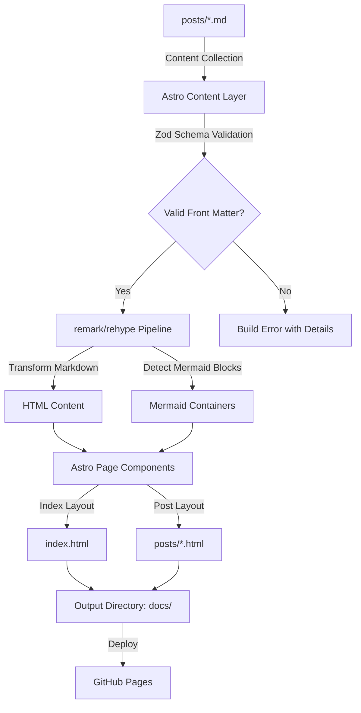
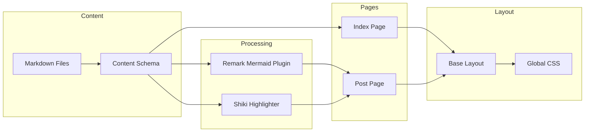

# Design Document: Markdown Blog Site

## Overview

This design describes a static blog site generator that converts markdown files with YAML front matter into a fully styled, modern HTML website deployable to GitHub Pages. The system supports syntax-highlighted code blocks, Mermaid diagram rendering, responsive design, and chronological post navigation.

### Framework Evaluation: Astro vs Hugo

| Criteria | Astro | Hugo |
|---|---|---|
| Language | JavaScript/TypeScript | Go |
| Markdown Support | Built-in with remark/rehype pipeline | Built-in with Goldmark |
| Mermaid Support | Via remark plugin or custom component | Requires shortcode or JS injection |
| Syntax Highlighting | Shiki (built-in) | Chroma (built-in) |
| Theming | Full control via Astro components + CSS | Go templates + CSS |
| GitHub Pages | First-class support, official docs | First-class support, official docs |
| Build Speed | Fast (Vite-based) | Extremely fast (Go-based) |
| Customization | Component-based, highly flexible | Template-based, moderate flexibility |
| Ecosystem | npm ecosystem, rich plugin library | Hugo modules, smaller plugin ecosystem |
| Learning Curve | Familiar for JS/web devs | Go template syntax can be unfamiliar |

### Recommendation: Astro

Astro is the recommended framework for this project:

1. **Mermaid integration is cleaner** — Astro's remark/rehype plugin pipeline makes it straightforward to detect `mermaid` code blocks and transform them into `<div class="mermaid">` containers during build. Hugo requires custom shortcodes or render hooks with more boilerplate.

2. **Full control over HTML/CSS output** — Astro components are essentially HTML/CSS/JS files. This makes it easy to craft a modern, minimal design without fighting a template engine. Hugo's Go templates are more rigid.

3. **Conditional Mermaid.js loading** — Astro layouts can check if a page contains mermaid diagrams and conditionally include the script. This is natural in Astro's component model.

4. **Content Collections** — Astro's content collections provide built-in front matter validation with Zod schemas, giving us type-safe parsing and clear error messages for missing/invalid fields — directly satisfying Requirements 1.6 and 1.7.

5. **Familiar tooling** — npm-based workflow, standard web technologies, no Go dependency.

Hugo's main advantage is raw build speed, but for a personal blog with a modest number of posts, Astro's build time is more than sufficient.

## Architecture

The site follows Astro's file-based routing and content collections architecture:



### Build Pipeline

1. **Content Discovery** — Astro scans the `src/content/blog/` directory for markdown files
2. **Front Matter Validation** — Zod schema validates `title` (string, required), `date` (date, required), `description` (string, optional)
3. **Markdown Processing** — remark parses markdown to MDAST, custom plugin transforms mermaid code blocks, rehype converts to HTML with syntax highlighting
4. **Page Generation** — Astro components render index page and individual post pages using layouts
5. **Static Output** — Astro builds to `docs/` directory with all HTML, CSS, and assets

## Components and Interfaces

### 1. Content Collection Schema (`src/content.config.ts`)

Defines the blog collection with Zod validation:
- `title`: required string
- `date`: required date
- `description`: optional string

Responsible for: Requirements 1.1, 1.6, 1.7

### 2. Remark Mermaid Plugin (`src/plugins/remark-mermaid.ts`)

A custom remark plugin that walks the MDAST tree and transforms fenced code blocks with `lang: "mermaid"` into raw HTML `<div class="mermaid">` containers.

Responsible for: Requirements 1.5, 8.1

### 3. Index Page (`src/pages/index.astro`)

Fetches all blog posts from the content collection, sorts by date descending, and renders a listing with title, date, description, and link to each post.

Responsible for: Requirements 2.1–2.5

### 4. Post Page (`src/pages/posts/[slug].astro`)

Dynamic route that renders a single blog post. Computes previous/next post links based on chronological order. Conditionally includes Mermaid.js script if the post contains mermaid diagrams.

Responsible for: Requirements 3.1–3.5, 8.2–8.4

### 5. Base Layout (`src/layouts/BaseLayout.astro`)

Shared layout providing:
- HTML document structure with `<head>` metadata (title, charset, viewport)
- Site header with blog name and home link
- Site footer
- Global CSS

Responsible for: Requirements 7.1–7.3

### 6. Global Stylesheet (`src/styles/global.css`)

Modern, minimal CSS providing:
- Clean sans-serif typography with constrained content width
- Responsive layout with fluid transitions
- Styled code blocks with subtle backgrounds and rounded corners
- Restrained color palette with high contrast
- Hover states and smooth transitions for interactive elements
- Centered mermaid diagram containers

Responsible for: Requirements 4.1–4.7

### 7. Astro Configuration (`astro.config.mjs`)

Configures:
- Output directory: `docs/`
- Site URL for GitHub Pages
- Markdown processing: Shiki for syntax highlighting, custom remark-mermaid plugin
- Relative URL mode for portability

Responsible for: Requirements 5.4, 6.1–6.4

### Component Interaction Diagram



## Data Models

### BlogPost Front Matter Schema

```typescript
import { z } from 'zod';

const blogSchema = z.object({
  title: z.string(),
  date: z.date(),
  description: z.string().optional(),
});
```

### Resolved Post Entry

```typescript
interface ResolvedPost {
  slug: string;          // derived from filename, e.g. "hello-world"
  data: {
    title: string;
    date: Date;
    description?: string;
  };
  render(): Promise<{ Content: AstroComponent }>;
}
```

### Post Navigation Context

```typescript
interface PostNavigation {
  prev: { slug: string; title: string } | null;
  next: { slug: string; title: string } | null;
}
```

### Index Page Data

```typescript
interface IndexPageData {
  posts: Array<{
    slug: string;
    title: string;
    date: Date;
    description?: string;
  }>;
  // sorted by date descending
}
```

### Mermaid Block (MDAST Node)

The remark plugin transforms nodes matching this shape:

```typescript
// Input: code node with lang "mermaid"
interface MermaidCodeNode {
  type: 'code';
  lang: 'mermaid';
  value: string;  // mermaid diagram source
}

// Output: raw HTML node
interface MermaidHtmlNode {
  type: 'html';
  value: string;  // '<div class="mermaid">...source...</div>'
}
```


## Correctness Properties

*A property is a characteristic or behavior that should hold true across all valid executions of a system — essentially, a formal statement about what the system should do. Properties serve as the bridge between human-readable specifications and machine-verifiable correctness guarantees.*

### Property 1: Front matter extraction

*For any* valid markdown file with YAML front matter containing title, date, and description fields, parsing the file shall produce a data object whose title, date, and description values exactly match the original front matter values.

**Validates: Requirements 1.1**

### Property 2: Markdown elements produce correct HTML tags

*For any* valid markdown body containing standard elements (headings, paragraphs, links, images, code blocks, lists, bold, italic), converting to HTML shall produce output containing the corresponding HTML tags (`<h1>`–`<h6>`, `<p>`, `<a>`, ``, `<pre><code>`, `<ul>/<ol>/<li>`, `<strong>`, `<em>`).

**Validates: Requirements 1.2, 1.3**

### Property 3: Code blocks receive syntax highlighting

*For any* markdown file containing a fenced code block with a non-mermaid language identifier, the rendered HTML shall contain syntax highlighting markup (e.g., `<span>` elements with highlight classes) within the code block output.

**Validates: Requirements 1.4**

### Property 4: Mermaid blocks preserved in container

*For any* markdown file containing a fenced code block with the `mermaid` language identifier, the rendered HTML shall contain a `<div class="mermaid">` element whose text content matches the original mermaid source code, and shall not contain syntax highlighting markup for that block.

**Validates: Requirements 1.5, 8.1**

### Property 5: Invalid front matter produces descriptive errors

*For any* markdown file with front matter that is either missing required fields (title or date) or contains invalid YAML, the parser shall produce an error that identifies the file and describes the specific issue.

**Validates: Requirements 1.6, 1.7**

### Property 6: Content round-trip preservation

*For any* valid blog post, parsing the markdown body to HTML and then extracting the text content from that HTML shall preserve all textual content from the original markdown body.

**Validates: Requirements 1.8**

### Property 7: Index page lists all posts with metadata in reverse chronological order

*For any* non-empty set of blog posts, the generated index page HTML shall contain each post's title, date, and description, with entries ordered by date descending (newest first), and each entry shall contain a link to the corresponding post page URL.

**Validates: Requirements 2.1, 2.2, 2.3, 2.4**

### Property 8: Post page contains content, metadata, and index link

*For any* blog post, the generated post page HTML shall contain the rendered body content, the post title, the post date, and a link back to the index page.

**Validates: Requirements 3.1, 3.2**

### Property 9: Post navigation correctness

*For any* ordered list of blog posts sorted chronologically, each post page shall include a "previous" link if and only if a chronologically earlier post exists, and a "next" link if and only if a chronologically later post exists, with each link pointing to the correct adjacent post.

**Validates: Requirements 3.3, 3.4, 3.5**

### Property 10: Build produces files at URL-friendly paths

*For any* set of blog post markdown files, the build shall produce an HTML file for each post at a path derived from the post's filename, where the path contains only lowercase letters, numbers, and hyphens.

**Validates: Requirements 5.1, 5.4**

### Property 11: All internal URLs are relative

*For any* generated HTML page (index or post), all internal links (`<a href>`) and asset references (`<link href>`, `<script src>`, ``) pointing to site resources shall use relative URLs (not starting with `http` or `/`).

**Validates: Requirements 6.1, 6.4**

### Property 12: Page structure includes valid head, header, and footer

*For any* generated HTML page, the document shall contain a `<head>` with a `<title>` element and a charset `<meta>` tag, a site header containing the blog name and a link to the index page, and a `<footer>` element.

**Validates: Requirements 7.1, 7.2, 7.3**

### Property 13: Conditional Mermaid.js script inclusion

*For any* generated post page, the HTML shall include a Mermaid.js `<script>` tag if and only if the source markdown contains at least one fenced code block with the `mermaid` language identifier.

**Validates: Requirements 8.3, 8.4**

## Error Handling

### Build-Time Errors

| Error Condition | Behavior | User Feedback |
|---|---|---|
| Missing required front matter (title/date) | Build fails for that file | Error message naming the file and missing field(s) |
| Invalid YAML in front matter | Build fails for that file | Error message naming the file with YAML parse details |
| Source directory missing | Build aborts | Error message indicating the expected directory path |
| No markdown files found | Build succeeds | Index page renders with empty-state message |

Astro's content collection validation (via Zod) handles front matter errors natively, producing clear error messages during build. The `astro build` command exits with a non-zero code on validation failures.

### Client-Side Errors

| Error Condition | Behavior | User Feedback |
|---|---|---|
| Invalid Mermaid syntax | Mermaid.js renders error in place | Error message displayed in the diagram container; rest of page unaffected |
| Mermaid.js fails to load (CDN) | Mermaid source remains as text | Raw mermaid code visible in the div (graceful degradation) |

Mermaid.js is configured with `securityLevel: 'strict'` and error handling enabled so invalid diagrams show an error message without breaking the page.

## Testing Strategy

### Unit Tests

Unit tests verify specific examples and edge cases:

- Parsing a known markdown file (like `hello-world.md`) produces expected HTML structure
- Empty post list generates index with empty-state message (Req 2.5)
- Build clears output directory of stale files before writing (Req 5.3)
- Missing source directory produces descriptive error (Req 5.5)
- Default output directory is `docs/` (Req 6.2)
- Specific mermaid diagram types (flowchart, sequence, class, state, Gantt) render containers correctly

### Property-Based Tests

Property-based tests verify universal correctness properties using generated inputs. Each property from the Correctness Properties section maps to a single property-based test.

**Library:** [fast-check](https://github.com/dubzzz/fast-check) (JavaScript/TypeScript property-based testing)

**Configuration:**
- Minimum 100 iterations per property test
- Each test tagged with: `Feature: markdown-blog-site, Property {N}: {title}`

**Test Mapping:**

| Property | Test Description | Generator Strategy |
|---|---|---|
| 1: Front matter extraction | Generate random title/date/description, build front matter string, parse, verify fields match | Arbitrary strings for title/description, arbitrary dates |
| 2: Markdown elements → HTML | Generate markdown with random elements, convert, verify HTML tags present | Structured markdown generator producing headings, lists, links, etc. |
| 3: Code block highlighting | Generate code blocks with random language identifiers, verify highlight markup | Random language strings + random code content |
| 4: Mermaid block preservation | Generate mermaid code blocks, verify div.mermaid container with preserved source | Random mermaid-like source strings |
| 5: Invalid front matter errors | Generate front matter missing title/date or with broken YAML, verify error output | Structured invalid front matter generator |
| 6: Content round-trip | Generate random text, wrap in valid markdown, parse to HTML, extract text, compare | Arbitrary text strings |
| 7: Index page completeness | Generate random post sets, build index, verify all metadata present and ordered | Arrays of random post metadata |
| 8: Post page content | Generate random posts, build pages, verify content/title/date/index-link present | Random post content + metadata |
| 9: Navigation correctness | Generate ordered post lists, verify prev/next links on each page | Arrays of 1–20 posts with random dates |
| 10: URL-friendly paths | Generate filenames, build, verify output paths are clean | Random filenames with special characters |
| 11: Relative URLs | Generate pages, parse all href/src attributes, verify none are absolute | Full site builds with random post sets |
| 12: Page structure | Generate pages, verify head/title/charset/header/footer present | Random post and index pages |
| 13: Conditional Mermaid.js | Generate posts with and without mermaid blocks, verify script inclusion matches | Boolean flag for mermaid presence + random content |
