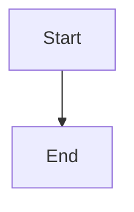

# My Blog

[中文说明](README_CN.md)

A static blog site built with [Astro](https://astro.build/), featuring Mermaid diagram support, syntax highlighting, GitHub-based comments, and GitHub Pages deployment.

## Features

- Markdown blog posts with YAML front matter
- Syntax highlighting (Shiki, github-dark theme)
- Mermaid diagram rendering (flowcharts, sequence diagrams, etc.)
- Tag filtering and search
- Table of contents outline on post pages
- GitHub-based comments via [giscus](https://giscus.app/)
- Responsive, modern design
- GitHub Pages ready

## Project Structure

```
├── src/
│   ├── content/blog/       # Markdown blog posts go here
│   ├── layouts/             # BaseLayout.astro
│   ├── pages/               # index.astro, about.astro, posts/[slug].astro
│   ├── plugins/             # remark-mermaid plugin
│   └── styles/              # global.css
├── public/images/           # Static images for posts
├── docs/                    # Built output (GitHub Pages serves from here)
├── astro.config.mjs
└── package.json
```

## Quick Start

```bash
# Install dependencies
npm install

# Build the site
npm run build

# Preview locally
npm run preview
```

Open http://localhost:4321 to see your blog.

## Writing Posts

### Create a New Post

Create a `.md` file in `src/content/blog/`:

```markdown
---
title: "My Post Title"
date: 2026-03-20
description: "A short description of the post."
tags: ["tag1", "tag2"]
---

Your content here...
```

**Required fields:** `title`, `date`
**Optional fields:** `description`, `tags`

### Using Typora

1. Open the `src/content/blog/` folder in Typora
2. Configure Typora image settings:
   - Go to **Preferences → Image**
   - Set "When Insert" to **Copy image to custom folder**
   - Set the custom folder to: `../../public/images`
   - Check **Use relative path**
3. Write your post — paste images directly and Typora saves them to `public/images/`
4. After writing, run `npm run build` to generate the site

### Images

Place images in `public/images/` and reference them in markdown:

```markdown

```

### Videos

Use HTML in your markdown:

```markdown
<video src="/videos/demo.mp4" controls width="100%"></video>
```

Or embed YouTube:

```markdown
<iframe width="100%" height="400" src="https://www.youtube.com/embed/VIDEO_ID" frameborder="0" allowfullscreen></iframe>
```

### Mermaid Diagrams

Use fenced code blocks with the `mermaid` language:

````markdown

````

## Deploy to GitHub Pages

1. Create a GitHub repo (e.g., `username.github.io`)
2. Push this project to the repo
3. Go to repo **Settings → Pages**
4. Set Source to **Deploy from a branch**
5. Set Branch to `main`, folder to `/docs`
6. Your blog is live at `https://username.github.io`

### Workflow

```bash
# Write a post in src/content/blog/
# Build
npm run build
# Commit and push
git add .
git commit -m "new post"
git push
```

## Enable Comments (giscus)

1. Install giscus on your repo: https://github.com/apps/giscus
2. Enable Discussions: repo Settings → General → Features → Discussions
3. Go to https://giscus.app/ and enter your repo name
4. Copy the generated values and update `src/pages/posts/[slug].astro`:
   - `data-repo` → your repo (e.g., `username/username.github.io`)
   - `data-repo-id` → from giscus.app
   - `data-category-id` → from giscus.app
5. Rebuild and push

## Customize

### About Page

Edit `src/content/about.md` in Typora or any text editor:

- **Front matter** controls your name, avatar, GitHub link, and email
- **Body** is your bio written in standard markdown
- Supports all markdown features (headings, lists, links, images, etc.)

```markdown
---
name: "Your Name"
github: "https://github.com/YOUR_USERNAME"
github_username: "YOUR_USERNAME"
email: "your@email.com"
avatar: "/images/avatar.jpg"
---

Your bio here in markdown...
```

Place your avatar at `public/images/avatar.jpg`.

### Other Customizations

- **Blog name:** Edit `src/layouts/BaseLayout.astro` (header and footer)
- **Styling:** Edit `src/styles/global.css`
- **Output directory:** Change `outDir` in `astro.config.mjs`
