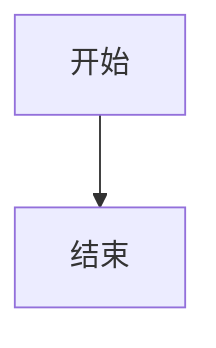

# My Blog

[English](README.md)

一个基于 [Astro](https://astro.build/) 的静态博客网站，支持 Mermaid 图表、代码高亮、GitHub 评论和 GitHub Pages 部署。

## 功能特性

- Markdown 博客文章，支持 YAML front matter
- **内容与源码分离** — 在 `content/` 中写作，`src/` 存放网站代码
- **文章独立图片目录** — 图片与文章放在一起，方便管理
- 代码语法高亮（Shiki，github-dark 主题）
- Mermaid 图表渲染（流程图、时序图等）
- 标签筛选和搜索
- 文章目录大纲
- 基于 GitHub 的评论系统（giscus）
- 响应式现代设计，支持深色模式
- 支持 GitHub Pages 部署

## 项目结构

```
├── content/                # ✏️ 所有文章内容在这里
│   ├── about.md            # 关于页面
│   └── blog/
│       ├── my-post/
│       │   ├── index.md    # 文章正文
│       │   └── images/     # 文章专属图片
│       └── another-post/
│           └── index.md
├── src/                    # 🔧 网站源码
│   ├── content.config.ts   # 内容集合定义
│   ├── layouts/            # BaseLayout.astro
│   ├── pages/              # index.astro, about.astro, posts/[slug].astro
│   ├── plugins/            # Remark 和 Vite 插件
│   └── styles/             # global.css
├── public/images/          # 站点公共图片（头像等）
├── docs/                   # 构建产物（GitHub Pages 从这里部署）
├── astro.config.mjs
└── package.json
```

## 快速开始

```bash
npm install
npm run build
npm run preview
```

打开 http://localhost:4321 查看博客。

## 写文章

### 新建文章

在 `content/blog/` 下创建文章目录，包含一个 `index.md` 文件：

```
content/blog/my-new-post/
└── index.md
```

```markdown
---
title: "文章标题"
date: 2026-03-20
description: "文章简介"
tags: ["标签1", "标签2"]
---

正文内容...
```

**必填字段：** `title`、`date`
**可选字段：** `description`、`tags`

目录名即为 URL slug — `my-new-post/index.md` → `/posts/my-new-post`。

### 插入图片

将图片放在文章目录的 `images/` 文件夹中，使用**相对路径**引用：

```
content/blog/my-post/
├── index.md
└── images/
    ├── screenshot.png
    └── diagram.svg
```

```markdown


```

相对图片路径会在构建时自动解析。站点公共图片（头像等）仍放在 `public/images/`。

### 配合 Typora 使用

1. 用 Typora 打开文章目录（如 `content/blog/my-post/`）
2. 配置 Typora 图片设置：
   - 打开 **偏好设置 → 图像**
   - "插入图片时" 选择 **复制图片到自定义文件夹**
   - 自定义文件夹设为：`./images`
   - 勾选 **使用相对路径**
3. 写文章时直接粘贴图片，Typora 会自动保存到文章旁边的 `images/` 目录
4. 写完后运行 `npm run build` 生成网站

### 插入视频

在 markdown 中使用 HTML：

```markdown
<video src="/videos/demo.mp4" controls width="100%"></video>
```

或嵌入 YouTube：

```markdown
<iframe width="100%" height="400" src="https://www.youtube.com/embed/VIDEO_ID" frameborder="0" allowfullscreen></iframe>
```

### Mermaid 图表

使用 `mermaid` 语言标识的代码块：

````markdown

````

## 部署到 GitHub Pages

1. 创建 GitHub 仓库（如 `username.github.io`）
2. 将项目推送到仓库
3. 进入仓库 **Settings → Pages**
4. Source 选择 **Deploy from a branch**
5. Branch 选 `main`，文件夹选 `/docs`
6. 博客上线：`https://username.github.io`

### 日常工作流

```bash
# 1. 新建文章
mkdir content/blog/my-new-post
# 2. 编写 content/blog/my-new-post/index.md
# 3. 构建
npm run build
# 4. 提交推送
git add .
git commit -m "新文章"
git push
```

## 开启评论（giscus）

1. 在仓库安装 giscus：https://github.com/apps/giscus
2. 开启 Discussions：仓库 Settings → General → Features → Discussions
3. 访问 https://giscus.app/，输入仓库名
4. 将生成的值更新到 `src/pages/posts/[slug].astro`：
   - `data-repo` → 你的仓库（如 `username/username.github.io`）
   - `data-repo-id` → 从 giscus.app 获取
   - `data-category-id` → 从 giscus.app 获取
5. 重新构建并推送

## 自定义

### 关于页面

编辑 `content/about.md`：

- **Front matter** 控制你的名字、头像、GitHub 链接和邮箱
- **正文** 用标准 markdown 写你的个人简介

```markdown
---
name: "你的名字"
github: "https://github.com/YOUR_USERNAME"
github_username: "YOUR_USERNAME"
email: "your@email.com"
avatar: "/images/avatar.jpg"
---

用 markdown 写你的简介...
```

将头像放到 `public/images/avatar.jpg`。

### 其他自定义

- **博客名称：** 编辑 `src/layouts/BaseLayout.astro`（页头和页脚）
- **样式：** 编辑 `src/styles/global.css`
- **输出目录：** 修改 `astro.config.mjs` 中的 `outDir`
