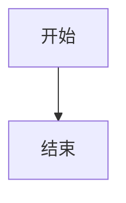

# My Blog

[English](README.md)

一个基于 [Astro](https://astro.build/) 的静态博客网站，支持 Mermaid 图表、代码高亮、GitHub 评论和 GitHub Pages 部署。

## 功能特性

- Markdown 博客文章，支持 YAML front matter
- 代码语法高亮（Shiki，github-dark 主题）
- Mermaid 图表渲染（流程图、时序图等）
- 标签筛选和搜索
- 文章目录大纲
- 基于 GitHub 的评论系统（giscus）
- 响应式现代设计
- 支持 GitHub Pages 部署

## 快速开始

```bash
# 安装依赖
npm install

# 构建网站
npm run build

# 本地预览
npm run preview
```

打开 http://localhost:4321 查看博客。

## 写文章

### 新建文章

在 `src/content/blog/` 目录下创建 `.md` 文件：

```markdown
---
title: "文章标题"
date: 2026-03-20
description: "文章简介"
tags: ["标签1", "标签2"]
---

正文内容...
```

**必填字段：** `title`、`date`
**可选字段：** `description`、`tags`

### 配合 Typora 使用

1. 用 Typora 打开 `src/content/blog/` 文件夹
2. 配置 Typora 图片设置：
   - 打开 **偏好设置 → 图像**
   - "插入图片时" 选择 **复制图片到自定义文件夹**
   - 自定义文件夹设为：`../../public/images`
   - 勾选 **使用相对路径**
3. 写文章时直接粘贴图片，Typora 会自动保存到 `public/images/`
4. 写完后运行 `npm run build` 生成网站

### 插入图片

将图片放在 `public/images/` 目录，在 markdown 中引用：

```markdown

```

### 插入视频

在 markdown 中使用 HTML：

```markdown
<video src="/videos/demo.mp4" controls width="100%"></video>
```

或嵌入 YouTube：

```markdown
<iframe width="100%" height="400" src="https://www.youtube.com/embed/VIDEO_ID" frameborder="0" allowfullscreen></iframe>
```

### Mermaid 图表

使用 `mermaid` 语言标识的代码块：

````markdown

````

## 部署到 GitHub Pages

1. 创建 GitHub 仓库（如 `username.github.io`）
2. 将项目推送到仓库
3. 进入仓库 **Settings → Pages**
4. Source 选择 **Deploy from a branch**
5. Branch 选 `main`，文件夹选 `/docs`
6. 博客上线：`https://username.github.io`

### 日常工作流

```bash
# 在 src/content/blog/ 写文章
# 构建
npm run build
# 提交推送
git add .
git commit -m "新文章"
git push
```

## 开启评论（giscus）

1. 在仓库安装 giscus：https://github.com/apps/giscus
2. 开启 Discussions：仓库 Settings → General → Features → Discussions
3. 访问 https://giscus.app/，输入仓库名
4. 将生成的值更新到 `src/pages/posts/[slug].astro`：
   - `data-repo` → 你的仓库（如 `username/username.github.io`）
   - `data-repo-id` → 从 giscus.app 获取
   - `data-category-id` → 从 giscus.app 获取
5. 重新构建并推送

## 自定义

### 关于页面

用 Typora 或任何编辑器编辑 `src/content/about.md`：

- **Front matter** 控制你的名字、头像、GitHub 链接和邮箱
- **正文** 用标准 markdown 写你的个人简介
- 支持所有 markdown 特性（标题、列表、链接、图片等）

```markdown
---
name: "你的名字"
github: "https://github.com/YOUR_USERNAME"
github_username: "YOUR_USERNAME"
email: "your@email.com"
avatar: "/images/avatar.jpg"
---

用 markdown 写你的简介...
```

将头像放到 `public/images/avatar.jpg`。

### 其他自定义

- **博客名称：** 编辑 `src/layouts/BaseLayout.astro`（页头和页脚）
- **样式：** 编辑 `src/styles/global.css`
- **输出目录：** 修改 `astro.config.mjs` 中的 `outDir`
