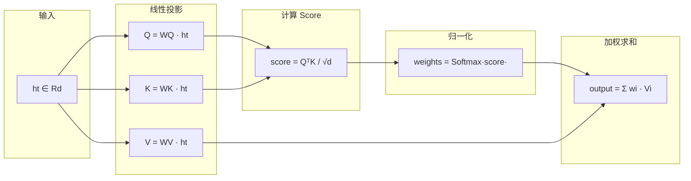
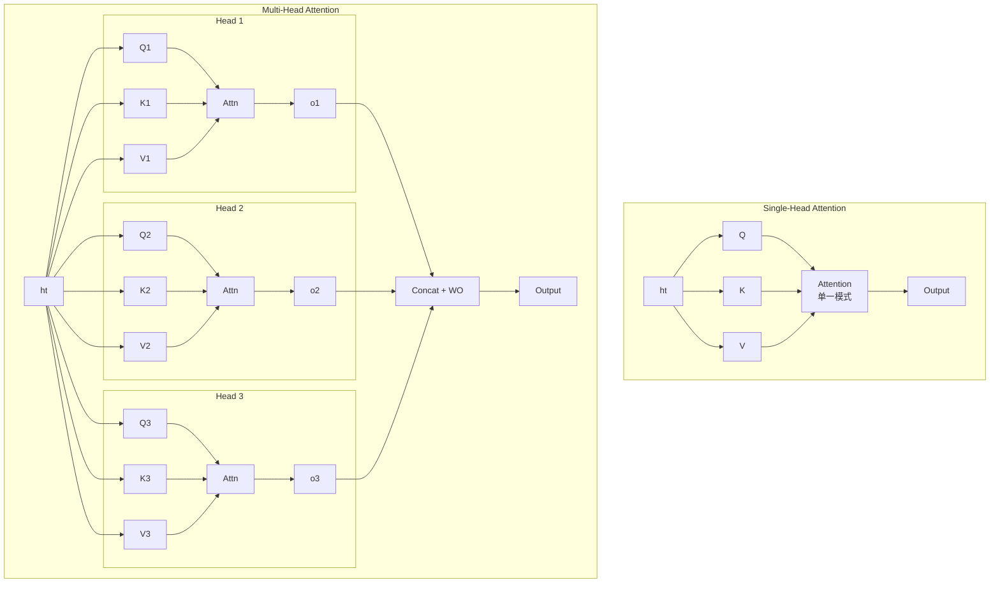
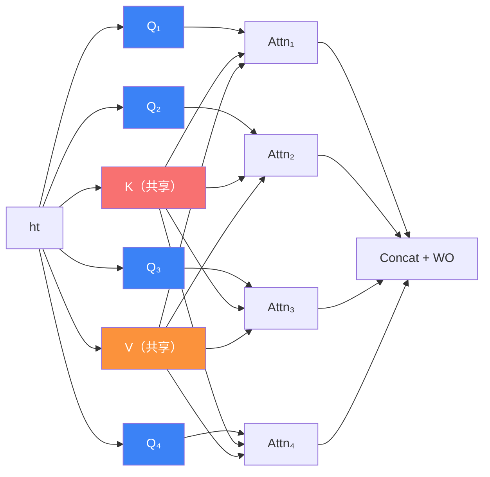
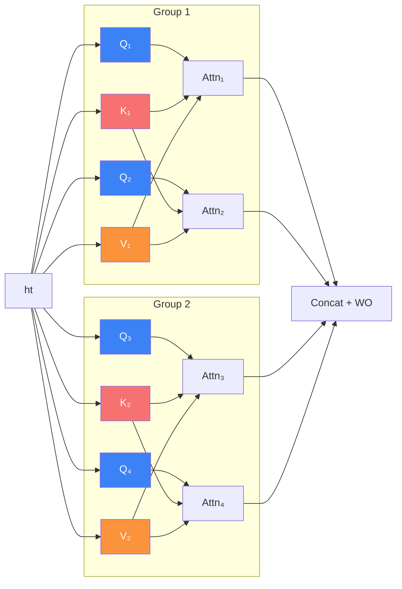
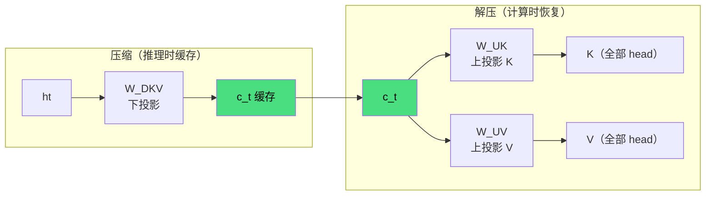
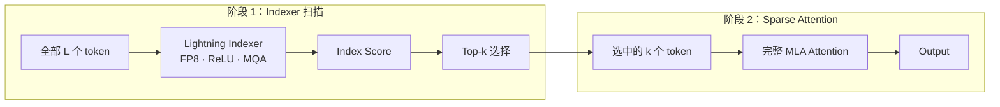

> 最近在看 GLM5，又开始绕各种 attention 了，借着 AI 让它梳理一下，方便后面自己再回头来看。

Transformer 架构自 2017 年提出以来，Attention 机制一直是其核心。但随着模型规模和上下文长度的增长，Attention 的两个瓶颈越来越突出：

1. **KV Cache 显存占用**：推理时需要缓存所有历史 token 的 Key 和 Value，128K 上下文 + 60 层的模型，KV cache 可以轻松超过 400GB
2. **计算复杂度**：每个 token 都要和所有历史 token 计算 attention score，复杂度为 $O(L^2)$

围绕这两个问题，业界先后提出了五种主要的 Attention 机制：

| 机制 | 年份 | 核心思路 | 代表模型 |
|------|------|---------|---------|
| Single-Head | 2014 | 基础 attention：query-key 匹配 + value 加权求和 | Seq2Seq with Attention |
| MHA | 2017 | 多头独立 attention | 原始 Transformer, GPT 系列 |
| MQA | 2019 | 所有 head 共享 KV | PaLM, StarCoder |
| GQA | 2023 | 分组共享 KV | LLaMA 2/3, Mistral |
| MLA | 2024 | 低秩压缩 KV 到 latent | DeepSeek-V2/V3 |
| DSA | 2025 | 稀疏化 attention pattern | DeepSeek-V3.2, GLM-5 |

下面从最基础的 Single-Head Attention 开始，逐一展开。

---

## 1. Single-Head Attention（基础 Attention）

> 在理解 MHA 之前，先搞清楚单头 Attention 的完整计算流程。这是所有后续变体的原子操作。

### 1.1 核心思想

Attention 的本质是一个**加权检索**过程：给定一个 query（"我在找什么"），在一组 key-value 对中，根据 query 和每个 key 的相似度，对 value 做加权求和。

用一个直觉类比：你在图书馆找资料（query），书架上每本书的标题是 key，书的内容是 value。你会根据标题和你需求的匹配程度（attention score），决定从每本书中"提取"多少信息。

在 Transformer 中，query、key、value 都来自输入序列本身（self-attention），通过不同的线性投影得到：

$$
\mathbf{q}_t = W^Q \mathbf{h}_t, \quad \mathbf{k}_t = W^K \mathbf{h}_t, \quad \mathbf{v}_t = W^V \mathbf{h}_t
$$

其中 $\mathbf{h}_t \in \mathbb{R}^d$ 是第 $t$ 个 token 的隐藏状态，$W^Q, W^K, W^V \in \mathbb{R}^{d \times d}$ 是可学习的投影矩阵。

> 为什么需要三个不同的投影？如果 Q、K、V 都直接用 $\mathbf{h}_t$，那 attention score 就是 $\mathbf{h}_t^\top \mathbf{h}_j$——纯粹的余弦相似度。通过不同的投影矩阵，模型可以学到"用什么视角去查询"（Q）、"用什么特征被匹配"（K）、"匹配后返回什么信息"（V）这三个独立的语义空间。

下图展示了 Single-Head Attention 的完整计算流程：

三个投影矩阵将同一个输入 $\mathbf{h}_t$ 映射到三个不同的语义空间，然后通过 score → softmax → 加权求和 得到输出。

### 1.2 公式推导

#### 符号约定

| 符号 | 含义 | 典型值 |
|------|------|--------|
| $d$ | 模型隐藏维度 | $512 \sim 8192$ |
| $L$ | 序列长度 | $512 \sim 128000$ |
| $\mathbf{h}_t$ | 第 $t$ 个 token 的隐藏状态 | $\in \mathbb{R}^d$ |
| $W^Q, W^K, W^V$ | 投影矩阵 | $\in \mathbb{R}^{d \times d}$ |

#### 公式 1.1：线性投影

$$
\mathbf{q}_t = W^Q \mathbf{h}_t \in \mathbb{R}^d
$$

$$
\mathbf{k}_t = W^K \mathbf{h}_t \in \mathbb{R}^d
$$

$$
\mathbf{v}_t = W^V \mathbf{h}_t \in \mathbb{R}^d
$$

**例子：** 设 $d = 4$，输入 $\mathbf{h}_2 = [1.0,\; 0.5,\; -0.3,\; 0.8]^\top$

$$
\underbrace{\mathbf{q}_2}_{(4 \times 1)} = \underbrace{W^Q}_{(4 \times 4)} \underbrace{\mathbf{h}_2}_{(4 \times 1)}
= \underbrace{\begin{bmatrix}
0.2 & 0.1 & -0.3 & 0.4 \\
-0.1 & 0.3 & 0.2 & 0.0 \\
0.3 & -0.1 & 0.1 & 0.2 \\
0.0 & 0.2 & -0.1 & 0.5
\end{bmatrix}}_{(4 \times 4)}
\underbrace{\begin{bmatrix} 1.0 \\ 0.5 \\ -0.3 \\ 0.8 \end{bmatrix}}_{(4 \times 1)}
= \begin{bmatrix}
0.2(1.0) + 0.1(0.5) + (-0.3)(-0.3) + 0.4(0.8) \\
(-0.1)(1.0) + 0.3(0.5) + 0.2(-0.3) + 0.0(0.8) \\
0.3(1.0) + (-0.1)(0.5) + 0.1(-0.3) + 0.2(0.8) \\
0.0(1.0) + 0.2(0.5) + (-0.1)(-0.3) + 0.5(0.8)
\end{bmatrix}
= \underbrace{\begin{bmatrix} 0.66 \\ -0.01 \\ 0.38 \\ 0.53 \end{bmatrix}}_{(4 \times 1)}
$$

同理用 $W^K$ 和 $W^V$ 分别计算 $\mathbf{k}_2$ 和 $\mathbf{v}_2$。序列中的每个 token 都做同样的投影。

#### 公式 1.2：Scaled Dot-Product Score

token $t$ 对 token $j$ 的 attention score：

$$
s_{t,j} = \frac{\mathbf{q}_t^\top \mathbf{k}_j}{\sqrt{d}}
$$

**为什么除以 $\sqrt{d}$？** 假设 $\mathbf{q}$ 和 $\mathbf{k}$ 的每个分量独立、均值为 0、方差为 1，则点积 $\mathbf{q}^\top \mathbf{k} = \sum_{i=1}^d q_i k_i$ 的方差为 $d$。当 $d$ 很大时（如 4096），点积值会非常大，导致 Softmax 输出接近 one-hot（梯度消失）。除以 $\sqrt{d}$ 将方差归一化为 1，保持 Softmax 在有效梯度区间。

**例子：** 设 $d = 4$，序列长度 $L = 3$

$$
\mathbf{q}_3 = \begin{bmatrix} 0.5 \\ -0.2 \\ 0.8 \\ 0.1 \end{bmatrix}, \quad
\mathbf{k}_1 = \begin{bmatrix} 0.3 \\ 0.7 \\ -0.1 \\ 0.4 \end{bmatrix}, \quad
\mathbf{k}_2 = \begin{bmatrix} -0.4 \\ 0.2 \\ 0.6 \\ -0.3 \end{bmatrix}, \quad
\mathbf{k}_3 = \begin{bmatrix} 0.6 \\ -0.1 \\ 0.3 \\ 0.5 \end{bmatrix}
$$

$$
s_{3,1} = \frac{0.5(0.3) + (-0.2)(0.7) + 0.8(-0.1) + 0.1(0.4)}{\sqrt{4}} = \frac{0.15 - 0.14 - 0.08 + 0.04}{2} = \frac{-0.03}{2} = -0.015
$$

$$
s_{3,2} = \frac{0.5(-0.4) + (-0.2)(0.2) + 0.8(0.6) + 0.1(-0.3)}{2} = \frac{-0.20 - 0.04 + 0.48 - 0.03}{2} = \frac{0.21}{2} = 0.105
$$

$$
s_{3,3} = \frac{0.5(0.6) + (-0.2)(-0.1) + 0.8(0.3) + 0.1(0.5)}{2} = \frac{0.30 + 0.02 + 0.24 + 0.05}{2} = \frac{0.61}{2} = 0.305
$$

#### 公式 1.3：Causal Mask + Softmax

在自回归模型中，token $t$ 只能看到位置 $\leq t$ 的 token。对于 $j > t$，将 score 设为 $-\infty$：

$$
\alpha_{t,j} = \text{Softmax}_j\left(\tilde{s}_{t,j}\right) = \frac{\exp(\tilde{s}_{t,j})}{\sum_{l=1}^{t} \exp(\tilde{s}_{t,l})}
$$

**例子：** token $t=3$ 的 score 为 $[-0.015, 0.105, 0.305]$（三个 token 都可见）

$$
\alpha_{3,1} = \frac{e^{-0.015}}{e^{-0.015} + e^{0.105} + e^{0.305}} = \frac{0.985}{0.985 + 1.111 + 1.357} = \frac{0.985}{3.453} = 0.285
$$

$$
\alpha_{3,2} = \frac{1.111}{3.453} = 0.322, \quad \alpha_{3,3} = \frac{1.357}{3.453} = 0.393
$$

验证：$0.285 + 0.322 + 0.393 = 1.000$ ✓

token 3 对自己的 attention weight 最大（0.393），这在实践中很常见——当前 token 通常对自身有较强的关注。

#### 公式 1.4：加权求和

$$
\mathbf{o}_t = \sum_{j=1}^{t} \alpha_{t,j} \cdot \mathbf{v}_j
$$

**例子：**

$$
\mathbf{v}_1 = \begin{bmatrix} 0.2 \\ 0.4 \\ -0.1 \\ 0.3 \end{bmatrix}, \quad
\mathbf{v}_2 = \begin{bmatrix} -0.3 \\ 0.1 \\ 0.5 \\ 0.2 \end{bmatrix}, \quad
\mathbf{v}_3 = \begin{bmatrix} 0.4 \\ -0.2 \\ 0.3 \\ 0.6 \end{bmatrix}
$$

$$
\mathbf{o}_3 = 0.285 \begin{bmatrix} 0.2 \\ 0.4 \\ -0.1 \\ 0.3 \end{bmatrix}
+ 0.322 \begin{bmatrix} -0.3 \\ 0.1 \\ 0.5 \\ 0.2 \end{bmatrix}
+ 0.393 \begin{bmatrix} 0.4 \\ -0.2 \\ 0.3 \\ 0.6 \end{bmatrix}
$$

逐元素计算：

$$
o[0] = 0.285 \times 0.2 + 0.322 \times (-0.3) + 0.393 \times 0.4 = 0.057 - 0.097 + 0.157 = 0.117
$$

$$
o[1] = 0.285 \times 0.4 + 0.322 \times 0.1 + 0.393 \times (-0.2) = 0.114 + 0.032 - 0.079 = 0.067
$$

$$
o[2] = 0.285 \times (-0.1) + 0.322 \times 0.5 + 0.393 \times 0.3 = -0.029 + 0.161 + 0.118 = 0.250
$$

$$
o[3] = 0.285 \times 0.3 + 0.322 \times 0.2 + 0.393 \times 0.6 = 0.086 + 0.064 + 0.236 = 0.386
$$

$$
\mathbf{o}_3 = \begin{bmatrix} 0.117 \\ 0.067 \\ 0.250 \\ 0.386 \end{bmatrix} \in \mathbb{R}^4
$$

这个输出向量是所有可见 token 的 value 的加权组合，权重由 query-key 相似度决定。

#### 矩阵形式

上面是逐 token 的写法，实际实现中用矩阵运算一次处理整个序列：

$$
\text{Attention}(Q, K, V) = \text{Softmax}\left(\frac{QK^\top}{\sqrt{d}}\right) V
$$

其中 $Q, K, V \in \mathbb{R}^{L \times d}$ 分别是所有 token 的 query、key、value 按行堆叠的矩阵。$QK^\top \in \mathbb{R}^{L \times L}$ 就是完整的 attention score 矩阵。

### 1.3 Single-Head 的局限性

Single-Head Attention 只有一组 $W^Q, W^K, W^V$，意味着模型只能学到**一种** query-key 匹配模式。但自然语言中的依赖关系是多样的：

- **语法依赖**："The cat **that** sat on the mat **is** black" — "is" 需要关注远处的 "cat"
- **语义相似**："I love **dogs**. **Puppies** are adorable." — "Puppies" 需要关注 "dogs"
- **位置邻近**：相邻 token 之间的局部依赖
- **指代消解**："**Alice** went to the store. **She** bought milk." — "She" 需要关注 "Alice"

一个 head 很难同时捕捉所有这些模式。这就是 MHA 要解决的问题。

### 1.4 参数量与计算量

| 项目 | 公式 | $d = 4096$ 时的值 |
|------|------|-------------------|
| 参数量 | $3d^2$（Q、K、V 三个投影矩阵） | $\sim 50\text{M}$ |
| Score 矩阵大小 | $L \times L$ | $L^2$ |
| 计算复杂度 | $O(L^2 \cdot d)$ | — |
| KV Cache（每 token 每 layer） | $2d$ | $8{,}192$ 个元素 |

### 1.5 交互动画：Single-Head Attention 计算过程

<iframe id="sha-iframe" src="/_ci/blog/attention-mechanisms-evolution/animations/sha-animation.html" style="width:100%;height:450px;border:none;border-radius:8px;margin:16px 0" onload="this.style.height=this.contentDocument.documentElement.scrollHeight+'px'" loading="lazy"></iframe>

---

## 2. MHA（Multi-Head Attention）

> 2017 年 Vaswani 等人在 "Attention Is All You Need" 中提出，是所有后续变体的基础。

### 2.1 核心思想

上一节的 Single-Head Attention 只有一组投影矩阵，只能学到一种 query-key 匹配模式。MHA 的核心想法是：**把 $d$ 维空间拆成 $n_h$ 个 $d_h$ 维的子空间，每个子空间独立做 attention，最后合并结果**。

直觉上，这就像让多个专家分别从不同角度审视同一段文本：
- Head 1 可能关注主谓关系
- Head 2 可能关注指代消解
- Head 3 可能关注位置邻近性
- ...

每个 head 独立计算自己的 attention，最后把所有 head 的结果拼接起来，通过一个线性变换融合。

> 注意参数量的变化：Single-Head 用 $W^Q \in \mathbb{R}^{d \times d}$，MHA 用 $n_h$ 个 $W_i^Q \in \mathbb{R}^{d_h \times d}$。由于 $n_h \times d_h = d$，总参数量不变——MHA 并没有增加参数，只是把同样的参数"分配"到了多个独立的子空间中。

下图对比了 Single-Head 和 Multi-Head 的结构差异（以 $n_h = 3$ 为例）：

关键区别：Single-Head 在完整的 $d$ 维空间做一次 attention；MHA 把 $d$ 维拆成 $n_h$ 个 $d_h$ 维子空间，每个子空间独立做 attention，最后拼接并通过 $W^O$ 融合。

### 2.2 公式推导

#### 符号约定

| 符号 | 含义 | 典型值 |
|------|------|--------|
| $d$ | 模型隐藏维度 | $4096 \sim 8192$ |
| $n_h$ | head 数量 | $32 \sim 128$ |
| $d_h$ | 每个 head 的维度，$d_h = d / n_h$ | $64 \sim 128$ |
| $L$ | 序列长度 | $4096 \sim 128000$ |
| $\mathbf{h}_t$ | 第 $t$ 个 token 的隐藏状态 | $\in \mathbb{R}^d$ |

#### 公式 2.1：线性投影

每个 head $i$ 有独立的投影矩阵，将输入映射到 query、key、value 空间：

$$
\mathbf{q}_{t,i} = W_i^Q \mathbf{h}_t \in \mathbb{R}^{d_h}
$$

$$
\mathbf{k}_{t,i} = W_i^K \mathbf{h}_t \in \mathbb{R}^{d_h}
$$

$$
\mathbf{v}_{t,i} = W_i^V \mathbf{h}_t \in \mathbb{R}^{d_h}
$$

其中 $W_i^Q, W_i^K, W_i^V \in \mathbb{R}^{d_h \times d}$。

**例子：** 设 $d = 6,\; n_h = 2,\; d_h = 3$，输入 $\mathbf{h}_3 = [1.0,\; 0.5,\; -0.3,\; 0.8,\; -0.1,\; 0.6]^\top$

Head 1 的 query 投影（$W_1^Q \in \mathbb{R}^{3 \times 6}$）：

$$
\underbrace{\mathbf{q}_{3,1}}_{(3 \times 1)} = \underbrace{W_1^Q}_{(3 \times 6)} \underbrace{\mathbf{h}_3}_{(6 \times 1)}
= \underbrace{\begin{bmatrix}
0.2 & 0.1 & -0.3 & 0.4 & 0.0 & 0.1 \\
-0.1 & 0.3 & 0.2 & 0.0 & 0.5 & -0.2 \\
0.3 & -0.1 & 0.1 & 0.2 & -0.2 & 0.4
\end{bmatrix}}_{(3 \times 6)}
\underbrace{\begin{bmatrix} 1.0 \\ 0.5 \\ -0.3 \\ 0.8 \\ -0.1 \\ 0.6 \end{bmatrix}}_{(6 \times 1)}
= \begin{bmatrix}
0.2(1.0) + 0.1(0.5) + (-0.3)(-0.3) + 0.4(0.8) + 0.0(-0.1) + 0.1(0.6) \\
(-0.1)(1.0) + 0.3(0.5) + 0.2(-0.3) + 0.0(0.8) + 0.5(-0.1) + (-0.2)(0.6) \\
0.3(1.0) + (-0.1)(0.5) + 0.1(-0.3) + 0.2(0.8) + (-0.2)(-0.1) + 0.4(0.6)
\end{bmatrix}
= \underbrace{\begin{bmatrix} 0.72 \\ -0.21 \\ 0.66 \end{bmatrix}}_{(3 \times 1)}
$$

同理可以计算 $\mathbf{k}_{3,1}$ 和 $\mathbf{v}_{3,1}$，以及 Head 2 的所有投影。

> 关键点：每个 head 的投影矩阵是独立的，所以同一个输入 $\mathbf{h}_t$ 在不同 head 中会被映射到不同的子空间。这就是"多头"的含义——多个视角。

#### 公式 2.2：Scaled Dot-Product Attention Score

对于 head $i$，token $t$ 对 token $j$ 的 attention score：

$$
s_{t,j,i} = \frac{\mathbf{q}_{t,i}^\top \mathbf{k}_{j,i}}{\sqrt{d_h}}
$$

除以 $\sqrt{d_h}$ 是为了防止点积值过大导致 Softmax 梯度消失。直觉上，$d_h$ 维向量的点积期望值与 $d_h$ 成正比，除以 $\sqrt{d_h}$ 将其归一化到合理范围。

**例子：** 设 $d_h = 3$

$$
\mathbf{q}_{3,1} = \begin{bmatrix} 0.72 \\ -0.21 \\ 0.66 \end{bmatrix}, \quad
\mathbf{k}_{1,1} = \begin{bmatrix} 0.5 \\ 0.3 \\ -0.1 \end{bmatrix}, \quad
\mathbf{k}_{2,1} = \begin{bmatrix} -0.2 \\ 0.8 \\ 0.4 \end{bmatrix}
$$

$$
s_{3,1,1} = \frac{0.72 \times 0.5 + (-0.21) \times 0.3 + 0.66 \times (-0.1)}{\sqrt{3}} = \frac{0.360 - 0.063 - 0.066}{1.732} = \frac{0.231}{1.732} = 0.133
$$

$$
s_{3,2,1} = \frac{0.72 \times (-0.2) + (-0.21) \times 0.8 + 0.66 \times 0.4}{\sqrt{3}} = \frac{-0.144 - 0.168 + 0.264}{1.732} = \frac{-0.048}{1.732} = -0.028
$$

#### 公式 2.3：Causal Mask

在自回归（decoder-only）模型中，token $t$ 只能看到 $t$ 及之前的 token：

$$
\tilde{s}_{t,j,i} = \begin{cases} s_{t,j,i} & \text{if } j \leq t \\ -\infty & \text{if } j > t \end{cases}
$$

这确保了生成过程中不会"偷看"未来的 token。$-\infty$ 经过 Softmax 后变为 $0$，等效于完全忽略。

#### 公式 2.4：Softmax 归一化

$$
\alpha_{t,j,i} = \text{Softmax}_j(\tilde{s}_{t,j,i}) = \frac{\exp(\tilde{s}_{t,j,i})}{\sum_{l=1}^{t} \exp(\tilde{s}_{t,l,i})}
$$

**例子：** 设 token $t=3$ 对 token $j=1,2,3$ 的 score 为 $[0.133, -0.028, 0.215]$

$$
\alpha_{3,1,1} = \frac{e^{0.133}}{e^{0.133} + e^{-0.028} + e^{0.215}} = \frac{1.142}{1.142 + 0.972 + 1.240} = \frac{1.142}{3.354} = 0.340
$$

$$
\alpha_{3,2,1} = \frac{0.972}{3.354} = 0.290, \quad \alpha_{3,3,1} = \frac{1.240}{3.354} = 0.370
$$

验证：$0.340 + 0.290 + 0.370 = 1.000$ ✓

> 注意 attention weight 之和为 1，这意味着输出是 value 向量的凸组合。score 最高的 token 3 获得了最大的权重 0.370。

#### 公式 2.5：加权求和

$$
\mathbf{o}_{t,i} = \sum_{j=1}^{t} \alpha_{t,j,i} \cdot \mathbf{v}_{j,i}
$$

**例子：**

$$
\mathbf{v}_{1,1} = \begin{bmatrix} 0.1 \\ 0.3 \\ 0.5 \end{bmatrix}, \quad
\mathbf{v}_{2,1} = \begin{bmatrix} 0.4 \\ 0.1 \\ 0.2 \end{bmatrix}, \quad
\mathbf{v}_{3,1} = \begin{bmatrix} 0.3 \\ 0.6 \\ 0.1 \end{bmatrix}
$$

$$
\mathbf{o}_{3,1} = 0.340 \begin{bmatrix} 0.1 \\ 0.3 \\ 0.5 \end{bmatrix}
+ 0.290 \begin{bmatrix} 0.4 \\ 0.1 \\ 0.2 \end{bmatrix}
+ 0.370 \begin{bmatrix} 0.3 \\ 0.6 \\ 0.1 \end{bmatrix}
$$

逐元素计算：

$$
o[0] = 0.340 \times 0.1 + 0.290 \times 0.4 + 0.370 \times 0.3 = 0.034 + 0.116 + 0.111 = 0.261
$$

$$
o[1] = 0.340 \times 0.3 + 0.290 \times 0.1 + 0.370 \times 0.6 = 0.102 + 0.029 + 0.222 = 0.353
$$

$$
o[2] = 0.340 \times 0.5 + 0.290 \times 0.2 + 0.370 \times 0.1 = 0.170 + 0.058 + 0.037 = 0.265
$$

$$
\mathbf{o}_{3,1} = \begin{bmatrix} 0.261 \\ 0.353 \\ 0.265 \end{bmatrix} \in \mathbb{R}^3
$$

> Head 2 的计算方式完全相同，只是使用 $\mathbf{q}_{t,2}, \mathbf{k}_{j,2}, \mathbf{v}_{j,2}$，会得到不同的结果。

#### 公式 2.6：合并所有 Head

$$
\mathbf{u}_t = W^O [\mathbf{o}_{t,1};\; \mathbf{o}_{t,2};\; \dots;\; \mathbf{o}_{t,n_h}], \quad W^O \in \mathbb{R}^{d \times (n_h d_h)}
$$

**例子：** 假设 Head 2 的输出为 $\mathbf{o}_{3,2} = [0.18,\; 0.42,\; 0.31]^\top$，拼接后：

$$
[\mathbf{o}_{3,1};\; \mathbf{o}_{3,2}] = \begin{bmatrix} 0.261 \\ 0.353 \\ 0.265 \\ 0.180 \\ 0.420 \\ 0.310 \end{bmatrix} \in \mathbb{R}^6
$$

然后通过 $W^O \in \mathbb{R}^{6 \times 6}$ 投影回 $d$ 维空间，得到最终输出 $\mathbf{u}_t \in \mathbb{R}^6$。

> 这个输出投影矩阵 $W^O$ 的作用是让不同 head 的信息互相交流。在 head 内部，各 head 是完全独立的；$W^O$ 是唯一的跨 head 信息融合点。

### 2.3 KV Cache 分析

推理时需要缓存所有过去 token 的 K 和 V：

$$
\text{KV Cache（每 token 每 layer）} = 2 \times n_h \times d_h
$$

**例子：** $n_h = 128,\; d_h = 128$

$$
\text{每 token 每 layer} = 2 \times 128 \times 128 = 32{,}768 \text{ 个元素}
$$

$$
\text{整个模型}(L=128\text{K},\; l=60,\; \text{FP16}) = 128{,}000 \times 60 \times 32{,}768 \times 2\text{ bytes} \approx 469 \text{ GB}
$$

> 这就是为什么长上下文推理如此昂贵——光 KV cache 就需要数百 GB 显存，远超模型参数本身的大小。

### 2.4 计算复杂度

$$
O(L^2 \cdot d)
$$

对于每个 token（共 $L$ 个），要和所有 $L$ 个 token 计算点积，每次点积涉及 $d$ 维。

当 $L = 128\text{K}$ 时，$L^2 \approx 1.64 \times 10^{10}$，这个二次方的增长是 Transformer 处理超长序列的主要瓶颈。

### 2.5 MHA 的局限性

MHA 的设计在质量上是优秀的——每个 head 独立的 KV 提供了最大的表达能力。但在推理效率上存在两个根本问题：

1. **KV Cache 线性增长**：cache 大小与 $n_h$ 成正比，head 越多、序列越长，显存压力越大
2. **计算量二次增长**：每个 token 都要和所有历史 token 交互，长序列下计算量爆炸

后续的 MQA、GQA、MLA、DSA 都是围绕这两个问题展开的优化。

### 2.6 交互动画：MHA 计算过程（Head 1）

<iframe id="mha-iframe" src="/_ci/blog/attention-mechanisms-evolution/animations/mha-animation.html" style="width:100%;height:420px;border:none;border-radius:8px;margin:16px 0" onload="this.style.height=this.contentDocument.documentElement.scrollHeight+'px'" loading="lazy"></iframe>

---

## 3. MQA（Multi-Query Attention）

> 2019 年 Shazeer 提出。核心改动：所有 query head 共享同一组 K 和 V。

### 3.1 核心思想

MHA 中每个 head 有独立的 K 和 V，导致 KV cache 很大。MQA 的想法很简单：**query 保持多个 head，但 K 和 V 只保留一份，所有 head 共享**。

每个 head 有独立的 Q（蓝色），但所有 head 共用同一个 K（红色）和 V（橙色）。KV cache 从 $n_h$ 份缩减到 1 份。

### 3.2 公式

$$
\mathbf{q}_t = W^Q \mathbf{h}_t \in \mathbb{R}^{n_h d_h} \quad \text{（和 MHA 一样，每个 head 独立的 query）}
$$

$$
\mathbf{k}_t = W^K \mathbf{h}_t \in \mathbb{R}^{d_h} \quad \text{（只有 1 份 key，注意维度是 } d_h \text{ 而不是 } n_h d_h \text{）}
$$

$$
\mathbf{v}_t = W^V \mathbf{h}_t \in \mathbb{R}^{d_h} \quad \text{（只有 1 份 value）}
$$

Attention 计算变为：

$$
\alpha_{t,j,i} = \text{Softmax}_j \left( \frac{\mathbf{q}_{t,i}^\top \mathbf{k}_j}{\sqrt{d_h}} \right)
$$

注意：$\mathbf{k}_j$ 没有下标 $i$，所有 head 共享同一个 key。

$$
\mathbf{o}_{t,i} = \sum_{j=1}^{t} \alpha_{t,j,i} \cdot \mathbf{v}_j
$$

同样，$\mathbf{v}_j$ 也没有下标 $i$。

### 3.3 与 MHA 的对比例子

设 $n_h = 2,\; d_h = 3$，token $t=2$ 对 token $j=1,2$ 做 attention：

**MHA（每个 head 独立 K）：**

$$
\text{Head 1: } \mathbf{k}_{1,1} = \begin{bmatrix} 0.2 \\ 0.9 \\ -0.1 \end{bmatrix}, \quad
\text{Head 2: } \mathbf{k}_{1,2} = \begin{bmatrix} 0.5 \\ -0.3 \\ 0.7 \end{bmatrix}
$$

Head 1 和 Head 2 看到的是 token 1 的不同"侧面"。

**MQA（所有 head 共享 K）：**

$$
\text{Head 1 和 Head 2 共用: } \mathbf{k}_1 = \begin{bmatrix} 0.3 \\ 0.4 \\ 0.2 \end{bmatrix}
$$

两个 head 看到的是 token 1 的同一个"侧面"，只是各自的 query 不同。

**Score 计算对比：**

| | MHA | MQA |
|---|---|---|
| Head 1 score | $\mathbf{q}_{2,1}^\top \mathbf{k}_{1,\color{red}{1}}$ | $\mathbf{q}_{2,1}^\top \mathbf{k}_{1}$ |
| Head 2 score | $\mathbf{q}_{2,2}^\top \mathbf{k}_{1,\color{red}{2}}$ | $\mathbf{q}_{2,2}^\top \mathbf{k}_{1}$ |
| K 不同？ | ✅ 每个 head 的 K 不同 | ❌ 所有 head 共享同一个 K |

### 3.4 KV Cache 对比

$$
\text{MHA: } 2 \times n_h \times d_h = 2 \times 128 \times 128 = 32{,}768 \text{ 元素/token/layer}
$$

$$
\text{MQA: } 2 \times 1 \times d_h = 2 \times 128 = 256 \text{ 元素/token/layer}
$$

$$
\text{压缩比} = \frac{256}{32{,}768} = \frac{1}{128} \approx 0.78\%
$$

### 3.5 优缺点

- ✅ KV cache 缩小到 MHA 的 $\frac{1}{n_h}$
- ✅ 推理吞吐量大幅提升
- ❌ 所有 head 被迫共享同一个 K 和 V，表达能力下降
- ❌ 在复杂推理任务上质量明显不如 MHA

---

## 4. GQA（Grouped-Query Attention）

> 2023 年 Ainslie 等人提出。MHA 和 MQA 的折中方案。

### 4.1 核心思想

将 $n_h$ 个 query head 分成 $g$ 组，**每组内的 head 共享一个 K 和 V**。

- 当 $g = n_h$ 时，退化为 MHA（每个 head 独立 KV）
- 当 $g = 1$ 时，退化为 MQA（所有 head 共享 KV）
- 当 $1 < g < n_h$ 时，在质量和效率之间取平衡

GQA 用 subgraph 框划分 Group：Q₁Q₂ 共享 K₁V₁（Group 1），Q₃Q₄ 共享 K₂V₂（Group 2）。组内 K（红色）和 V（橙色）共享，组间独立。

### 4.2 公式

设每组有 $n_h / g$ 个 query head。对于第 $i$ 个 head，它属于第 $\lceil i \cdot g / n_h \rceil$ 组：

$$
\text{group}(i) = \left\lceil \frac{i \cdot g}{n_h} \right\rceil
$$

$$
\alpha_{t,j,i} = \text{Softmax}_j \left( \frac{\mathbf{q}_{t,i}^\top \mathbf{k}_{j,\text{group}(i)}}{\sqrt{d_h}} \right)
$$

$$
\mathbf{o}_{t,i} = \sum_{j=1}^{t} \alpha_{t,j,i} \cdot \mathbf{v}_{j,\text{group}(i)}
$$

### 4.3 例子

设 $n_h = 8,\; g = 2$，每组 $8/2 = 4$ 个 query head：

$$
\underbrace{Q_1, Q_2, Q_3, Q_4}_{\text{Group 1：共享 } K_1, V_1} \quad
\underbrace{Q_5, Q_6, Q_7, Q_8}_{\text{Group 2：共享 } K_2, V_2}
$$

具体 score 计算：

$$
\text{Head 1 (Group 1): } \text{score} = \frac{\mathbf{q}_{t,1}^\top \mathbf{k}_{j,\color{blue}{1}}}{\sqrt{d_h}}
$$

$$
\text{Head 3 (Group 1): } \text{score} = \frac{\mathbf{q}_{t,3}^\top \mathbf{k}_{j,\color{blue}{1}}}{\sqrt{d_h}} \quad \text{（和 Head 1 用同一个 K）}
$$

$$
\text{Head 5 (Group 2): } \text{score} = \frac{\mathbf{q}_{t,5}^\top \mathbf{k}_{j,\color{red}{2}}}{\sqrt{d_h}} \quad \text{（用不同的 K）}
$$

### 4.4 KV Cache 对比

| 机制 | 公式 | $n_h=128,\; d_h=128$ 时的值 |
|------|------|---------------------------|
| MHA ($g = n_h$) | $2 \times n_h \times d_h$ | $32{,}768$ |
| GQA ($g = 8$) | $2 \times g \times d_h$ | $2{,}048$ |
| GQA ($g = 4$) | $2 \times g \times d_h$ | $1{,}024$ |
| MQA ($g = 1$) | $2 \times d_h$ | $256$ |

### 4.5 交互动画：GQA 分组共享 KV 的计算过程

<iframe id="kv-iframe" src="/_ci/blog/attention-mechanisms-evolution/animations/kv-sharing.html" style="width:100%;height:580px;border:none;border-radius:8px;margin:16px 0" onload="this.style.height=this.contentDocument.documentElement.scrollHeight+'px'" loading="lazy"></iframe>

---

## 5. MLA（Multi-Head Latent Attention）

> 2024 年 DeepSeek-V2 提出。核心思想完全不同于 MQA/GQA——不是减少 KV head 数量，而是把 K 和 V **联合压缩**到一个低维 latent 向量中。

### 5.1 核心思想

MQA 和 GQA 通过"共享 head"来减少 KV cache，但这会损失表达能力。MLA 换了一个思路：

> **不减少 head 数量，而是把所有 head 的 K 和 V 压缩到一个很小的 latent 向量里。需要时再解压。**

类比：MQA/GQA 像是"几个人合看一本书"，MLA 像是"把整本书压缩成摘要存起来，需要时再展开"。

下图展示了 MLA 的压缩-解压流程：

关键：缓存的是压缩后的 $\mathbf{c}_t^{KV} \in \mathbb{R}^{d_c}$（如 512 维），而不是完整的 K 和 V（如 32768 维）。

### 5.2 公式推导

#### 公式 5.1：Low-Rank KV Joint Compression（低秩 KV 联合压缩）

**下投影（压缩）：**

$$
\mathbf{c}_t^{KV} = W^{DKV} \mathbf{h}_t
$$

| 符号 | 含义 | 维度 |
|------|------|------|
| $\mathbf{h}_t$ | 输入隐藏状态 | $\mathbb{R}^d$，例如 $\mathbb{R}^{5120}$ |
| $W^{DKV}$ | 下投影矩阵（Down-projection） | $\mathbb{R}^{d_c \times d}$，例如 $\mathbb{R}^{512 \times 5120}$ |
| $\mathbf{c}_t^{KV}$ | 压缩后的 latent 向量 | $\mathbb{R}^{d_c}$，例如 $\mathbb{R}^{512}$ |

> ⭐ **推理时只需要缓存这个 $\mathbf{c}_t^{KV}$**，而不是完整的 K 和 V。

**上投影（解压）：**

$$
\mathbf{k}_t^C = W^{UK} \mathbf{c}_t^{KV}, \quad W^{UK} \in \mathbb{R}^{(n_h d_h) \times d_c}
$$

$$
\mathbf{v}_t^C = W^{UV} \mathbf{c}_t^{KV}, \quad W^{UV} \in \mathbb{R}^{(n_h d_h) \times d_c}
$$

从同一个 latent 向量 $\mathbf{c}_t^{KV}$ 恢复出完整的 K 和 V。

**例子：** 设 $d = 6,\; n_h = 2,\; d_h = 3,\; d_c = 2$（极度简化）。

输入：

$$
\mathbf{h}_t = \begin{bmatrix} 1.0 \\ 0.5 \\ -0.3 \\ 0.8 \\ -0.1 \\ 0.6 \end{bmatrix} \in \mathbb{R}^6
$$

下投影矩阵 $W^{DKV} \in \mathbb{R}^{2 \times 6}$：

$$
W^{DKV} = \begin{bmatrix}
0.3 & 0.1 & -0.2 & 0.4 & 0.0 & 0.1 \\
-0.1 & 0.2 & 0.3 & 0.0 & 0.5 & -0.2
\end{bmatrix}
$$

计算 latent 向量：

$$
\mathbf{c}_t^{KV} = W^{DKV} \mathbf{h}_t = \begin{bmatrix}
0.30 + 0.05 + 0.06 + 0.32 + 0.00 + 0.06 \\
-0.10 + 0.10 - 0.09 + 0.00 - 0.05 - 0.12
\end{bmatrix}
= \begin{bmatrix} 0.79 \\ -0.26 \end{bmatrix} \in \mathbb{R}^2
$$

> 关键：原来需要缓存 $\mathbf{k}_t \in \mathbb{R}^6$ 和 $\mathbf{v}_t \in \mathbb{R}^6$（共 $12$ 个元素），现在只需缓存 $\mathbf{c}_t^{KV} \in \mathbb{R}^2$（$2$ 个元素）。压缩比 $= 2/12 \approx 16.7\%$。

**实际规模的压缩比：**

$$
\text{MHA cache} = 2 \times n_h \times d_h = 2 \times 128 \times 128 = 32{,}768
$$

$$
\text{MLA cache} = d_c = 512
$$

$$
\text{压缩比} = \frac{512}{32{,}768} = 1.56\%
$$

#### 公式 5.2：Absorption Trick（吸收技巧）

这是 MLA 推理速度快的关键。

**问题：** 如果每次计算 score 都要先把 $\mathbf{c}_j^{KV}$ 上投影成完整的 $\mathbf{k}_j$，那压缩就没意义了——计算量反而更大。

**解决方案：** 利用矩阵乘法的结合律，把上投影矩阵"吸收"进 query 投影中。

推导过程（省略 head 下标 $i$）：

$$
\text{score} = \mathbf{q}_t^\top \mathbf{k}_j^C = (W^Q \mathbf{h}_t)^\top (W^{UK} \mathbf{c}_j^{KV})
$$

$$
= \mathbf{h}_t^\top (W^Q)^\top W^{UK} \mathbf{c}_j^{KV}
$$

利用结合律，重新分组：

$$
= \mathbf{h}_t^\top \underbrace{(W^Q)^\top W^{UK}}_{\text{可以预计算为 } \tilde{W}} \mathbf{c}_j^{KV}
$$

定义"吸收后的 query"：

$$
\tilde{\mathbf{q}}_t = \tilde{W}^\top \mathbf{h}_t \in \mathbb{R}^{d_c}
$$

最终：

$$
\boxed{\text{score} = \tilde{\mathbf{q}}_t^\top \mathbf{c}_j^{KV}}
$$

**对比：**

不用 absorption（慢）：对每个缓存 token $j$，先上投影 $\mathbf{k}_j = W^{UK} \mathbf{c}_j^{KV} \in \mathbb{R}^{n_h d_h}$，再做 $n_h d_h$ 维点积。

$$
\text{128,000 个 token} \times 16{,}384 \text{ 维点积} = 2.1 \times 10^9 \text{ 次乘法}
$$

用 absorption（快）：变换 query 一次 $\tilde{\mathbf{q}}_t \in \mathbb{R}^{d_c}$，然后对每个缓存 token 做 $d_c$ 维点积。

$$
\text{128,000 个 token} \times 512 \text{ 维点积} = 6.6 \times 10^7 \text{ 次乘法}
$$

$$
\text{加速比} = \frac{16{,}384}{512} = 32\times
$$

#### 公式 5.3：Decoupled RoPE（解耦位置编码）

**问题：** RoPE（Rotary Position Embedding）会在 Q 和 K 之间插入位置相关的旋转矩阵 $\mathcal{R}_t$，破坏了 absorption trick 所依赖的矩阵结合律。

**解决方案：** 把位置信息单独拆出来，用额外的小向量携带。

最终 score 是两部分之和：

$$
\boxed{\text{score} = \underbrace{\tilde{\mathbf{q}}_{t,i}^\top \mathbf{c}_j^{KV}}_{\text{内容相关性（可 absorption）}} + \underbrace{(\mathbf{q}_{t,i}^{\text{RoPE}})^\top \mathbf{k}_j^R}_{\text{位置相关性（维度很小，直接算）}}}
$$

**例子：** 设 $d_c = 512,\; d_h^R = 64$

- 内容部分：$\tilde{\mathbf{q}}_t \in \mathbb{R}^{512}$，$\mathbf{c}_j^{KV} \in \mathbb{R}^{512}$ → 512 维点积（用 absorption）
- 位置部分：$\mathbf{q}_t^{\text{RoPE}} \in \mathbb{R}^{64}$，$\mathbf{k}_j^R \in \mathbb{R}^{64}$ → 64 维点积（直接算，很小）

$$
\text{总 cache 每 token} = d_c + d_h^R = 512 + 64 = 576 \text{ 个元素}
$$

### 5.3 KV Cache 全面对比

| 机制 | Cache 公式 | 数值（$n_h\!=\!128, d_h\!=\!128$） | 相对 MHA |
|------|-----------|----------------------------------|----------|
| MHA | $2 n_h d_h$ | $32{,}768$ | $100\%$ |
| GQA ($g\!=\!8$) | $2 g d_h$ | $2{,}048$ | $6.25\%$ |
| MQA | $2 d_h$ | $256$ | $0.78\%$ |
| MLA | $d_c + d_h^R$ | $576$ | $1.76\%$ |

> MLA 的 cache 比 MQA 稍大（$576$ vs $256$），但质量比 MHA 还好——这是 MLA 的核心优势。

### 5.4 为什么 MLA 质量比 MHA 还好？

1. **低秩压缩起到了正则化作用**：强制 K 和 V 通过一个 bottleneck（$d_c \ll n_h d_h$），过滤掉噪声
2. **联合压缩**：K 和 V 共享同一个 latent，让模型学到 K 和 V 之间的关联
3. **Query 也做了低秩压缩**：减少了训练时的 activation memory，允许更大的 batch size

### 5.5 交互动画：MLA 压缩与 Absorption Trick 计算过程

<iframe id="mla-iframe" src="/_ci/blog/attention-mechanisms-evolution/animations/mla-absorption.html" style="width:100%;height:520px;border:none;border-radius:8px;margin:16px 0" onload="this.style.height=this.contentDocument.documentElement.scrollHeight+'px'" loading="lazy"></iframe>

---

## 6. DSA（DeepSeek Sparse Attention）

> 2025 年 DeepSeek-V3.2 提出。MLA 解决了"存什么"（KV cache 压缩），DSA 解决了"算多少"（不再对所有 token 做 attention）。

### 6.1 核心思想

MLA 虽然把 KV cache 压缩了 $98\%$，但 attention 的计算量仍然是 $O(L^2)$——每个 query token 要和所有 $L$ 个过去 token 计算 score。

$$
L = 128{,}000 \text{ 时：每个 token 的 attention 计算} \propto 128{,}000 \text{ 次点积}
$$

$$
\text{整个序列：} 128{,}000 \times 128{,}000 = 1.64 \times 10^{10} \text{ 次点积}
$$

DSA 的解决方案：

> **用一个极其廉价的 Lightning Indexer 先扫描所有 token，选出最相关的 $k$ 个，然后只对这 $k$ 个 token 做完整的 MLA attention。**

$$
\text{DSA 计算量} \propto 128{,}000 \times 2{,}048 = 2.62 \times 10^8 \quad \text{（核心 attention 部分）}
$$

$$
\text{加速比} = \frac{1.64 \times 10^{10}}{2.62 \times 10^8} \approx 63\times
$$

### 6.2 Lightning Indexer 公式

#### 公式 6.1：Index Score

对于 query token $\mathbf{h}_t$ 和过去 token $\mathbf{h}_s$，indexer 计算一个标量 index score：

$$
I_{t,s} = \sum_{j=1}^{H_I} w_{t,j}^I \cdot \text{ReLU}\left( (\mathbf{q}_{t,j}^I)^\top \mathbf{k}_s^I \right)
$$

| 符号 | 含义 | 说明 |
|------|------|------|
| $H_I$ | indexer 的 head 数量（$64$） | 比主 attention 的 $128$ 少 |
| $w_{t,j}^I$ | 第 $j$ 个 indexer head 的权重 | 从 $\mathbf{h}_t$ 派生 |
| $\mathbf{q}_{t,j}^I$ | indexer query | 从 MLA 的 $\mathbf{c}_t^Q$ 投影而来（复用） |
| $\mathbf{k}_s^I$ | indexer key | MQA 风格，所有 head 共享同一个 key |
| $\text{ReLU}(x)$ | $\max(0, x)$ | 丢弃负相关性，比 Softmax 快 |

**例子：** 设 $H_I = 3,\; d_I = 2$（极度简化），计算 token $t=5$ 对 token $s=2$ 的 index score：

Indexer query（3 个 head）：

$$
\mathbf{q}_{5,1}^I = \begin{bmatrix} 0.8 \\ -0.3 \end{bmatrix}, \quad
\mathbf{q}_{5,2}^I = \begin{bmatrix} 0.1 \\ 0.9 \end{bmatrix}, \quad
\mathbf{q}_{5,3}^I = \begin{bmatrix} -0.5 \\ 0.4 \end{bmatrix}
$$

Indexer key（MQA 风格，只有 1 份）：

$$
\mathbf{k}_2^I = \begin{bmatrix} 0.6 \\ 0.2 \end{bmatrix}
$$

Per-head 权重：$w_{5,1}^I = 0.5, \quad w_{5,2}^I = 0.3, \quad w_{5,3}^I = 0.2$

**第一步：计算每个 head 的点积**

$$
(\mathbf{q}_{5,1}^I)^\top \mathbf{k}_2^I = 0.8 \times 0.6 + (-0.3) \times 0.2 = 0.42
$$

$$
(\mathbf{q}_{5,2}^I)^\top \mathbf{k}_2^I = 0.1 \times 0.6 + 0.9 \times 0.2 = 0.24
$$

$$
(\mathbf{q}_{5,3}^I)^\top \mathbf{k}_2^I = (-0.5) \times 0.6 + 0.4 \times 0.2 = -0.22
$$

**第二步：ReLU（丢弃负值）**

$$
\text{ReLU}(0.42) = 0.42, \quad \text{ReLU}(0.24) = 0.24, \quad \text{ReLU}(-0.22) = 0
$$

> Head 3 的点积为负（$-0.22$），说明 token 2 在这个 head 的视角下和 token 5 不相关，ReLU 直接置零。

**第三步：加权求和**

$$
I_{5,2} = 0.5 \times 0.42 + 0.3 \times 0.24 + 0.2 \times 0 = 0.210 + 0.072 + 0 = 0.282
$$

#### 公式 6.2：Token Selection

$$
\mathcal{S}_t = \{ s \mid I_{t,s} \in \text{Top-}k(I_{t,:}) \}
$$

**例子：** 设 $L = 8,\; k = 3$，token $t = 8$ 对所有过去 token 的 index score：

| token $s$ | $1$ | $2$ | $3$ | $4$ | $5$ | $6$ | $7$ |
|-----------|-----|-----|-----|-----|-----|-----|-----|
| $I_{8,s}$ | $0.15$ | $0.82$ | $0.03$ | $0.91$ | $0.47$ | $0.12$ | $0.68$ |

Top-3 选择：

$$
\mathcal{S}_8 = \{2, 4, 7\} \quad \text{（score 分别为 } 0.82, 0.91, 0.68\text{）}
$$

> Token 3 和 6 的 score 很低（$0.03$ 和 $0.12$），被丢弃。

#### 公式 6.3：Sparse Attention

$$
\mathbf{u}_t = \text{Attn}\left( \mathbf{h}_t, \left\{ \mathbf{c}_s^{KV} \mid s \in \mathcal{S}_t \right\} \right)
$$

即：完整的 MLA attention，但只在选中的 $k$ 个 token 上计算。

> 只计算 $k$ 次点积和加权求和，而不是 $L$ 次。在实际规模下（$L=128\text{K},\; k=2048$），从 $128{,}000$ 次减少到 $2{,}048$ 次。

### 6.3 Indexer 的效率分析

为什么 indexer 虽然也扫描所有 $L$ 个 token，但比主 attention 快得多？

| 特性 | 主 MLA Attention | Lightning Indexer |
|------|-----------------|-------------------|
| Head 数 | $n_h = 128$ | $H_I = 64$ |
| Head 维度 | $d_h = 128$ | $d_I = 128$ |
| KV 风格 | 每 head 独立（通过 latent） | MQA（所有 head 共享 1 个 key） |
| 精度 | FP16 / BF16 | **FP8**（8-bit） |
| 激活函数 | Softmax（需要全局归一化） | **ReLU**（逐元素，无依赖） |

**计算量对比：**

$$
\text{主 attention（对 } L \text{ 个 token）} = L \times n_h \times d_h = 128{,}000 \times 128 \times 128 \approx 2.1 \times 10^9
$$

$$
\text{Indexer（对 } L \text{ 个 token）} = L \times d_I = 128{,}000 \times 128 \approx 1.6 \times 10^7
$$

$$
\text{Indexer 占主 attention 的比例} = \frac{1.6 \times 10^7}{2.1 \times 10^9} \approx 0.8\%
$$

> Indexer 只花了不到 $1\%$ 的代价就扫描了全部历史，然后主 attention 只需处理 Top-k 的 $1.6\%$ token。

### 6.4 Hadamard 旋转与 FP8 量化

在计算 index score 之前，indexer 的 query 和 key 会经过 Hadamard 旋转：

$$
\mathbf{q}_{\text{rot}} = H \cdot \mathbf{q}^{\text{mix}}, \quad \mathbf{k}_{\text{rot}} = H \cdot \mathbf{k}^{\text{mix}}
$$

> 为什么需要？FP8 只有 8 bit 精度，如果向量中某些维度的值特别大、某些特别小，量化误差会很大。Hadamard 旋转将能量均匀分散到所有维度，使得 FP8 量化更稳定。

**例子：** 设 $d_I = 4$，旋转前的向量：

$$
\mathbf{q}^{\text{mix}} = \begin{bmatrix} 3.0 \\ 0.1 \\ 0.0 \\ -0.1 \end{bmatrix} \quad \text{（能量集中在第 1 维）}
$$

$4 \times 4$ 的 Hadamard 矩阵：

$$
H_4 = \frac{1}{2} \begin{bmatrix} 1 & 1 & 1 & 1 \\ 1 & -1 & 1 & -1 \\ 1 & 1 & -1 & -1 \\ 1 & -1 & -1 & 1 \end{bmatrix}
$$

旋转后：

$$
\mathbf{q}_{\text{rot}} = H_4 \cdot \mathbf{q}^{\text{mix}} = \begin{bmatrix} 1.50 \\ 1.50 \\ 1.60 \\ 1.40 \end{bmatrix}
$$

> 旋转前：$[3.0, 0.1, 0.0, -0.1]$，能量集中在第 1 维，FP8 量化会损失小值的精度。
> 旋转后：$[1.50, 1.50, 1.60, 1.40]$，能量均匀分布，FP8 量化更精确。

### 6.5 Cache 布局

每个 token 每 layer 需要存储：

| 缓存项 | 用途 | 维度 | 精度 | 大小 |
|--------|------|------|------|------|
| $\mathbf{c}^{KV}$ | MLA latent | $d_c = 512$ | FP16 | $1{,}024$ bytes |
| $\mathbf{k}^R$ | Decoupled RoPE key | $d_h^R = 64$ | FP16 | $128$ bytes |
| $\mathbf{k}_{\text{fp8}}^I$ | Indexer key | $d_I = 128$ | FP8 | $128$ bytes |
| scale | FP8 量化尺度 | per-block | FP16 | $\sim 4$ bytes |

$$
\text{总计} \approx 1{,}284 \text{ bytes/token/layer}
$$

$$
\text{对比 MHA（FP16）} = 32{,}768 \times 2 = 65{,}536 \text{ bytes/token/layer}
$$

$$
\text{压缩比} = \frac{1{,}284}{65{,}536} \approx 2.0\%
$$

### 6.6 交互动画：DSA 两阶段流程

<iframe id="dsa-iframe" src="/_ci/blog/attention-mechanisms-evolution/animations/dsa-sparse.html" style="width:100%;height:620px;border:none;border-radius:8px;margin:16px 0" onload="this.style.height=this.contentDocument.documentElement.scrollHeight+'px'" loading="lazy"></iframe>

---

## 7. 全景对比

### 7.1 Attention Pattern 对比

设序列长度 $L = 8$，$\blacksquare$ 表示 attend，$\square$ 表示 skip：

| token | Dense (MHA/MLA) | Sliding Window ($w\!=\!4$) | DSA ($k\!=\!3$) |
|-------|----------------|---------------------------|-----------------|
| $t=8$ | $\blacksquare\blacksquare\blacksquare\blacksquare\blacksquare\blacksquare\blacksquare\blacksquare$ | $\square\square\square\square\blacksquare\blacksquare\blacksquare\blacksquare$ | $\blacksquare\square\square\blacksquare\square\square\blacksquare\blacksquare$ |
| $t=7$ | $\blacksquare\blacksquare\blacksquare\blacksquare\blacksquare\blacksquare\blacksquare\square$ | $\square\square\square\blacksquare\blacksquare\blacksquare\blacksquare\square$ | $\square\blacksquare\square\square\blacksquare\square\blacksquare\square$ |
| $t=6$ | $\blacksquare\blacksquare\blacksquare\blacksquare\blacksquare\blacksquare\square\square$ | $\square\square\blacksquare\blacksquare\blacksquare\blacksquare\square\square$ | $\blacksquare\square\blacksquare\square\square\blacksquare\square\square$ |

- **Dense**：每个 token 看所有过去 token，$O(L^2)$
- **Sliding Window**：只看最近 $w$ 个，$O(Lw)$，**永久丢失**远处的上下文
- **DSA**：看 indexer 选出的 $k$ 个，$O(Lk)$，**全部上下文可达**，选择是 learned 的

### 7.2 交互动画：三种 Attention Pattern 对比

<iframe id="pattern-iframe" src="/_ci/blog/attention-mechanisms-evolution/animations/attn-patterns.html" style="width:100%;height:520px;border:none;border-radius:8px;margin:16px 0" onload="this.style.height=this.contentDocument.documentElement.scrollHeight+'px'" loading="lazy"></iframe>

### 7.3 数值对比总表

| 机制 | 年份 | KV Cache/token/layer | 计算复杂度 | 质量 |
|------|------|---------------------|-----------|------|
| MHA | 2017 | $2 n_h d_h = 32{,}768$ | $O(L^2 d)$ | 基准 |
| MQA | 2019 | $2 d_h = 256$ | $O(L^2 d)$ | $< \text{MHA}$ |
| GQA ($g\!=\!8$) | 2023 | $2 g d_h = 2{,}048$ | $O(L^2 d)$ | $\lesssim \text{MHA}$ |
| MLA | 2024 | $d_c + d_h^R = 576$ | $O(L^2 d_c)$ | $\geq \text{MHA}$ |
| MLA + DSA | 2025 | $576 + \sim 128_{\text{FP8}}$ | $O(L \cdot k \cdot d_c)$ | $\approx \text{MLA}$ |

### 7.4 演进逻辑

$$
\boxed{
\begin{aligned}
&\text{MHA} \xrightarrow{\text{减少 KV head 数}} \text{MQA/GQA} \xrightarrow{\text{压缩 KV 到 latent}} \text{MLA} \xrightarrow{\text{稀疏化 attention pattern}} \text{DSA} \\[6pt]
&\text{解决的问题：} \quad \underbrace{\text{KV cache 太大}}_{\text{MQA/GQA/MLA}} \quad \longrightarrow \quad \underbrace{\text{计算量太大}}_{\text{DSA}}
\end{aligned}
}
$$

| 阶段 | 核心问题 | 解决思路 | 代表模型 |
|------|---------|---------|---------|
| MHA → MQA/GQA | KV cache 占用太多显存 | 减少 KV head 数量（共享） | LLaMA 2/3, Mistral |
| MQA/GQA → MLA | 共享 head 损失质量 | 不减少 head，而是压缩到 latent | DeepSeek-V2/V3 |
| MLA → DSA | 计算量仍然 $O(L^2)$ | 用廉价 indexer 选出 Top-k token | DeepSeek-V3.2, GLM-5 |

---

## 参考文献

1. Vaswani et al., ["Attention Is All You Need"](https://arxiv.org/abs/1706.03762), NeurIPS 2017 — MHA
2. Shazeer, ["Fast Transformer Decoding: One Write-Head is All You Need"](https://arxiv.org/abs/1911.02150), 2019 — MQA
3. Ainslie et al., ["GQA: Training Generalized Multi-Query Transformer Models from Multi-Head Checkpoints"](https://arxiv.org/abs/2305.13245), EMNLP 2023 — GQA
4. DeepSeek-AI, ["DeepSeek-V2: A Strong, Economical, and Efficient Mixture-of-Experts Language Model"](https://arxiv.org/abs/2405.04434), 2024 — MLA
5. DeepSeek-AI, ["DeepSeek-V3.2: Pushing the Frontier of Open Large Language Models"](https://arxiv.org/abs/2507.00198), 2025 — DSA
6. GLM-5 Team, ["GLM-5: from Vibe Coding to Agentic Engineering"](https://arxiv.org/abs/2507.04579), 2025 — GLM-5 (MoE + MLA + DSA)
