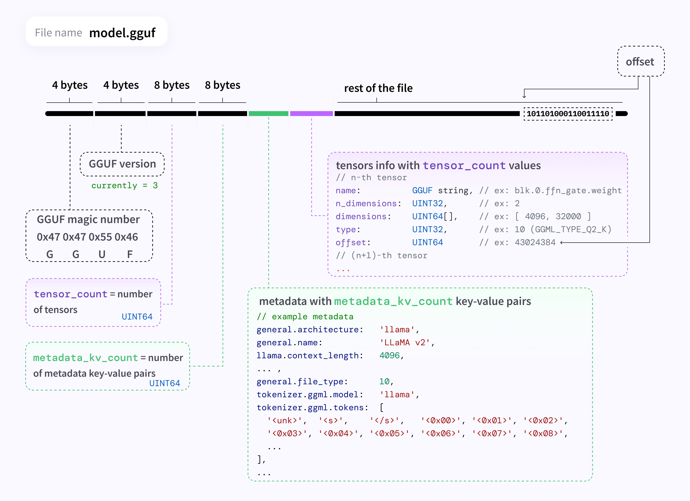
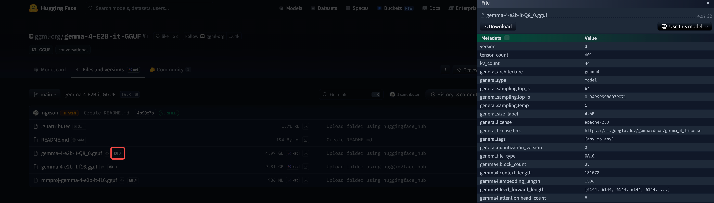

> 前两天看到 google deepmind 发布了 Gemma 4，本地 macmini 上就可以跑，就想着玩玩。首先下载下来熟悉的 safetensors，然后使用 Apple 的 MLX 来跑，发现 4B 的直接内存爆炸了，算了下也是不够的。然后又有人提到 lm-studio，就下载了个看看，下载模型的时候，发现有 GGUF/MLX 标注，然后用 GGUF 跑了下 4B 发现内存使用量不大。
>
> lm-studio 就是个前端，后面的 engine 还是 MLX or llama.cpp，想知道区别在哪。另外，权重文件名也是标注一些看起来跟量化相关的名词（Q4_K_M 什么的），虽然很早前公司有人分享过 GGUF，不过现在早忘了，正好趁此机会了解一下，看看 device 侧现在怎么玩。

GGUF（GGML Universal File）是 llama.cpp 项目使用的模型文件格式。它将模型的 metadata、tokenizer 配置、tensor 数据等所有信息打包到一个 self-contained 的二进制文件中，使得模型的分发和加载都极其简单——一个文件即是一个完整的模型。

本文从 GGUF 文件格式出发，逐步深入其 quantization 机制，基于 llama.cpp 源码（tag: b8667）进行解读。

## 一、GGUF 文件格式

### 1.1 设计哲学

GGUF 的前身是 GGML 格式（后来的 GGJTv3）。旧格式存在的问题是：metadata 和 tensor 数据耦合严重，不同模型架构需要不同的 loader 代码，扩展性差。

GGUF 的设计目标是：

- **Self-contained**：一个文件包含运行模型所需的一切——架构参数、tokenizer、tensor weight
- **Extensible**：通过 key-value pair 存储 metadata，新增字段不会破坏向后兼容
- **Mmap-friendly**：tensor 数据区域连续存放且对齐，可以直接 mmap 到内存，避免额外的拷贝
- **Single-file deployment**：不需要额外的 config.json、tokenizer.json 等文件

### 1.2 二进制布局

GGUF 文件的结构定义在 `ggml/include/gguf.h` 的头部注释中：

```
┌─────────────────────────────────────────┐
│  Magic: "GGUF" (4 bytes)                │
│  Version: uint32 (当前为 3)              │
│  Tensor count: int64                     │
│  KV pair count: int64                    │
├─────────────────────────────────────────┤
│  KV Pairs (元数据区)                     │
│  ┌─────────────────────────────────┐    │
│  │ Key (string)                    │    │
│  │ Value type (gguf_type)          │    │
│  │ Value (binary data)             │    │
│  └─────────────────────────────────┘    │
│  ... 重复 n_kv 次                        │
├─────────────────────────────────────────┤
│  Tensor Infos (张量描述区)               │
│  ┌─────────────────────────────────┐    │
│  │ Name (string)                   │    │
│  │ N dimensions (uint32)           │    │
│  │ Shape (int64 × n_dims)          │    │
│  │ Data type (ggml_type)           │    │
│  │ Data offset (uint64)            │    │
│  └─────────────────────────────────┘    │
│  ... 重复 n_tensors 次                   │
├─────── alignment padding ───────────────┤
│  Tensor Data (张量数据区, 对齐存放)       │
│  [tensor_0 data] [padding]              │
│  [tensor_1 data] [padding]              │
│  ...                                    │
└─────────────────────────────────────────┘
```

几个关键设计点：

- **String encoding**：`uint64 长度 + 字节内容`（无 null terminator）
- **Alignment**：默认 32 bytes 对齐（可通过 `general.alignment` KV 自定义），确保 tensor 数据可以高效 mmap
- **Tensor offset**：记录的是相对于 tensor data 区域起始位置的偏移，不是文件绝对偏移



### 1.3 KV Metadata 体系

GGUF 的 metadata 使用统一的 key-value 结构存储，支持多种数据类型：

```c
enum gguf_type {
    GGUF_TYPE_UINT8, GGUF_TYPE_INT8,
    GGUF_TYPE_UINT16, GGUF_TYPE_INT16,
    GGUF_TYPE_UINT32, GGUF_TYPE_INT32,
    GGUF_TYPE_FLOAT32, GGUF_TYPE_BOOL,
    GGUF_TYPE_STRING, GGUF_TYPE_ARRAY,
    GGUF_TYPE_UINT64, GGUF_TYPE_INT64,
    GGUF_TYPE_FLOAT64,
};
```

Key 遵循命名空间约定，主要分为以下几类：

**通用信息（`general.*`）**

| Key                            | 类型   | 说明                          |
| ------------------------------ | ------ | ----------------------------- |
| `general.architecture`         | string | 模型架构，如 "llama", "qwen2" |
| `general.name`                 | string | 模型名称                      |
| `general.file_type`            | uint32 | quantization 类型编号         |
| `general.quantization_version` | uint32 | quantization 版本             |
| `general.alignment`            | uint32 | tensor 数据对齐字节数         |

**模型超参数（`{arch}.*`）**

| Key                           | 说明                |
| ----------------------------- | ------------------- |
| `{arch}.context_length`       | 上下文长度          |
| `{arch}.embedding_length`     | embedding 维度      |
| `{arch}.block_count`          | transformer 层数    |
| `{arch}.feed_forward_length`  | FFN 中间维度        |
| `{arch}.attention.head_count` | attention head 数量 |
| `{arch}.vocab_size`           | 词表大小            |

**Tokenizer（`tokenizer.ggml.*`）**

| Key                           | 说明                                 |
| ----------------------------- | ------------------------------------ |
| `tokenizer.ggml.model`        | tokenizer 类型（"gpt2", "llama" 等） |
| `tokenizer.ggml.tokens`       | 完整词表（string array）             |
| `tokenizer.ggml.scores`       | token 分数（float array）            |
| `tokenizer.ggml.merges`       | BPE merge 规则（string array）       |
| `tokenizer.ggml.bos_token_id` | BOS token ID                         |
| `tokenizer.ggml.eos_token_id` | EOS token ID                         |
| `tokenizer.chat_template`     | Jinja chat template                  |

这套 KV 体系的强大之处在于：**loader 不需要知道模型的具体架构**，只要按照命名规范读取 KV 即可获取所有需要的参数。新增模型架构只需要定义新的 KV 键名，不需要修改文件格式本身。

### 1.4 Tensor 存储与 ggml_type

每个 tensor 在 info 区域记录了它的名字、shape 和 **data type**（`ggml_type`）。这个 type 决定了 tensor data 区域中对应数据的编码方式。

llama.cpp 支持的 type 包括：

```c
GGML_TYPE_F32     // 32-bit float
GGML_TYPE_F16     // 16-bit float
GGML_TYPE_Q4_0    // 4-bit quantization, variant 0
GGML_TYPE_Q4_1    // 4-bit quantization, variant 1
GGML_TYPE_Q5_0    // 5-bit quantization, variant 0
GGML_TYPE_Q5_1    // 5-bit quantization, variant 1
GGML_TYPE_Q8_0    // 8-bit quantization, variant 0
GGML_TYPE_Q2_K    // 2-bit K-quant
GGML_TYPE_Q3_K    // 3-bit K-quant
GGML_TYPE_Q4_K    // 4-bit K-quant
GGML_TYPE_Q5_K    // 5-bit K-quant
GGML_TYPE_Q6_K    // 6-bit K-quant
// ... 以及 IQ (importance-weighted) 系列等
```

**一个 GGUF 文件中的不同 tensor 可以使用不同的 type**。例如 Q4_K_M 策略下，大部分 weight 使用 Q4_K，但关键 tensor 会使用 Q5_K 或 Q6_K——这些信息都记录在每个 tensor 的 info 中。

> 在 huggingface 上点击图标可以看到 gguf 文件的 meta 信息
>
> 

### 1.5 生产流程

一个典型的 GGUF 文件生产流程：

```
HuggingFace 模型 (PyTorch safetensors)
          │
          ▼
  convert_hf_to_gguf.py    ← 转换为 GGUF (FP16/FP32)
          │
          ▼
  llama-quantize            ← 量化为指定 type (Q4_K_M 等)
          │
          ▼
  model-Q4_K_M.gguf        ← 最终可部署文件
```

## 二、命名规范

GGUF 文件遵循一套标准的命名约定（[GGUF Naming Convention](https://github.com/ggml-org/ggml/blob/master/docs/gguf.md#gguf-naming-convention)），目的是让人类能够一眼获取模型最重要的信息。

### 2.1 命名格式

```
<BaseName>-<SizeLabel>-<FineTune>-<Version>-<Encoding>-<Type>-<Shard>.gguf
```

各组件之间用 `-` 分隔，只有 BaseName、SizeLabel 和 Version 是必需的，其余是可选的。

### 2.2 各组件详解

| 组件          | 是否必需 | 说明                                    | 对应 GGUF metadata   |
| ------------- | -------- | --------------------------------------- | -------------------- |
| **BaseName**  | 必需     | 模型基础架构或名称                      | `general.basename`   |
| **SizeLabel** | 必需     | 参数规模（用于排行榜）                  | `general.size_label` |
| **FineTune**  | 可选     | 微调目标（如 Chat, Instruct）           | `general.finetune`   |
| **Version**   | 必需     | 版本号，格式为 `v主版本.次版本`         | `general.version`    |
| **Encoding**  | 可选     | weight 编码方案（即 quantization type） | `general.file_type`  |
| **Type**      | 可选     | 文件类型（`LoRA`、`vocab`）             | -                    |
| **Shard**     | 可选     | 分片信息，格式为 `XXXXX-of-XXXXX`       | -                    |

### 2.3 各组件格式细节

**BaseName**

模型的基础名称，可以包含字母、数字，用 `-` 连接多个词。

```
Llama-3
Hermes-2-Pro-Llama-3
Mixtral
Phi-3-mini
```

**SizeLabel**

参数规模，格式为 `<数量><单位>`，支持 MoE 的 `专家数x参数量` 写法：

| 单位 | 含义                  |
| ---- | --------------------- |
| `Q`  | Quadrillion（千万亿） |
| `T`  | Trillion（万亿）      |
| `B`  | Billion（十亿）       |
| `M`  | Million（百万）       |
| `K`  | Thousand（千）        |

示例：`8B`、`70B`、`3.8B`、`8x7B`（MoE，8 个 expert 各 7B）

在 llama.cpp 中，SizeLabel 由 `gguf-py/gguf/utility.py:21-41` 自动计算：

```python
def model_weight_count_rounded_notation(model_params_count: int, min_digits: int = 2) -> str:
    if model_params_count > 1e12:
        scaled_model_params = model_params_count * 1e-12
        scale_suffix = "T"
    elif model_params_count > 1e9:
        scaled_model_params = model_params_count * 1e-9
        scale_suffix = "B"
    elif model_params_count > 1e6:
        scaled_model_params = model_params_count * 1e-6
        scale_suffix = "M"
    else:
        scaled_model_params = model_params_count * 1e-3
        scale_suffix = "K"
    # ...
    return f"{scaled_model_params:.{fix}f}{scale_suffix}"
```

MoE 模型的格式为 `专家数x每专家参数量`，如 `8x7B`。

**FineTune**

描述微调目标，常见值：

- `Instruct`：指令遵循微调
- `Chat`：对话微调
- `Code`：代码生成微调

**Version**

版本号，格式为 `v主版本.次版本`。如果缺省则默认为 `v1.0`。

**Encoding**

weight 的 quantization scheme，常见值：

| Encoding | 含义                            |
| -------- | ------------------------------- |
| `F32`    | 32-bit float（无量化）          |
| `F16`    | 16-bit float                    |
| `BF16`   | Brain float 16                  |
| `Q8_0`   | 8-bit 对称量化                  |
| `Q6_K`   | 6-bit K-quant                   |
| `Q5_K_M` | 5-bit K-quant Medium            |
| `Q4_K_M` | 4-bit K-quant Medium            |
| `Q4_K_S` | 4-bit K-quant Small             |
| `Q3_K_M` | 3-bit K-quant Medium            |
| `Q2_K`   | 2-bit K-quant                   |
| `IQ4_XS` | 4-bit importance-weighted quant |

**Shard**

当模型过大需要拆分为多个文件时，使用 5 位数字的分片编号：

```
00001-of-00009   ← 第 1 片，共 9 片
00003-of-00009   ← 第 3 片，共 9 片
```

分片编号从 `00001` 开始（不是 `00000`）。

### 2.4 完整示例

**`Mixtral-8x7B-v0.1-KQ2.gguf`**

| 组件      | 值                              |
| --------- | ------------------------------- |
| BaseName  | `Mixtral`                       |
| SizeLabel | `8x7B`（8 experts × 7B params） |
| FineTune  | -（无）                         |
| Version   | `v0.1`                          |
| Encoding  | `KQ2`                           |
| Shard     | -（单文件）                     |

**`Hermes-2-Pro-Llama-3-8B-F16.gguf`**

| 组件      | 值                     |
| --------- | ---------------------- |
| BaseName  | `Hermes-2-Pro-Llama-3` |
| SizeLabel | `8B`                   |
| FineTune  | -（无）                |
| Version   | `v1.0`（缺省默认）     |
| Encoding  | `F16`                  |
| Shard     | -（单文件）            |

**`Grok-100B-v1.0-Q4_0-00003-of-00009.gguf`**

| 组件      | 值               |
| --------- | ---------------- |
| BaseName  | `Grok`           |
| SizeLabel | `100B`           |
| FineTune  | -（无）          |
| Version   | `v1.0`           |
| Encoding  | `Q4_0`           |
| Shard     | 第 3 片，共 9 片 |

**`Phi-3-mini-3.8B-ContextLength4k-instruct-v1.0.gguf`**

| 组件      | 值                     |
| --------- | ---------------------- |
| BaseName  | `Phi-3-mini`           |
| SizeLabel | `3.8B-ContextLength4k` |
| FineTune  | `instruct`             |
| Version   | `v1.0`                 |
| Encoding  | -（无，即未量化）      |
| Shard     | -（单文件）            |

### 2.5 在 llama.cpp 中的实现

命名约定的组装逻辑位于 `gguf-py/gguf/utility.py:55-75`：

```python
def naming_convention(model_name, base_name, finetune_string,
                      version_string, size_label, output_type,
                      model_type=None) -> str:
    if base_name is not None:
        name = base_name.strip().replace(' ', '-').replace('/', '-')
    elif model_name is not None:
        name = model_name.strip().replace(' ', '-').replace('/', '-')
    else:
        name = "ggml-model"

    parameters = f"-{size_label}" if size_label is not None else ""
    finetune   = f"-{finetune_string.strip().replace(' ', '-')}" if finetune_string is not None else ""
    version    = f"-{version_string.strip().replace(' ', '-')}" if version_string is not None else ""
    encoding   = f"-{output_type.strip().replace(' ', '-').upper()}" if output_type is not None else ""
    kind       = f"-{model_type.strip().replace(' ', '-')}" if model_type is not None else ""

    return f"{name}{parameters}{finetune}{version}{encoding}{kind}"
```

各字段的值来自 GGUF 文件内部的 metadata KV（如 `general.basename`、`general.size_label`、`general.finetune`、`general.version`），这些 metadata 在 `convert_hf_to_gguf.py` 转换模型时自动填入。

## 三、Quantization

### 3.1 Q8_0

#### 核心思想

Q8_0 是 llama.cpp 中最简单直观的 quantization scheme。它是一种 **symmetric（对称）block quantization**，将 FP32 weight 压缩为 int8：

$x \approx d \times q$

其中 $d$ 是 scale factor（缩放因子），$q$ 是 quantized 后的 int8 值。

#### 数据结构

```c
#define QK8_0 32
typedef struct {
    ggml_half d;       // delta (scale factor), FP16
    int8_t  qs[QK8_0]; // quantized values
} block_q8_0;
```

每个 block 包含 **32 个 weight (固定)**：

| 字段     | 大小                 | 说明                     |
| -------- | -------------------- | ------------------------ |
| `d`      | 2 bytes (FP16)       | 该 block 的 scale factor |
| `qs[32]` | 32 bytes (int8 × 32) | 32 个 quantized weight   |

总大小 34 bytes 存储 32 个 weight，平均每个 weight 约 **8.5 bits**（对比 FP32 的 32 bits）。

#### Quantization 过程

```c
void quantize_row_q8_0_ref(const float * x, block_q8_0 * y, int64_t k) {
    const int nb = k / QK8_0;

    for (int i = 0; i < nb; i++) {
        // Step 1: 找 block 内绝对值最大值
        float amax = 0.0f;
        for (int j = 0; j < QK8_0; j++) {
            amax = MAX(amax, fabsf(x[i*QK8_0 + j]));
        }

        // Step 2: 计算 scale factor
        const float d  = amax / 127;   // 127 = 2^7 - 1
        const float id = d ? 1.0f/d : 0.0f;

        // Step 3: 存储 scale (FP32 → FP16)
        y[i].d = GGML_FP32_TO_FP16(d);

        // Step 4: 量化每个 weight
        for (int j = 0; j < QK8_0; ++j) {
            y[i].qs[j] = roundf(x[i*QK8_0 + j] * id);
        }
    }
}
```

**举例**：假设 block 中绝对值最大的是 3.5

```
d  = 3.5 / 127 ≈ 0.02756
id = 1 / d      ≈ 36.286

原始值  2.1 → round(2.1 × 36.286)  = 76    → 还原: 76 × 0.02756 ≈ 2.095
原始值 -1.0 → round(-1.0 × 36.286) = -36   → 还原: -36 × 0.02756 ≈ -0.992
原始值  3.5 → round(3.5 × 36.286)  = 127   → 还原: 127 × 0.02756 ≈ 3.500
```

#### Dequantization 过程

```c
void dequantize_row_q8_0(const block_q8_0 * x, float * y, int64_t k) {
    for (int i = 0; i < nb; i++) {
        const float d = GGML_FP16_TO_FP32(x[i].d);
        for (int j = 0; j < QK8_0; ++j) {
            y[i*QK8_0 + j] = x[i].qs[j] * d;
        }
    }
}
```

#### 量化域直接 Dot Product

LLM inference 的核心是 matrix multiplication，而其核心是 vector dot product。Q8_0 可以**直接在 quantized 域计算**，无需先 dequantize：

```c
void ggml_vec_dot_q8_0_q8_0(int n, float * s, const void * vx, const void * vy, ...) {
    const block_q8_0 * x = vx;
    const block_q8_0 * y = vy;

    float sumf = 0;
    for (int ib = 0; ib < nb; ++ib) {
        int sumi = 0;
        for (int j = 0; j < QK8_0; j++) {
            sumi += x[ib].qs[j] * y[ib].qs[j];  // 整数乘加
        }
        sumf += sumi * (FP16_TO_FP32(x[ib].d) * FP16_TO_FP32(y[ib].d));
    }
    *s = sumf;
}
```

数学原理：

$$\sum_i x_i y_i \approx \sum_i (d_x q_{x,i})(d_y q_{y,i}) = d_x d_y \sum_i q_{x,i} q_{y,i}$$

内层循环是纯整数乘加，可以被 SIMD 指令（AVX2、ARM NEON）高度并行化。每个 block 仅需一次浮点乘法。


> #### 为什么 Block Size 是 32 ?
>
> 32 是硬编码的设计常量，不可运行时更改。这个数字是多方面权衡的结果：
>
> - **精度 vs 开销**：block 越小，每个 block 的 scale factor 能更好地适应局部数据分布，quantization error 越小；但 2 bytes 的 scale 摊到更少的 weight 上，overhead 比例越大
> - **SIMD 对齐**：32 × int8 = 256 bits = 一个 AVX2 register 的宽度 = 两个 ARM NEON register 的宽度
>
> 不同 quantization family 使用不同的 block size：基础类型（Q4_0/Q5_0/Q8_0 等）用 32，K-quant 家族（Q2_K ~ Q6_K）用 256 作为 super-block size。

### 3.2 K-quant：分层 Quantization

以 Q4_K 为例

#### 从 Q8_0 到 Q4_K 的跃升

Q4_K 属于 **K-quant** 家族，引入两个关键升级：

1. **两级（分层）quantization**：256 weight 的 super-block 内分为 8 个 sub-block（各 32 weight），每层有独立的 scale
2. **Asymmetric（非对称）quantization**：不仅有 scale，还有 min（最小值偏移）

#### 数据结构

```c
#define QK_K 256
#define K_SCALE_SIZE 12

typedef struct {
    ggml_half d;            // super-block scale for quantized scales
    ggml_half dmin;         // super-block scale for quantized mins
    uint8_t scales[12];     // 8 组 sub-block 的 scale 和 min, 6-bit 量化后打包
    uint8_t qs[QK_K/2];    // 256 个 4-bit quant, 两两共享一个 byte
} block_q4_K;
```

| 字段         | 大小           | 说明                                              |
| ------------ | -------------- | ------------------------------------------------- |
| `d`          | 2 bytes (FP16) | super-block 级 scale 的 scale（"scale 的 scale"） |
| `dmin`       | 2 bytes (FP16) | super-block 级 min 的 scale（"min 的 scale"）     |
| `scales[12]` | 12 bytes       | 8 个 sub-block 各自的 scale 和 min，6-bit 打包    |
| `qs[128]`    | 128 bytes      | 256 个 4-bit weight，两个共享一个 byte            |

总大小 144 bytes / 256 weights = **4.5 bits/weight**。

#### 三层嵌套结构

```
第 1 层 (顶层):  d, dmin — FP16 直接存储
                    ↓ 用于还原第 2 层
第 2 层 (中间):  8 个 sub-block 的 float scale/min
                 → 量化为 6-bit unsigned int (0~63)
                    ↓ 用于还原第 3 层
第 3 层 (底层):  256 个 float weight
                 → 量化为 4-bit unsigned int (0~15)
```

Dequantization 公式：

$$\text{weight} \approx d \times sc_j \times q_i - d_{min} \times m_j$$

其中：

- $d$ = super-block scale (FP16)
- $d_{min}$ = super-block min scale (FP16)
- $sc_j$ = 第 j 个 sub-block 的 quantized scale (6-bit, 范围 0~63)
- $m_j$ = 第 j 个 sub-block 的 quantized min (6-bit, 范围 0~63)
- $q_i$ = 具体 weight 的 quantized value (4-bit, 范围 0~15)

#### 为什么要两级 Quantization

如果每个 sub-block（32 weights）都用一个完整 FP16 存 scale 和 min：

```
8 sub-blocks × 2 值 (scale+min) × 2 bytes (FP16) = 32 bytes metadata
```

通过把 8 个 sub-block 的 scale/min 也做一次 quantization（压缩为 6-bit），再用 2 个 FP16（`d` 和 `dmin`）来还原它们：

```
2 bytes (d) + 2 bytes (dmin) + 12 bytes (8×scale + 8×min, 各 6-bit) = 16 bytes metadata
```

Metadata 从 32 bytes 压缩到 16 bytes，节省了一半，同时 sub-block 级别的局部适应性依然保留。

#### 6-bit 的 Bit Packing

8 个 scale (6-bit) + 8 个 min (6-bit) = 96 bits = 12 bytes。代码通过精巧的 bit packing 将它们紧凑存储：

```c
static inline void get_scale_min_k4(int j, const uint8_t * q,
                                     uint8_t * d, uint8_t * m) {
    if (j < 4) {
        *d = q[j] & 63;
        *m = q[j + 4] & 63;
    } else {
        *d = (q[j+4] & 0xF) | ((q[j-4] >> 6) << 4);
        *m = (q[j+4] >>  4) | ((q[j-0] >> 6) << 4);
    }
}
```

前 4 个 sub-block 的 scale/min 直接存在低 6 位；后 4 个的则拆成低 4 位和高 2 位分别存放在不同的 byte 中。

#### Dequantization 代码

```c
void dequantize_row_q4_K(const block_q4_K * x, float * y, int64_t k) {
    for (int i = 0; i < nb; i++) {
        const float d   = GGML_FP16_TO_FP32(x[i].d);
        const float min = GGML_FP16_TO_FP32(x[i].dmin);

        for (int j = 0; j < QK_K; j += 64) {
            get_scale_min_k4(is, x[i].scales, &sc, &m);
            const float d1 = d * sc;
            const float m1 = min * m;
            for (int l = 0; l < 32; ++l)
                *y++ = d1 * (q[l] & 0xF) - m1;   // 低 4 位
            for (int l = 0; l < 32; ++l)
                *y++ = d2 * (q[l] >> 4) - m2;     // 高 4 位
        }
    }
}
```

### 3.3 Mixed-Precision 策略：Q4_K_S 与 Q4_K_M

**同一格式，不同策略:**

Q4_K_S 和 Q4_K_M 在底层使用**完全相同的 `GGML_TYPE_Q4_K` 数据格式**——block 结构、quantization 算法一模一样。

它们的区别在于：对模型中不同类型的 tensor 使用不同 bit 数的 **mixed-precision（混合精度）策略**。

- **S = Small**：尽量小，只对最关键的少量 tensor 升级精度
- **M = Medium**：稍大一些，对更多敏感 tensor 使用更高精度

#### 哪些 Layer 更重要

llama.cpp 用 `use_more_bits` 函数判断哪些 layer 对模型质量更关键：

```c
auto use_more_bits = [](int i_layer, int n_layers) -> bool {
    return i_layer < n_layers/8         // 前 1/8 层
        || i_layer >= 7*n_layers/8      // 后 1/8 层
        || (i_layer - n_layers/8)%3 == 2;  // 中间每隔 3 层取 1 层
};
```

这些位置的 tensor 对 perplexity 影响更大，值得分配更多 bits。

#### 对比

|                    | Q4_K_S           | Q4_K_M                           |
| ------------------ | ---------------- | -------------------------------- |
| Default type       | Q4_K             | Q4_K                             |
| attention_v 升级   | 前 4 层 → Q5_K   | `use_more_bits` 位置 → **Q6_K**  |
| ffn_down 升级      | 前 1/8 层 → Q5_K | `use_more_bits` 位置 → Q5_K/Q6_K |
| attention_qkv 升级 | 不升级           | → Q5_K                           |
| 模型大小 (7B 参数) | ~3.6 GB          | ~3.8 GB                          |
| Perplexity         | 略高（略差）     | 略低（略好）                     |

**Q4_K_M 是 llama.cpp 的默认推荐选项**。

### 3.4 Activation Quantization: On-the-fly

#### Weight 和 Activation 的格式不匹配

LLM inference 的核心运算是 $\text{output} = \text{weight} \times \text{activation}$：

- **Weight**（`src0`）：提前 quantize 好（如 Q4_K），存储在 GGUF 文件中
- **Activation**（`src1`）：每次 inference 时动态计算出来的中间结果，通常是 **FP32**

两者格式不同，无法直接做 dot product。

#### 临时量化 Activation

llama.cpp 的做法是：在 matrix multiplication 前，将 FP32 activation **on-the-fly** 量化为兼容的 int8 格式，用完即丢。

每种 weight type 都注册了与之配对的 activation type：

```c
[GGML_TYPE_Q4_0] = { .vec_dot_type = GGML_TYPE_Q8_0 },
[GGML_TYPE_Q4_1] = { .vec_dot_type = GGML_TYPE_Q8_1 },
[GGML_TYPE_Q4_K] = { .vec_dot_type = GGML_TYPE_Q8_K },
[GGML_TYPE_Q5_K] = { .vec_dot_type = GGML_TYPE_Q8_K },
[GGML_TYPE_Q6_K] = { .vec_dot_type = GGML_TYPE_Q8_K },
```

规律很清晰：

- 基础 quantization（Q4_0/Q5_0/Q8_0）配对 **Q8_0**
- K-quant 家族（Q2_K ~ Q6_K）配对 **Q8_K**

#### 核心代码流程

在 `ggml_compute_forward_mul_mat` 中：

```c
// 1. 根据 weight type 查表得到配对的 activation type
enum ggml_type    vec_dot_type = type_traits_cpu[src0->type].vec_dot_type;
ggml_from_float_t from_float   = type_traits_cpu[vec_dot_type].from_float;

// 2. 如果 activation 不是目标类型，执行 on-the-fly quantization
if (src1->type != vec_dot_type) {
    GGML_ASSERT(src1->type == GGML_TYPE_F32);  // activation 必须是 FP32
    // 在临时 buffer 中: FP32 activation → Q8_K
    from_float(src1_data, wdata_buffer, count);
}

// 3. 两个 quantized tensor 做整数 dot product
ggml_vec_dot_q4_K_q8_K(n, &result, weight_q4k, activation_q8k, ...);
```

#### 流程图

```
Weight (GGUF 文件, Q4_K)       Activation (运行时计算, FP32)
       │                              │
       │  (离线 quantize)     from_float() — on-the-fly quantize
       │                              │
       ▼                              ▼
  block_q4_K                     block_q8_K
       \                            /
        \                          /
      ggml_vec_dot_q4_K_q8_K()  ← 整数 dot product
                  │
                  ▼
          float result (FP32)
```

> #### 为什么 Activation 用 Q8 而不是 Q4
>
> - **Activation 对精度更敏感**：weight 分布相对稳定，可以用低 bit；activation 随 input 变化剧烈，需要更高精度防止 error 累积
> - **Q8 quantization 极快**：算法极其简单（找 max → 除 → round），几乎无额外计算开销
> - **整数 dot product 仍然高效**：`int8 × int4` 的运算在 SIMD 上仍远快于 `float × float`

### 3.5 总结

| 类型           | Bits/Weight | Block Size | Quantization 类型 | Scale 层数 |
| -------------- | ----------- | ---------- | ----------------- | ---------- |
| FP32           | 32          | -          | -                 | -          |
| FP16           | 16          | -          | -                 | -          |
| Q8_0           | ~8.5        | 32         | Symmetric         | 1 层       |
| Q4_K (K-quant) | ~4.5        | 256 / 32   | Asymmetric        | 2 层       |
| Q2_K (K-quant) | ~2.6        | 256 / 16   | Asymmetric        | 2 层       |

## 四、评估 Quantization 质量

### 4.1 Perplexity(PPL)

Perplexity（困惑度）是衡量语言模型质量**最常用最基础**的指标。直觉上，它衡量的是：**模型对下一个 token 的"困惑"程度**。PPL 越低，说明模型预测下一个 token 的能力越强，模型质量越好。

数学定义：

$$\text{PPL} = \exp\left(-\frac{1}{N}\sum_{i=1}^{N}\log P(t_i \mid t_1, ..., t_{i-1})\right)$$

即 negative log-likelihood（NLL）的平均值，再取指数。

拆解为三步：

1. 对每个 token $t_i$，模型给出给定前文后该 token 的概率 $P(t_i | t_1,...,t_{i-1})$
2. 取 $-\log P$，得到 negative log-likelihood（NLL），概率越低值越大
3. 对所有 token 的 NLL 取平均，再 $\exp()$ 回去

**直觉理解**：如果 PPL = 6，可以粗略地理解为模型在每个位置"犹豫"于大约 6 个等概率的候选 token 之间。PPL = 1 意味着模型完全确定每个 token。

| 档位       | PPL 范围 (以 LLaMA 3 8B 为参考) | 说明                         |
| ---------- | ------------------------------- | ---------------------------- |
| 基准       | 6.23 (FP16)                     | 满精度                       |
| 近乎无损   | 6.23 ~ 6.26                     | q8_0, q6_K                   |
| 微弱损失   | 6.26 ~ 6.50                     | q5_K_M, q4_K_M               |
| 可感知损失 | 6.50 ~ 7.00                     | q4_K_S(无imatrix), q3_K 系列 |
| 明显劣化   | 7.00 ~ 10.0                     | q3_K_S, q2_K                 |
| 不可用     | > 10.0                          | iq2_XXS 及更低               |

#### 在 llama.cpp 中的实现

核心计算位于 `tools/perplexity/perplexity.cpp`。

**Step 1：计算 log softmax**

对于每个位置，模型输出 logits（未归一化的分数），需要先转为概率（`tools/perplexity/perplexity.cpp:59-69`）：

```c
static results_log_softmax log_softmax(int n_vocab, const float * logits, int tok) {
    float max_logit = logits[0];
    for (int i = 1; i < n_vocab; ++i) {
        max_logit = std::max(max_logit, logits[i]);
    }
    double sum_exp = 0.0;
    for (int i = 0; i < n_vocab; ++i) {
        sum_exp += expf(logits[i] - max_logit);
    }
    return {logits[tok] - max_logit - log(sum_exp),   // log P(tok)
            logits[tok],                                // raw logit
            expf(logits[tok] - max_logit) / (float)sum_exp};  // P(tok)
}
```

先减去 `max_logit` 是经典的数值稳定技巧（log-sum-exp trick），防止 `exp()` 溢出。

**Step 2：累加 NLL**

`process_logits` 函数（`tools/perplexity/perplexity.cpp:114-131`）对每个 token 累加 NLL：

```c
auto compute = [&] () {
    double local_nll  = 0;
    double local_nll2 = 0;
    while (true) {
        // ...
        const results_log_softmax results = log_softmax(
                n_vocab, logits + size_t(i)*n_vocab, tokens[i+1]);
        const double v = -results.log_softmax;  // NLL = -log P(t_i)
        local_nll  += v;
        local_nll2 += v*v;   // 用于计算 uncertainty
        // ...
    }
};
```

注意 `tokens[i+1]`——模型在位置 $i$ 预测的是**下一个** token $t_{i+1}$。

**Step 3：计算最终 PPL**

位于 `tools/perplexity/perplexity.cpp:647-656`：

```c
nll2 /= count;
nll /= count;
const double ppl = exp(nll);       // PPL = exp(平均 NLL)
nll2 -= nll * nll;
if (nll2 > 0) {
    nll2 = sqrt(nll2/(count-1));
    LOG_INF("Final estimate: PPL = %.4lf +/- %.5lf\n", ppl, nll2*ppl);
}
```

± 后面的 uncertainty 通过假设 NLL 服从 Gaussian distribution，然后做 error propagation 估计。

**Sliding window 策略**

文本通常远超 context window 大小。llama.cpp 将文本切分为多个 chunk，每个 chunk 等于 context window 大小。但每个 chunk 的**前半段** token 不计入 PPL，只有后半段计入（`tools/perplexity/perplexity.cpp:529-541`）：

```c
// calculate the perplexity over the last half of the window
// (so the model always has some context to predict the token).
const int first = n_ctx/2;
```

这保证了每个被评估的 token 至少有 `n_ctx/2` 个 token 作为上下文，避免了"冷启动"带来的偏差。

#### 如何使用

llama.cpp 项目约定使用 **Wikitext-2 test set** 作为标准评测集（`tools/perplexity/README.md:9`）。

```bash
# 下载测试数据
bash scripts/get-wikitext-2.sh

# 运行 perplexity 评测
./llama-perplexity -m model-Q4_K_M.gguf -f wikitext-2-raw/wiki.test.raw
```

#### LLaMA 3 8B Quantization Scoreboard

以下数据来自 `tools/perplexity/README.md`，（测试环境：CUDA backend, AMD Epyc 7742 + RTX 4090）：

| Quantization | imatrix | Size (GiB) | PPL              | ΔPPL    | KLD      | Mean Δp  | RMS Δp  |
| ------------ | ------- | ---------- | ---------------- | ------- | -------- | -------- | ------- |
| f16          | -       | 14.97      | 6.2332 ± 0.0378  | 0.0015  | 0.000551 | +0.001%  | 0.787%  |
| q8_0         | -       | 7.96       | 6.2343 ± 0.0379  | 0.0027  | 0.001355 | -0.019%  | 1.198%  |
| q6_K         | -       | 6.14       | 6.2534 ± 0.0381  | 0.0217  | 0.005452 | -0.007%  | 2.295%  |
| q5_K_M       | -       | 5.33       | 6.2886 ± 0.0383  | 0.0570  | 0.010762 | -0.114%  | 3.160%  |
| q4_K_M       | WT 10m  | 4.58       | 6.3829 ± 0.0391  | 0.1513  | 0.028152 | -0.389%  | 5.251%  |
| q4_K_M       | -       | 4.58       | 6.4071 ± 0.0391  | 0.1755  | 0.031273 | -0.596%  | 5.519%  |
| q4_K_S       | -       | 4.37       | 6.5005 ± 0.0398  | 0.2689  | 0.043136 | -0.927%  | 6.562%  |
| q3_K_M       | -       | 3.74       | 6.8885 ± 0.0427  | 0.6569  | 0.101913 | -1.990%  | 10.203% |
| q2_K         | WT 10m  | 2.96       | 8.6478 ± 0.0556  | 2.4162  | 0.332223 | -6.500%  | 18.881% |
| q2_K         | -       | 2.96       | 9.7516 ± 0.0633  | 3.5199  | 0.445132 | -9.123%  | 21.421% |
| iq1_M        | WT 10m  | 2.01       | 25.4937 ± 0.1779 | 19.2621 | 1.393084 | -24.672% | 38.287% |
| iq1_S        | WT 1m   | 1.88       | 58.0978 ± 0.4386 | 51.8661 | 2.211278 | -32.471% | 46.418% |

LLaMA 2 7B 与 LLaMA 3 8B 的 quantization 对比（`tools/perplexity/README.md:109-125`）：

| Metric     | L2 7b q4_K_M  | L3 8b q4_K_M  | L2 7b q8_0    | L3 8b q8_0    |
| ---------- | ------------- | ------------- | ------------- | ------------- |
| PPL        | 5.877 ± 0.033 | 6.407 ± 0.039 | 5.799 ± 0.032 | 6.234 ± 0.038 |
| PPL ratio  | 1.0142        | 1.0282        | 1.0007        | 1.0004        |
| KLD        | 0.012686      | 0.031273      | 0.000369      | 0.001355      |
| Mean Δp    | -0.416%       | -0.596%       | -0.005%       | -0.019%       |
| RMS Δp     | 3.252%        | 5.519%        | 0.618%        | 1.198%        |
| Same top p | 94.665%       | 91.901%       | 98.846%       | 97.674%       |

可以看到 LLaMA 3 对 quantization 更敏感——同样的 q4_K_M，LLaMA 3 的 KLD 是 LLaMA 2 的 2.5 倍。

#### 局限性

- **不同 tokenizer 的模型之间不可比**：tokenizer 不同，token 数量不同，PPL 计算基准不同
- **Finetune 后 PPL 可能反而升高**：finetune 使模型在特定任务上更好，但在通用文本上的 PPL 可能变大
- **不同框架之间不可比**：实现细节（sliding window 策略、BOS token 处理等）都会影响数值 - **PPL 衡量的是"平均预测能力"**：无法反映模型在特定类型问题上的表现

**PPL 最佳使用场景**：比较**同一个模型**在不同 quantization scheme 下的质量损失——所有变量（模型、tokenizer、测试集、框架）固定，只改变 quantization 方案。 

### 4.2 ΔPPL（Delta PPL）

$\Delta\text{PPL} = \text{PPL}_{quant} - \text{PPL}_{f16}$

纯粹的差值，直接反映 quantization 带来的 PPL 劣化。PPL 本身的绝对值受模型和 tokenizer 影响，但 ΔPPL 作为同一模型内的差值，更具可比性。

### 4.3 KLD（Kullback-Leibler Divergence）

$$D_{KL}(P_{f16} \| P_{quant}) = \sum_{i} P_{f16}(t_i) \log \frac{P_{f16}(t_i)}{P_{quant}(t_i)}$$

KLD = 0 表示两个分布完全一致。

**与 PPL 的核心区别**：PPL 只看模型给"正确答案"的概率，而 KLD 比较的是**整个 vocabulary 上的概率分布**。即使两个模型 PPL 接近，如果它们在非正确 token 上的概率分配差异很大，KLD 仍然会很高。KLD 是对 quantization 影响更全面的衡量。

### 4.4 Mean Δp（平均概率变化）

$$\text{Mean } \Delta p = \frac{1}{N}\sum_{i=1}^{N}\left(P_{quant}(t_i) - P_{f16}(t_i)\right)$$

负值表示 quantization 使模型给正确答案的概率降低了。从数据看：

- q8_0：**-0.019%** — 正确 token 概率平均只降了万分之二
- q4_K_M：**-0.596%** — 平均降了不到 1%
- q2_K（无 imatrix）：**-9.123%** — 平均降了近 10%

### 4.5 RMS Δp（概率变化的均方根）

$$\text{RMS } \Delta p = \sqrt{\frac{1}{N}\sum_{i=1}^{N}\left(P_{quant}(t_i) - P_{f16}(t_i)\right)^2}$$

如果把 quantization 视为在 token 概率上叠加的"噪声"，RMS Δp 就是这个噪声的标准差。与 Mean Δp 的区别：Mean Δp 正负抵消，反映系统性偏移；RMS Δp 反映波动的绝对幅度。

### 4.6 Same top p（Top-1 一致率）

FP16 和 quantized model 预测的 top-1 token 相同的比例。q4_K_M 约 **91.9%** 的位置 top-1 一致，意味着绝大多数 generation step 产生的结果和 FP16 相同。

### 4.7 Percentiles of Δp

#### 先理解 Δp

对于测试集中的每一个 token $t_i$，我们可以算出一个 Δp：

$$\Delta p_i = P_{quant}(t_i) - P_{f16}(t_i)$$

即 quantized model 给正确 token 的概率，减去 FP16 model 给正确 token 的概率。

- $\Delta p_i > 0$：quantized model 在这个位置**反而预测更好了**
- $\Delta p_i < 0$：quantized model 在这个位置**预测变差了**
- $\Delta p_i = 0$：没有变化

Wikitext-2 test set 在 LLaMA 3 8B 上大约产生几十万个 token，所以我们得到了**几十万个 Δp 值**。

#### 什么是 Percentiles

Percentile（百分位数）就是把这几十万个 Δp 值**从小到大排序**，然后看各个位置的值：

```
排序后的 Δp 值:
[-99.97%, ..., -87.17%, ..., -2.48%, ..., 0%, ..., +25.88%, ..., +94.27%]
    ↑              ↑            ↑         ↑            ↑             ↑
 Minimum         1.0%       Median(50%)              99.0%       Maximum
```

具体含义：

| Percentile       | 含义                                                         |
| ---------------- | ------------------------------------------------------------ |
| **Maximum**      | 所有 token 中 Δp 最大的那个（quantization "帮了最大忙"的位置） |
| **99.9%**        | 99.9% 的 token 的 Δp 低于这个值                              |
| **99.0%**        | 99% 的 token 的 Δp 低于这个值                                |
| **Median (50%)** | 正中间的那个值                                               |
| **1.0%**         | 只有 1% 的 token 的 Δp 比这个值更低（即"最受伤"的 1%）       |
| **0.1%**         | 只有 0.1% 的 token 的 Δp 比这个值更低（极端 worst case）     |
| **Minimum**      | 所有 token 中 Δp 最小的那个（quantization "伤害最大"的位置） |

#### 用 q4_K_M 的具体数据举例

| Percentile | 值       | 解读                                           |
| ---------- | -------- | ---------------------------------------------- |
| Maximum    | +95.054% | 有个 token 在 quantize 后概率反而涨了 95%      |
| 99.0%      | +12.084% | 最好的 1% token 概率至少涨了 12%               |
| Median     | -0.024%  | 一半 token 概率变化在 -0.024% 以内，几乎无影响 |
| 1.0%       | -19.567% | 最差的 1% token 概率至少降了 19.6%             |
| 0.1%       | -56.054% | 最差的千分之一 token 概率降了 56%              |
| Minimum    | -98.699% | 最惨的单个 token 概率几乎归零                  |

#### 核心价值：判断是"噪声"还是"真正变差"

这是 `tools/perplexity/README.md` 中解释的关键判断方法。

**对称 → 只是噪声**（如 q8_0）：

```
99.0% Δp = +3.544%
 1.0% Δp = -3.698%     ← 正负幅度差不多
```

正的和负的差不多大，说明 quantization 只是给概率加了随机波动，没有系统性偏向。就像给照片加了均匀的噪点。

**不对称 → 真正劣化**（如 q2_K）：

```
99.0% Δp = +25.875%
 1.0% Δp = -87.173%    ← 负的方向大得多！
```

负方向的变化远大于正方向，说明 quantization 真的让模型变差了。而且最差的 1% token 概率暴跌 87%，意味着有些 token 几乎预测不出来了。

用图形直觉来理解：

```
q8_0 的 Δp 分布 (对称 → 纯噪声):

       ▁▂▃▅█████▅▃▂▁
  -4%  -2%   0   +2%  +4%


q2_K 的 Δp 分布 (不对称 → 真正劣化):

  ▁▂▃▅██████▅▃▂▁
-90%  -50%  -10% 0  +10%  +26%
                 ← 严重左偏，负方向有长长的尾巴
```

所以 Percentiles of Δp 比 Mean Δp 和 RMS Δp 提供了更细粒度的信息——它告诉你不只是"平均怎样"，还告诉你"最坏情况有多坏"，以及劣化是随机的还是系统性的。

以 LLaMA 3 8B 为例（`tools/perplexity/README.md:117-123`）：

| Percentile | q8_0    | q4_K_M   | q2_K     |
| ---------- | ------- | -------- | -------- |
| 99.0% Δp   | +3.544% | +12.084% | +25.875% |
| Median Δp  | -0.000% | -0.024%  | -2.476%  |
| 1.0% Δp    | -3.698% | -19.567% | -87.173% |
| 0.1% Δp    | -6.579% | -56.054% | -98.897% |

判断方法：

- **正负分位数大致对称**（如 q8_0：+3.5% vs -3.7%）→ quantization 只是加了随机噪声，没有系统性劣化
- **负值远大于正值**（如 q4_K_M：+12% vs -19.6%）→ quantization 导致模型有一定程度的真实劣化
- **极度不对称**（如 q2_K：+25.9% vs -87.2%）→ 严重劣化

### 4.8 Importance Matrix（imatrix）效果

imatrix 的原理：通过在代表性文本上统计每个 weight 对 output 的 importance（影响程度），然后在 quantization 时给重要的 weight 分配更高的精度。

从 scoreboard 中可以直接对比 imatrix 的作用：

| 配置              | PPL    | ΔPPL   | KLD      |
| ----------------- | ------ | ------ | -------- |
| q4_K_M 无 imatrix | 6.4071 | 0.1755 | 0.031273 |
| q4_K_M 有 imatrix | 6.3829 | 0.1513 | 0.028152 |
| q4_K_S 无 imatrix | 6.5005 | 0.2689 | 0.043136 |
| q4_K_S 有 imatrix | 6.4097 | 0.1781 | 0.031951 |
| q2_K 无 imatrix   | 9.7516 | 3.5199 | 0.445132 |
| q2_K 有 imatrix   | 8.6478 | 2.4162 | 0.332223 |

规律：**bit 数越低，imatrix 的收益越大**。q4_K_M 有 imatrix 后 ΔPPL 改善约 14%；q2_K 改善约 31%。高 bit 数（如 q8_0, q6_K）基本不需要 imatrix。

### 4.9 如何选择 Quantization

| 你的需求                 | 推荐方案         | PPL (8B)  | Size         | ΔPPL       |
| ------------------------ | ---------------- | --------- | ------------ | ---------- |
| 精度至上                 | q8_0             | 6.234     | 7.96 GiB     | +0.003     |
| 高质量 + 较小体积        | q6_K             | 6.253     | 6.14 GiB     | +0.022     |
| **平衡之选（默认推荐）** | **q4_K_M**       | **6.407** | **4.58 GiB** | **+0.175** |
| 尽量小                   | q4_K_S + imatrix | 6.410     | 4.37 GiB     | +0.178     |
| 极限压缩                 | q2_K + imatrix   | 8.648     | 2.96 GiB     | +2.416     |
| 学术实验                 | iq1_S            | 58.098    | 1.88 GiB     | +51.866    |

**核心原则**：ΔPPL 不超过 0.5 时，日常使用几乎感受不到质量下降。q4_K_M 在 size/quality trade-off 上是公认的 sweet spot。

> 使用 --help 也可以简单看到各类量化的效果
>
> ```
> $ ./llama-quantize -h
> 
> -----------------------------------------------------------------------------
>  allowed quantization types
> -----------------------------------------------------------------------------
> 
>    2  or  Q4_0    :  4.34G, +0.4685 ppl @ Llama-3-8B
>    3  or  Q4_1    :  4.78G, +0.4511 ppl @ Llama-3-8B
>   38  or  MXFP4_MOE :  MXFP4 MoE
>    8  or  Q5_0    :  5.21G, +0.1316 ppl @ Llama-3-8B
>    9  or  Q5_1    :  5.65G, +0.1062 ppl @ Llama-3-8B
>   19  or  IQ2_XXS :  2.06 bpw quantization
>   20  or  IQ2_XS  :  2.31 bpw quantization
>   28  or  IQ2_S   :  2.5  bpw quantization
>   29  or  IQ2_M   :  2.7  bpw quantization
>   24  or  IQ1_S   :  1.56 bpw quantization
>   31  or  IQ1_M   :  1.75 bpw quantization
>   36  or  TQ1_0   :  1.69 bpw ternarization
>   37  or  TQ2_0   :  2.06 bpw ternarization
>   10  or  Q2_K    :  2.96G, +3.5199 ppl @ Llama-3-8B
>   21  or  Q2_K_S  :  2.96G, +3.1836 ppl @ Llama-3-8B
>   23  or  IQ3_XXS :  3.06 bpw quantization
>   26  or  IQ3_S   :  3.44 bpw quantization
>   27  or  IQ3_M   :  3.66 bpw quantization mix
>   12  or  Q3_K    : alias for Q3_K_M
>   22  or  IQ3_XS  :  3.3 bpw quantization
>   11  or  Q3_K_S  :  3.41G, +1.6321 ppl @ Llama-3-8B
>   12  or  Q3_K_M  :  3.74G, +0.6569 ppl @ Llama-3-8B
>   13  or  Q3_K_L  :  4.03G, +0.5562 ppl @ Llama-3-8B
>   25  or  IQ4_NL  :  4.50 bpw non-linear quantization
>   30  or  IQ4_XS  :  4.25 bpw non-linear quantization
>   15  or  Q4_K    : alias for Q4_K_M
>   14  or  Q4_K_S  :  4.37G, +0.2689 ppl @ Llama-3-8B
>   15  or  Q4_K_M  :  4.58G, +0.1754 ppl @ Llama-3-8B
>   17  or  Q5_K    : alias for Q5_K_M
>   16  or  Q5_K_S  :  5.21G, +0.1049 ppl @ Llama-3-8B
>   17  or  Q5_K_M  :  5.33G, +0.0569 ppl @ Llama-3-8B
>   18  or  Q6_K    :  6.14G, +0.0217 ppl @ Llama-3-8B
>    7  or  Q8_0    :  7.96G, +0.0026 ppl @ Llama-3-8B
>    1  or  F16     : 14.00G, +0.0020 ppl @ Mistral-7B
>   32  or  BF16    : 14.00G, -0.0050 ppl @ Mistral-7B
>    0  or  F32     : 26.00G              @ 7B
>           COPY    : only copy tensors, no quantizing
> ```
>
> 

## 五、总结

GGUF 格式和 quantization 机制是 llama.cpp 的两大基石。GGUF 提供了 self-contained、extensible、mmap-friendly 的存储方案；quantization 则通过 block-wise 量化、分层 scale 设计、mixed-precision 策略、on-the-fly activation quantization 等一系列工程手段，在模型体积、推理速度和精度之间取得了出色的平衡。

这也是为什么一个 7B 参数的 LLM 能够以 ~4 GB 的体积，在 MacBook 上流畅运行的根本原因。

另外，不得不感叹下现在 AI 太厉害了，尤其是读代码，又准确又快。本文档也基本上是 AI 写的。

## 六、参考

- [llama.cpp](https://github.com/ggml-org/llama.cpp)
- [huggingface-gguf](https://huggingface.co/docs/hub/gguf)
- [Gemma 4](https://huggingface.co/blog/gemma4)