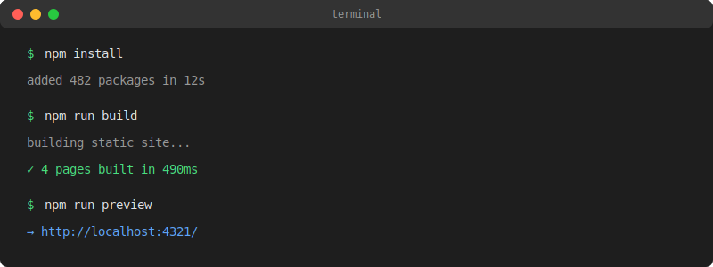

## Adding Images to Your Posts

One of the basics of any blog is embedding images. Place your article images in the `images/` folder next to your `index.md` file and use relative paths.

### A Landscape Photo

Here's a demo landscape image:


Images are automatically styled to be responsive — they scale down on smaller screens and have rounded corners.

### Terminal Screenshot

You can also include screenshots of your development workflow:



This is great for tutorials where you want to show terminal output or IDE screenshots.

## Image Tips

A few things to keep in mind:

- Place article images in the `images/` folder next to your `index.md`
- Reference them with relative paths like `./images/filename.ext`
- Supported formats: PNG, JPG, GIF, SVG, WebP
- Images are automatically responsive (max-width: 100%)
- If using **Typora**, configure it to save pasted images to `./images`

## Embedding Videos

You can embed videos using HTML directly in markdown:

```html
<video src="/videos/demo.mp4" controls width="100%"></video>
```

Or embed from YouTube:

```html
<iframe
  width="100%"
  height="400"
  src="https://www.youtube.com/embed/dQw4w9WgXcQ"
  frameborder="0"
  allowfullscreen
></iframe>
```

## Mixing It All Together

The real power comes from combining images, code, and diagrams in a single post:

```python
from pathlib import Path

def get_image_paths(directory: str) -> list[Path]:
    """Find all image files in a directory."""
    extensions = {'.png', '.jpg', '.svg', '.webp', '.gif'}
    return [
        p for p in Path(directory).iterdir()
        if p.suffix.lower() in extensions
    ]

images = get_image_paths('public/images')
print(f"Found {len(images)} images")
```

And here's how the image pipeline works:


That's it — images, videos, code, and diagrams all working together.
