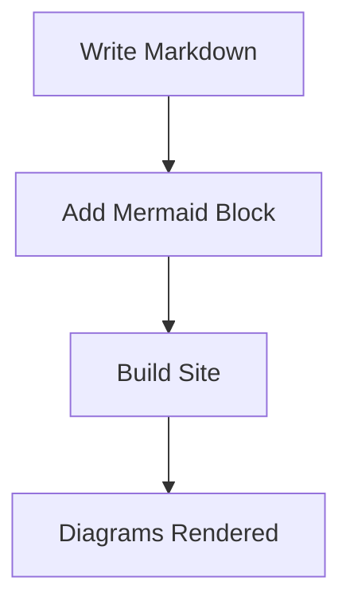
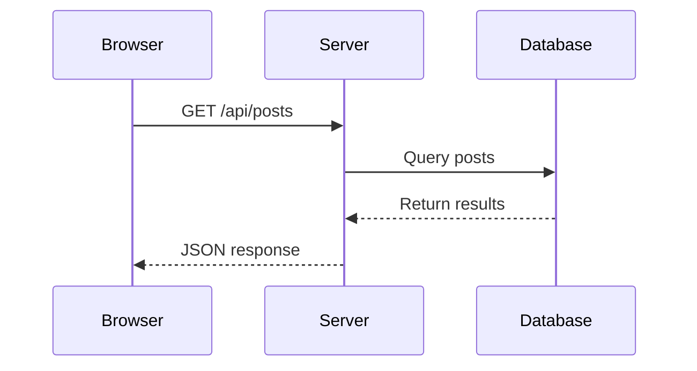

## Diagrams Made Easy

One of the cool features of this blog is built-in support for Mermaid diagrams. Just write them in fenced code blocks and they render automatically.

### A Simple Flowchart



### Sequence Diagram

Here's how a typical API request flows:



### Mixing Code and Diagrams

You can freely mix regular code blocks with Mermaid diagrams. Here's some TypeScript:

```typescript
interface BlogPost {
  title: string;
  date: Date;
  description?: string;
}
```

And that's it — diagrams and code living happily together.
