## 引言

智能家居领域经历了多代协议演进，从早期的 Zigbee 1.0 到现代的 Thread 和 Matter。现在的产品更是五花八门，各种标识、缩写让人一脸懵逼。

本文将从技术角度详细解析各协议的演进历程、架构设计、网络拓扑和关键机制，帮助理解这些协议的技术架构、工作原理。

## 部署示例

下图展示了一个完整的智能家居网络部署示例，包含具体的 IP 地址、MAC 地址、协议参数和设备配置：

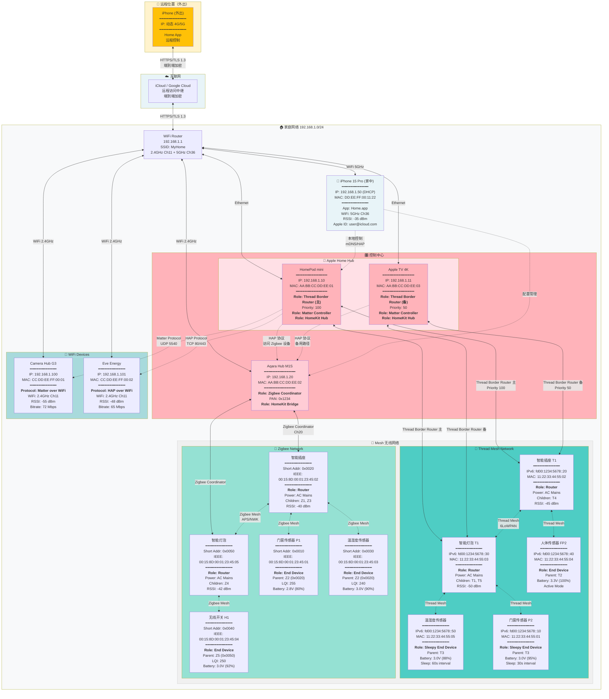
```mermaid
flowchart TB
    subgraph Internet["☁️ 互联网"]
        Cloud[iCloud / Google Cloud<br/>远程访问中继<br/>端到端加密]
    end
    
    subgraph Remote["📱 远程位置（外出）"]
        RemotePhone["iPhone (外出)<br/>━━━━━━━━━━━━<br/>IP: 动态 4G/5G<br/>━━━━━━━━━━━━<br/>Home App<br/>远程控制"]
    end
    
    subgraph HomeNetwork["🏠 家庭网络 192.168.1.0/24"]
        Router[WiFi Router<br/>192.168.1.1<br/>SSID: MyHome<br/>2.4GHz Ch11 + 5GHz Ch36]
        
        subgraph Controllers["🎛️ 控制中心"]
            subgraph AppleHub["🍎 Apple Home Hub"]
                HomePod["HomePod mini<br/>━━━━━━━━━━━━━━<br/>IP: 192.168.1.10<br/>MAC: AA:BB:CC:DD:EE:01<br/>━━━━━━━━━━━━━━<br/><b>Role: Thread Border Router (主)</b><br/>Priority: 100<br/><b>Role: Matter Controller</b><br/><b>Role: HomeKit Hub</b>"]
                
                AppleTV["Apple TV 4K<br/>━━━━━━━━━━━━━━<br/>IP: 192.168.1.11<br/>MAC: AA:BB:CC:DD:EE:03<br/>━━━━━━━━━━━━━━<br/><b>Role: Thread Border Router (备)</b><br/>Priority: 50<br/><b>Role: Matter Controller</b><br/><b>Role: HomeKit Hub</b>"]
            end
            
            AqaraHub["Aqara Hub M1S<br/>━━━━━━━━━━━━━━<br/>IP: 192.168.1.20<br/>MAC: AA:BB:CC:DD:EE:02<br/>━━━━━━━━━━━━━━<br/><b>Role: Zigbee Coordinator</b><br/>PAN: 0x1234<br/><b>Role: HomeKit Bridge</b>"]
        end
        
        subgraph MeshNetworks["📶 Mesh 无线网络"]
            direction LR
            subgraph ThreadMesh["🔷 Thread Mesh Network"]
                T2["智能插座 T1<br/>━━━━━━━━━━━━<br/>IPv6: fd00:1234:5678::20<br/>MAC: 11:22:33:44:55:02<br/>━━━━━━━━━━━━<br/><b>Role: Router</b><br/>Power: AC Mains<br/>Children: T4<br/>RSSI: -45 dBm"]
                
                T3["智能灯泡 T1<br/>━━━━━━━━━━━━<br/>IPv6: fd00:1234:5678::30<br/>MAC: 11:22:33:44:55:03<br/>━━━━━━━━━━━━<br/><b>Role: Router</b><br/>Power: AC Mains<br/>Children: T1, T5<br/>RSSI: -50 dBm"]
                
                T5["温湿度传感器<br/>━━━━━━━━━━━━<br/>IPv6: fd00:1234:5678::50<br/>MAC: 11:22:33:44:55:05<br/>━━━━━━━━━━━━<br/><b>Role: Sleepy End Device</b><br/>Parent: T3<br/>Battery: 3.0V (88%)<br/>Sleep: 60s interval"]
                
                T1["门窗传感器 P2<br/>━━━━━━━━━━━━<br/>IPv6: fd00:1234:5678::10<br/>MAC: 11:22:33:44:55:01<br/>━━━━━━━━━━━━<br/><b>Role: Sleepy End Device</b><br/>Parent: T3<br/>Battery: 3.0V (95%)<br/>Sleep: 30s interval"]
                
                T4["人体传感器 FP2<br/>━━━━━━━━━━━━<br/>IPv6: fd00:1234:5678::40<br/>MAC: 11:22:33:44:55:04<br/>━━━━━━━━━━━━<br/><b>Role: End Device</b><br/>Parent: T2<br/>Battery: 3.3V (100%)<br/>Active Mode"]
            end
            
            subgraph ZigbeeMesh["🔶 Zigbee Network"]
                Z2["智能插座<br/>━━━━━━━━━━━━<br/>Short Addr: 0x0020<br/>IEEE: 00:15:8D:00:01:23:45:02<br/>━━━━━━━━━━━━<br/><b>Role: Router</b><br/>Power: AC Mains<br/>Children: Z1, Z3<br/>RSSI: -40 dBm"]
                
                Z5["智能灯泡<br/>━━━━━━━━━━━━<br/>Short Addr: 0x0050<br/>IEEE: 00:15:8D:00:01:23:45:05<br/>━━━━━━━━━━━━<br/><b>Role: Router</b><br/>Power: AC Mains<br/>Children: Z4<br/>RSSI: -42 dBm"]
                
                Z1["门窗传感器 P1<br/>━━━━━━━━━━━━<br/>Short Addr: 0x0010<br/>IEEE: 00:15:8D:00:01:23:45:01<br/>━━━━━━━━━━━━<br/><b>Role: End Device</b><br/>Parent: Z2 (0x0020)<br/>LQI: 255<br/>Battery: 2.8V (80%)"]
                
                Z3["温湿度传感器<br/>━━━━━━━━━━━━<br/>Short Addr: 0x0030<br/>IEEE: 00:15:8D:00:01:23:45:03<br/>━━━━━━━━━━━━<br/><b>Role: End Device</b><br/>Parent: Z2 (0x0020)<br/>LQI: 240<br/>Battery: 3.0V (90%)"]
                
                Z4["无线开关 H1<br/>━━━━━━━━━━━━<br/>Short Addr: 0x0040<br/>IEEE: 00:15:8D:00:01:23:45:04<br/>━━━━━━━━━━━━<br/><b>Role: End Device</b><br/>Parent: Z5 (0x0050)<br/>LQI: 250<br/>Battery: 3.0V (92%)"]
            end
        end
        
        subgraph WiFiDevices["📡 WiFi Devices"]
            W1["Camera Hub G3<br/>━━━━━━━━━━━━<br/>IP: 192.168.1.100<br/>MAC: CC:DD:EE:FF:00:01<br/>━━━━━━━━━━━━<br/><b>Protocol: Matter over WiFi</b><br/>WiFi: 2.4GHz Ch11<br/>RSSI: -55 dBm<br/>Bitrate: 72 Mbps"]
            
            W2["Eve Energy<br/>━━━━━━━━━━━━<br/>IP: 192.168.1.101<br/>MAC: CC:DD:EE:FF:00:02<br/>━━━━━━━━━━━━<br/><b>Protocol: HAP over WiFi</b><br/>WiFi: 2.4GHz Ch11<br/>RSSI: -48 dBm<br/>Bitrate: 65 Mbps"]
        end
        
        iPhone["📱 iPhone 15 Pro (家中)<br/>━━━━━━━━━━━━<br/>IP: 192.168.1.50 (DHCP)<br/>MAC: DD:EE:FF:00:11:22<br/>━━━━━━━━━━━━<br/>App: Home.app<br/>WiFi: 5GHz Ch36<br/>RSSI: -35 dBm<br/>Apple ID: user@icloud.com"]
    end
    
    RemotePhone <-->|HTTPS/TLS 1.3<br/>端到端加密| Cloud
    Cloud <-->|HTTPS/TLS 1.3| Router
    Router <-->|Ethernet| HomePod
    Router <-->|Ethernet| AppleTV
    Router <-->|WiFi 2.4GHz| AqaraHub
    Router <-->|WiFi 2.4GHz| W1
    Router <-->|WiFi 2.4GHz| W2
    Router <-->|WiFi 5GHz| iPhone
    
    HomePod <-->|Thread Border Router 主<br/>Priority 100| T2
    HomePod <-->|Thread Border Router 主| T3
    AppleTV <-->|Thread Border Router 备<br/>Priority 50| T2
    AppleTV <-->|Thread Border Router 备| T3
    AqaraHub <-->|Zigbee Coordinator<br/>Ch20| Z2
    AqaraHub <-->|Zigbee Coordinator| Z5
    
    HomePod -.HAP 协议<br/>访问 Zigbee 设备.-> AqaraHub
    AppleTV -.HAP 协议<br/>备用路径.-> AqaraHub
    
    HomePod -.Matter Protocol<br/>UDP 5540.-> W1
    HomePod -.HAP Protocol<br/>TCP 80/443.-> W2
    
    T2 <-.Thread Mesh<br/>6LoWPAN.-> T3
    T3 <-.Thread Mesh.-> T1
    T3 <-.Thread Mesh.-> T5
    T2 <-.Thread Mesh.-> T4
    
    Z2 <-.Zigbee Mesh<br/>APS/NWK.-> Z5
    Z2 <-.Zigbee Mesh.-> Z1
    Z2 <-.Zigbee Mesh.-> Z3
    Z5 <-.Zigbee Mesh.-> Z4
    
    iPhone -.本地控制<br/>mDNS/HAP.-> HomePod
    iPhone -.配置管理.-> AqaraHub
    
    style Remote fill:#fff3cd
    style RemotePhone fill:#ffc107
    style Internet fill:#e8f4f8
    style HomeNetwork fill:#f8f9fa
    style Controllers fill:#ffb3ba
    style AppleHub fill:#ffe0e6
    style MeshNetworks fill:#f0f0f0,stroke:#ccc
    style ThreadMesh fill:#4ecdc4
    style ZigbeeMesh fill:#95e1d3
    style WiFiDevices fill:#a8dadc
    style HomePod fill:#ffb3ba
    style AppleTV fill:#ffb3ba
    style AqaraHub fill:#ffccd5
    style iPhone fill:#e8f4f8
```

### 协议栈层级总览

在深入各协议细节之前，先理解它们在网络协议栈中的位置关系：


```mermaid
graph TB
    subgraph AppLayer["应用层 Application Layer"]
        Matter[Matter<br/>设备类型、命令、属性]
        ZigbeeApp[Zigbee Application<br/>Cluster Library]
    end
    
    subgraph NetLayer["网络层 Network Layer"]
        Thread[Thread<br/>IPv6 Mesh]
        ZigbeeNet[Zigbee Network<br/>Mesh Routing]
    end
    
    subgraph PhyLayer["物理层 Physical Layer"]
        IEEE[IEEE 802.15.4<br/>2.4GHz Radio]
        WiFi[WiFi Radio<br/>2.4/5GHz]
    end
    
    Matter --> Thread
    Matter --> WiFi
    ZigbeeApp --> ZigbeeNet
    Thread --> IEEE
    ZigbeeNet --> IEEE
    
    style AppLayer fill:#ffb3ba
    style NetLayer fill:#457b9d
    style PhyLayer fill:#1d3557
```

**关键区别**：
- **Zigbee**：集成了应用层和网络层（紧耦合），对应总览图中的 🔶 Zigbee Network
- **Thread**：仅提供网络层（需要 Matter 等应用层），对应总览图中的 🔷 Thread Mesh Network
- **Matter**：纯应用层协议（可运行在 Thread、WiFi、Ethernet 上），对应总览图中 Controllers 的 Matter Controller 角色

接下来按照总览图中各区块，逐一深入解析。

## Zigbee 简介

> 对应总览图中 **🔶 Zigbee Network** 区块。Zigbee 是智能家居领域最成熟的低功耗无线协议之一，基于 IEEE 802.15.4 标准，采用 2.4GHz 频段，数据速率 250 kbps。

### 演变历史

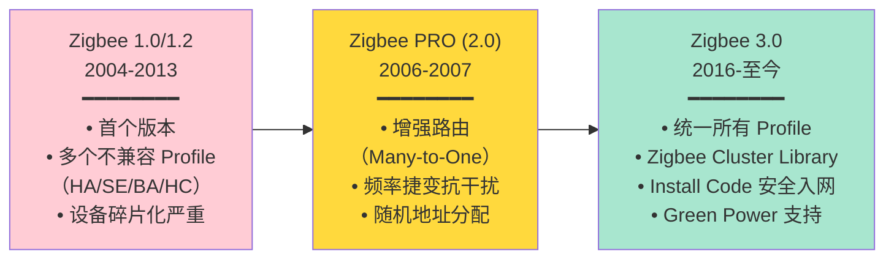
```mermaid
graph LR
    V1["Zigbee 1.0/1.2<br/>2004-2013<br/>━━━━━━━━<br/>• 首个版本<br/>• 多个不兼容 Profile<br/>（HA/SE/BA/HC）<br/>• 设备碎片化严重"]
    V2["Zigbee PRO (2.0)<br/>2006-2007<br/>━━━━━━━━<br/>• 增强路由<br/>（Many-to-One）<br/>• 频率捷变抗干扰<br/>• 随机地址分配"]
    V3["Zigbee 3.0<br/>2016-至今<br/>━━━━━━━━<br/>• 统一所有 Profile<br/>• Zigbee Cluster Library<br/>• Install Code 安全入网<br/>• Green Power 支持"]

    V1 --> V2 --> V3

    style V1 fill:#ffccd5
    style V2 fill:#ffd93d
    style V3 fill:#a8e6cf
```

**Zigbee 1.0/1.2** 定义了基础架构（Coordinator / Router / End Device），但最大问题是 Application Profile 碎片化——Home Automation、Smart Energy、Building Automation 等 Profile 之间的设备无法互通，厂商自定义扩展加剧了这一问题。

**Zigbee PRO (2.0)** 改进了网络层：引入 Many-to-One Routing 优化上行流量、Source Routing 让 Coordinator 指定完整路径、Frequency Agility 动态切换信道避开干扰。理论最大节点数 65,536，实际推荐 100-200 个设备。

**Zigbee 3.0** 是真正的转折点——统一所有 Application Profile 为单一标准，通过 Zigbee Cluster Library（ZCL）定义通用设备类型。安全方面引入 Install Code 机制（设备出厂预置，扫码入网），支持 Green Power（能量收集的无电池设备）。

| 特性 | Zigbee 3.0 规格 |
|------|-----------------|
| 物理层 | IEEE 802.15.4 |
| 频段 | 2.4GHz / 868MHz / 915MHz |
| 数据速率 | 250 kbps @ 2.4GHz |
| 加密 | AES-128-CCM（多层密钥） |
| 网络拓扑 | Star / Tree / Mesh |
| 最大节点数 | 65,536（理论），100-200（实际） |
| 传输范围 | 10-100m（单跳） |
| 电池寿命 | 6-24 个月（传感器） |

### 网络角色

Zigbee 网络由三种角色组成，对应总览图中 Aqara Hub M1S（Coordinator）、智能插座/灯泡（Router）和各类传感器/开关（End Device）：

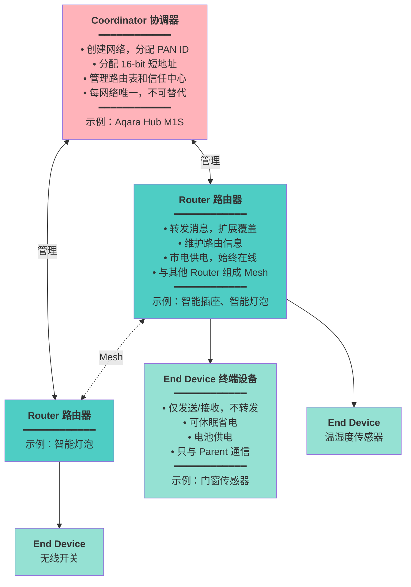
```mermaid
graph TD
    C["<b>Coordinator 协调器</b><br/>━━━━━━━━━━━━<br/>• 创建网络，分配 PAN ID<br/>• 分配 16-bit 短地址<br/>• 管理路由表和信任中心<br/>• 每网络唯一，不可替代<br/>━━━━━━━━━━━━<br/>示例：Aqara Hub M1S"]

    R1["<b>Router 路由器</b><br/>━━━━━━━━━━━━<br/>• 转发消息，扩展覆盖<br/>• 维护路由信息<br/>• 市电供电，始终在线<br/>• 与其他 Router 组成 Mesh<br/>━━━━━━━━━━━━<br/>示例：智能插座、智能灯泡"]

    R2["<b>Router 路由器</b><br/>━━━━━━━━━━━━<br/>示例：智能灯泡"]

    E1["<b>End Device 终端设备</b><br/>━━━━━━━━━━━━<br/>• 仅发送/接收，不转发<br/>• 可休眠省电<br/>• 电池供电<br/>• 只与 Parent 通信<br/>━━━━━━━━━━━━<br/>示例：门窗传感器"]

    E2["<b>End Device</b><br/>温湿度传感器"]
    E3["<b>End Device</b><br/>无线开关"]

    C <-->|管理| R1
    C <-->|管理| R2
    R1 <-.Mesh.-> R2
    R1 --> E1
    R1 --> E2
    R2 --> E3

    style C fill:#ffb3ba
    style R1 fill:#4ecdc4
    style R2 fill:#4ecdc4
    style E1 fill:#95e1d3
    style E2 fill:#95e1d3
    style E3 fill:#95e1d3
```

**地址体系**：
- **PAN ID**：16-bit 网络标识符（如 0x1234），由 Coordinator 创建
- **Short Address**：16-bit 设备地址（0x0000-0xFFF7），Coordinator 固定为 0x0000
- **Extended Address**：64-bit IEEE MAC 地址（全球唯一，出厂烧录）

### Coordinator 单点问题

Zigbee 的架构决定了 Coordinator 是网络的**单点故障**。每个网络只能有一个 Coordinator，因为它承担三项不可分割的职责：

1. **PAN ID 管理**：创建并维护唯一的 PAN，多个 Coordinator 意味着多个独立网络
2. **地址分配**：维护全局地址表，多个分配源会导致地址冲突
3. **路由中心**：维护全局路由表和信任中心，多中心会导致路由混乱

Coordinator 故障后只能通过手动备份恢复（PAN ID、Network Key、设备表等），恢复时间分钟级，设备可能需要重新配对。这与 Thread 的多 Border Router 自动故障切换形成鲜明对比。

#### 多网关场景

**实际部署中可以使用多个 Aqara Hub（如大户型、多楼层）**，但每个 Hub 是各自独立 Zigbee 网络的 Coordinator（不同 PAN ID），**协议层面完全隔离**。统一管理依赖上层：各 Hub 通过 HomeKit Bridge 将设备暴露给 Apple Home，在 Home App 中统一呈现。

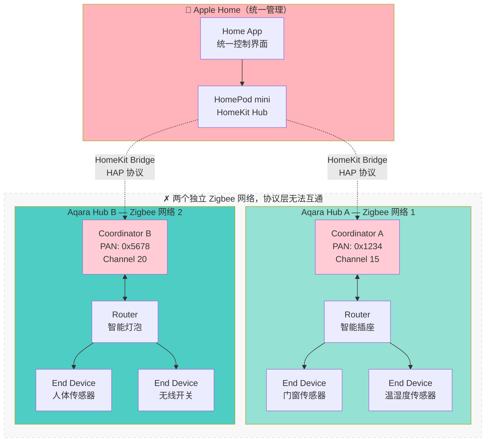
```mermaid
flowchart TB
    subgraph AppleHome["🍎 Apple Home（统一管理）"]
        HomeApp["Home App<br/>统一控制界面"]
        HomePod["HomePod mini<br/>HomeKit Hub"]
        HomeApp --> HomePod
    end

    subgraph Hubs["✗ 两个独立 Zigbee 网络，协议层无法互通"]
        direction LR

        subgraph HubA["Aqara Hub A — Zigbee 网络 1"]
            CA["Coordinator A<br/>PAN: 0x1234<br/>Channel 15"]
            RA["Router<br/>智能插座"]
            EA1["End Device<br/>门窗传感器"]
            EA2["End Device<br/>温湿度传感器"]
            CA <--> RA
            RA --> EA1
            RA --> EA2
        end

        subgraph HubB["Aqara Hub B — Zigbee 网络 2"]
            CB["Coordinator B<br/>PAN: 0x5678<br/>Channel 20"]
            RB["Router<br/>智能灯泡"]
            EB1["End Device<br/>人体传感器"]
            EB2["End Device<br/>无线开关"]
            CB <--> RB
            RB --> EB1
            RB --> EB2
        end
    end

    HomePod -.HomeKit Bridge<br/>HAP 协议.-> CA
    HomePod -.HomeKit Bridge<br/>HAP 协议.-> CB

    style AppleHome fill:#ffb3ba
    style Hubs fill:#f8f8f8,stroke:#ddd,stroke-dasharray:5 5
    style HubA fill:#95e1d3
    style HubB fill:#4ecdc4
    style CA fill:#ffccd5
    style CB fill:#ffccd5
```

跨 Hub 自动化通过 HomeKit 自动化引擎实现（如 Hub A 的温湿度传感器触发 → Hub B 的智能灯泡响应），而非 Zigbee 协议层面的互通。这本质上没有改变 Zigbee 单 Coordinator 的架构限制——只是在应用层做了聚合。

## Thread 协议详解

> 对应总览图中 **🔷 Thread Mesh Network** 区块。HomePod mini 和 Apple TV 4K 分别作为主备 Border Router，2 个 Router（智能插座、智能灯泡）组成 Mesh 骨干，3 个 End Device 分布在各 Router 下。

### Thread 核心设计

Thread 由 Thread Group 于 2014 年发布，专为低功耗 IoT 设备设计，是 Matter 的首选网络层。

#### 技术规格

| 特性 | 规格 |
|------|------|
| 物理层 | IEEE 802.15.4 |
| 网络层 | IPv6（6LoWPAN） |
| 频段 | 2.4GHz |
| 数据速率 | 250 kbps |
| 调制 | O-QPSK |
| 加密 | AES-128-CCM |
| 地址 | IPv6（每设备唯一） |
| 拓扑 | Mesh（多 Border Router） |
| 传输范围 | 10-30m（单跳） |
| 电池寿命 | 1-3 年（传感器） |

#### Thread 设备角色

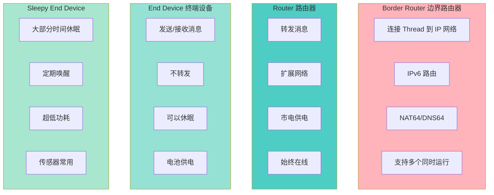
```mermaid
graph TB
    subgraph BorderRouter["Border Router 边界路由器"]
        BR1[连接 Thread 到 IP 网络]
        BR2[IPv6 路由]
        BR3[NAT64/DNS64]
        BR4[支持多个同时运行]
    end
    
    subgraph Router["Router 路由器"]
        R1[转发消息]
        R2[扩展网络]
        R3[市电供电]
        R4[始终在线]
    end
    
    subgraph EndDevice["End Device 终端设备"]
        E1[发送/接收消息]
        E2[不转发]
        E3[可以休眠]
        E4[电池供电]
    end
    
    subgraph SleepyEnd["Sleepy End Device"]
        S1[大部分时间休眠]
        S2[定期唤醒]
        S3[超低功耗]
        S4[传感器常用]
    end
    
    style BorderRouter fill:#ffb3ba
    style Router fill:#4ecdc4
    style EndDevice fill:#95e1d3
    style SleepyEnd fill:#a8e6cf
```

#### Thread 网络拓扑

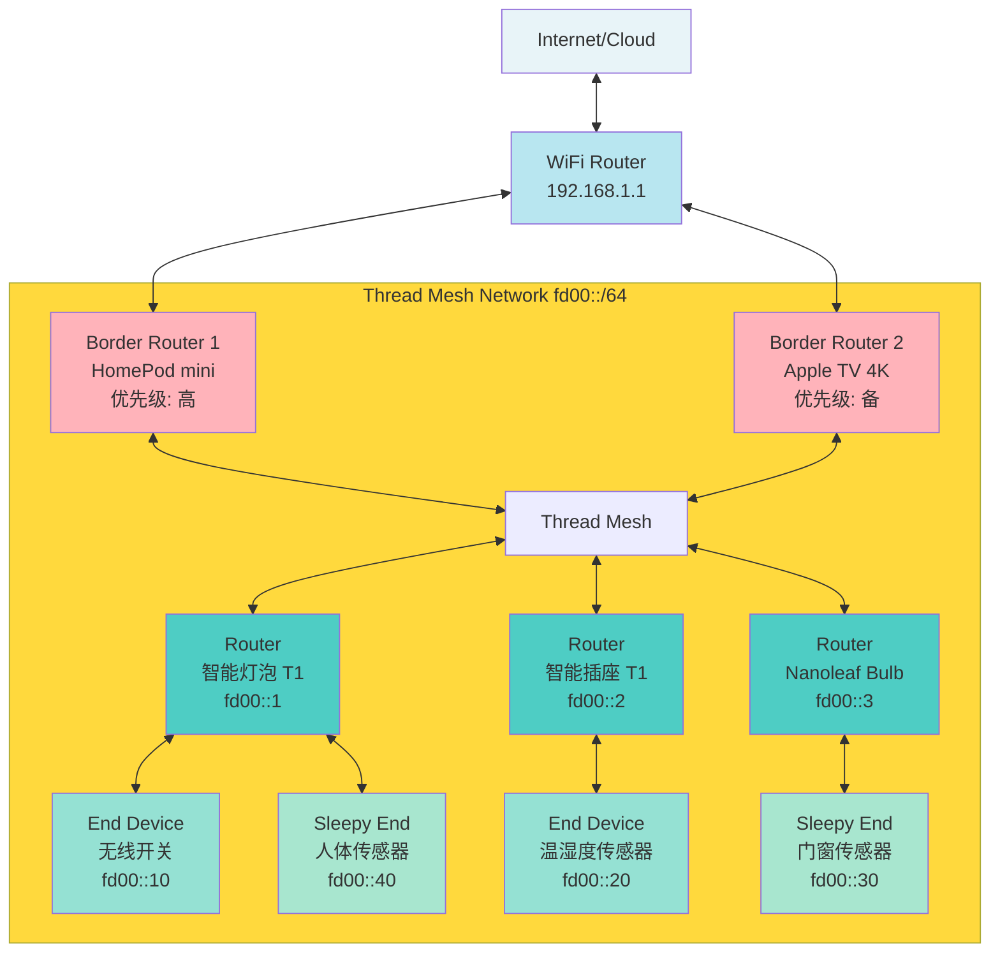
```mermaid
graph TB
    Internet[Internet/Cloud] <--> WR[WiFi Router<br/>192.168.1.1]
    
    WR <--> BR1[Border Router 1<br/>HomePod mini<br/>优先级: 高]
    WR <--> BR2[Border Router 2<br/>Apple TV 4K<br/>优先级: 备]
    
    subgraph ThreadMesh["Thread Mesh Network fd00::/64"]
        BR1 <--> TM[Thread Mesh]
        BR2 <--> TM
        
        TM <--> R1[Router<br/>智能灯泡 T1<br/>fd00::1]
        TM <--> R2[Router<br/>智能插座 T1<br/>fd00::2]
        TM <--> R3[Router<br/>Nanoleaf Bulb<br/>fd00::3]
        
        R1 <--> ED1[End Device<br/>无线开关<br/>fd00::10]
        R2 <--> ED2[End Device<br/>温湿度传感器<br/>fd00::20]
        R3 <--> SED1[Sleepy End<br/>门窗传感器<br/>fd00::30]
        R1 <--> SED2[Sleepy End<br/>人体传感器<br/>fd00::40]
    end
    
    style Internet fill:#e8f4f8
    style WR fill:#b8e6f0
    style BR1 fill:#ffb3ba
    style BR2 fill:#ffb3ba
    style ThreadMesh fill:#ffd93d
    style R1 fill:#4ecdc4
    style R2 fill:#4ecdc4
    style R3 fill:#4ecdc4
    style ED1 fill:#95e1d3
    style ED2 fill:#95e1d3
    style SED1 fill:#a8e6cf
    style SED2 fill:#a8e6cf
```

### Thread Border Router 详解

#### 核心功能

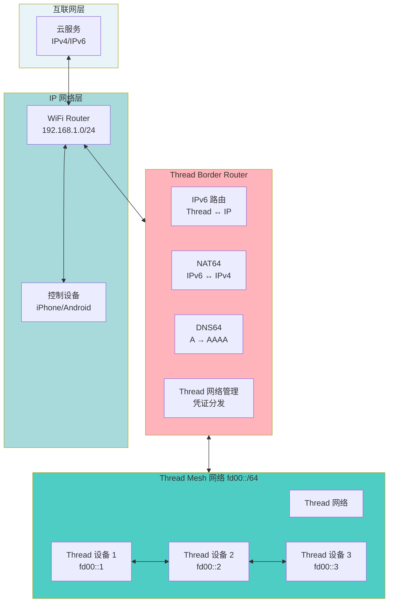
```mermaid
graph TB
    subgraph Internet["互联网层"]
        Cloud[云服务<br/>IPv4/IPv6]
    end
    
    subgraph IPNetwork["IP 网络层"]
        Router[WiFi Router<br/>192.168.1.0/24]
        Phone[控制设备<br/>iPhone/Android]
    end
    
    subgraph BorderRouter["Thread Border Router"]
        IPv6R[IPv6 路由<br/>Thread ↔ IP]
        NAT64[NAT64<br/>IPv6 ↔ IPv4]
        DNS64[DNS64<br/>A → AAAA]
        Mgmt[Thread 网络管理<br/>凭证分发]
    end
    
    subgraph ThreadNet["Thread Mesh 网络 fd00::/64"]
        TN[Thread 网络]
        TD1[Thread 设备 1<br/>fd00::1]
        TD2[Thread 设备 2<br/>fd00::2]
        TD3[Thread 设备 3<br/>fd00::3]
    end
    
    Cloud <--> Router
    Router <--> Phone
    Router <--> BorderRouter
    BorderRouter <--> ThreadNet
    TD1 <--> TD2
    TD2 <--> TD3
    
    style Internet fill:#e8f4f8
    style IPNetwork fill:#a8dadc
    style BorderRouter fill:#ffb3ba
    style ThreadNet fill:#4ecdc4
```

#### 多 Border Router 架构

Thread 的关键优势是**原生支持多个 Border Router**：

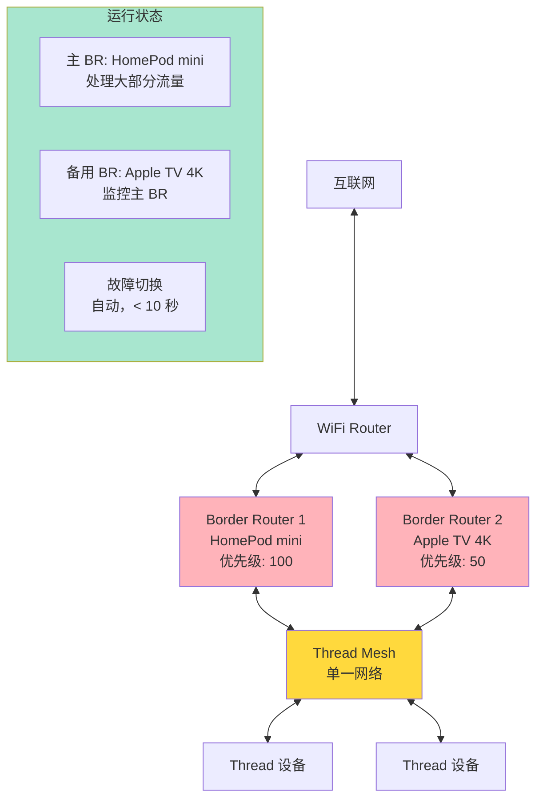
```mermaid
graph TB
    Internet[互联网] <--> Router[WiFi Router]
    
    Router <--> BR1[Border Router 1<br/>HomePod mini<br/>优先级: 100]
    Router <--> BR2[Border Router 2<br/>Apple TV 4K<br/>优先级: 50]
    
    BR1 <--> Mesh[Thread Mesh<br/>单一网络]
    BR2 <--> Mesh
    
    Mesh <--> D1[Thread 设备]
    Mesh <--> D2[Thread 设备]
    
    subgraph Status["运行状态"]
        S1[主 BR: HomePod mini<br/>处理大部分流量]
        S2[备用 BR: Apple TV 4K<br/>监控主 BR]
        S3[故障切换<br/>自动，< 10 秒]
    end
    
    style BR1 fill:#ffb3ba
    style BR2 fill:#ffb3ba
    style Mesh fill:#ffd93d
    style Status fill:#a8e6cf
```

**Border Router 选举机制**：
1. 基于优先级（Priority）
2. 优先级相同时比较 Router ID
3. 主 Border Router 故障时自动切换
4. 无需人工干预
5. 切换时间：< 10 秒

#### Thread vs Zigbee 架构对比

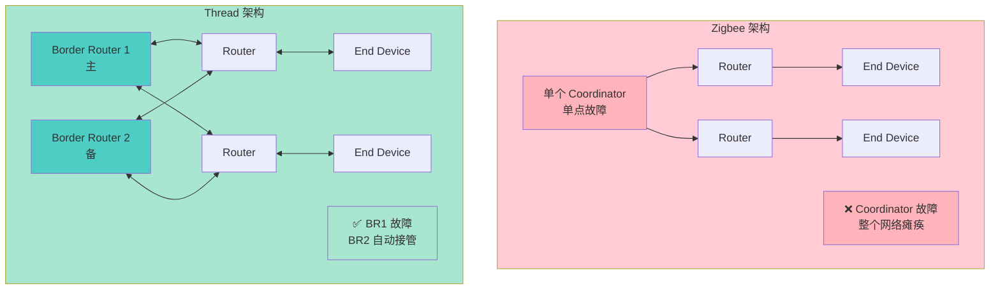
```mermaid
graph TB
    subgraph Zigbee["Zigbee 架构"]
        ZC[单个 Coordinator<br/>单点故障]
        ZR1[Router]
        ZR2[Router]
        ZE1[End Device]
        ZE2[End Device]
        
        ZC --> ZR1
        ZC --> ZR2
        ZR1 --> ZE1
        ZR2 --> ZE2
        
        ZFail[❌ Coordinator 故障<br/>整个网络瘫痪]
    end
    
    subgraph Thread["Thread 架构"]
        TBR1[Border Router 1<br/>主]
        TBR2[Border Router 2<br/>备]
        TR1[Router]
        TR2[Router]
        TE1[End Device]
        TE2[End Device]
        
        TBR1 <--> TR1
        TBR1 <--> TR2
        TBR2 <--> TR1
        TBR2 <--> TR2
        TR1 <--> TE1
        TR2 <--> TE2
        
        TOK[✅ BR1 故障<br/>BR2 自动接管]
    end
    
    style Zigbee fill:#ffccd5
    style Thread fill:#a8e6cf
    style ZC fill:#ffb3ba
    style ZFail fill:#ffb3ba
    style TBR1 fill:#4ecdc4
    style TBR2 fill:#4ecdc4
    style TOK fill:#a8e6cf
```

### Thread 技术特性

#### IPv6 原生支持

每个 Thread 设备都有唯一的 IPv6 地址：

```
全局单播地址（Global Unicast Address）：
  前缀：由 Border Router 分配
  示例：2001:db8:1234:5678::1

链路本地地址（Link-Local Address）：
  前缀：fe80::/10
  示例：fe80::1234:5678:9abc:def0

Mesh-Local 地址：
  前缀：fd00::/8（ULA）
  示例：fd00:1234:5678::1
```

#### 6LoWPAN 压缩

Thread 使用 6LoWPAN 压缩 IPv6 头部：

```
标准 IPv6 头部：40 字节
6LoWPAN 压缩后：最少 2 字节

压缩技术：
• 头部压缩（HC1, HC2）
• 上下文压缩（Context-based）
• 地址压缩（基于 MAC 地址）
• 跳数限制压缩
```


## Matter 协议详解

> 对应总览图中 **🎛️ 控制中心** 的 Matter Controller 角色和 **📡 WiFi Devices** 区块。Matter 是纯应用层协议，运行在 Thread 和 WiFi 之上，HomePod/Apple TV 作为 Matter Controller 统一管理所有 Matter 设备。

### Matter 架构设计

Matter（前身 Project CHIP）是纯应用层协议，由 Connectivity Standards Alliance 开发。

#### Matter 协议栈


```mermaid
graph TB
    subgraph Platform["智能家居平台"]
        P1[Apple Home]
        P2[Google Home]
        P3[Amazon Alexa]
        P4[Samsung SmartThings]
    end
    
    subgraph AppLayer["Matter Application Layer"]
        DM[数据模型<br/>Data Model]
        IM[交互模型<br/>Interaction Model]
        Cluster[Cluster Library<br/>设备类型定义]
    end
    
    subgraph TransLayer["Transport Layer"]
        T1[Thread]
        T2[WiFi]
        T3[Ethernet]
    end
    
    subgraph PhyLayer["Physical Layer"]
        PH1[IEEE 802.15.4<br/>2.4GHz]
        PH2[WiFi Radio<br/>2.4/5GHz]
        PH3[Ethernet Cable<br/>RJ45]
    end
    
    Platform --> AppLayer
    AppLayer --> TransLayer
    T1 --> PH1
    T2 --> PH2
    T3 --> PH3
    
    style Platform fill:#a8dadc
    style AppLayer fill:#ffb3ba
    style TransLayer fill:#457b9d
    style PhyLayer fill:#1d3557
```

### Matter Bridge 机制

Matter 支持通过 **Bridge** 将非 Matter 设备（如 Zigbee、Z-Wave、专有协议）集成到 Matter 生态：

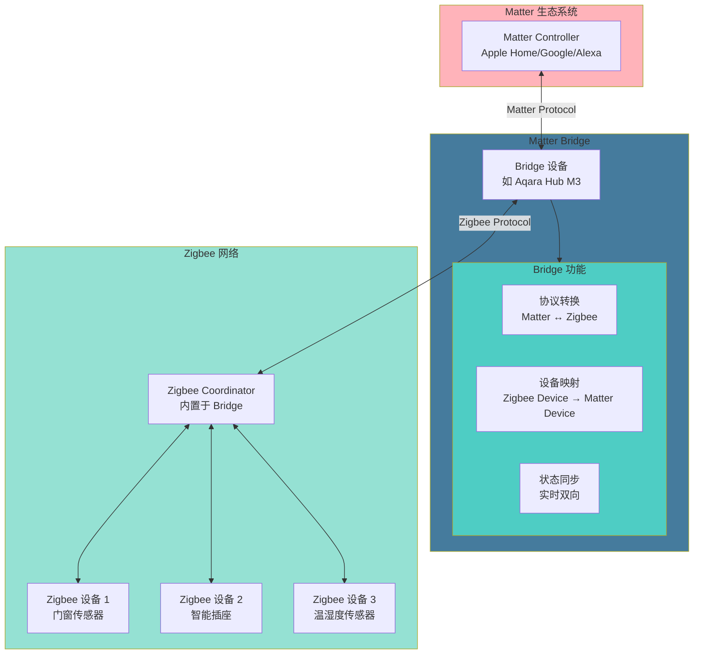
```mermaid
graph TB
    subgraph MatterEco["Matter 生态系统"]
        MC[Matter Controller<br/>Apple Home/Google/Alexa]
    end
    
    subgraph Bridge["Matter Bridge"]
        MB[Bridge 设备<br/>如 Aqara Hub M3]
        
        subgraph BridgeFunc["Bridge 功能"]
            Trans[协议转换<br/>Matter ↔ Zigbee]
            Map[设备映射<br/>Zigbee Device → Matter Device]
            State[状态同步<br/>实时双向]
        end
    end
    
    subgraph ZigbeeNet["Zigbee 网络"]
        ZC[Zigbee Coordinator<br/>内置于 Bridge]
        Z1[Zigbee 设备 1<br/>门窗传感器]
        Z2[Zigbee 设备 2<br/>智能插座]
        Z3[Zigbee 设备 3<br/>温湿度传感器]
    end
    
    MC <-->|Matter Protocol| MB
    MB --> BridgeFunc
    MB <-->|Zigbee Protocol| ZC
    ZC <--> Z1
    ZC <--> Z2
    ZC <--> Z3
    
    style MatterEco fill:#ffb3ba
    style Bridge fill:#457b9d
    style BridgeFunc fill:#4ecdc4
    style ZigbeeNet fill:#95e1d3
```

#### Bridge 工作原理

**设备映射**：

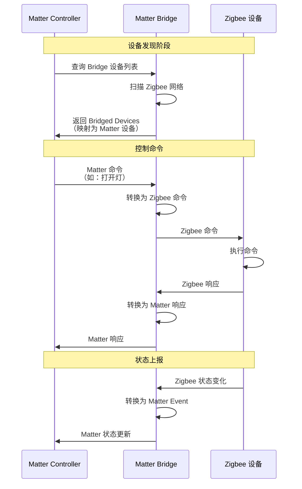
```mermaid
sequenceDiagram
    participant MC as Matter Controller
    participant Bridge as Matter Bridge
    participant ZD as Zigbee 设备
    
    Note over MC,ZD: 设备发现阶段
    MC->>Bridge: 查询 Bridge 设备列表
    Bridge->>Bridge: 扫描 Zigbee 网络
    Bridge->>MC: 返回 Bridged Devices<br/>（映射为 Matter 设备）
    
    Note over MC,ZD: 控制命令
    MC->>Bridge: Matter 命令<br/>（如：打开灯）
    Bridge->>Bridge: 转换为 Zigbee 命令
    Bridge->>ZD: Zigbee 命令
    ZD->>ZD: 执行命令
    ZD->>Bridge: Zigbee 响应
    Bridge->>Bridge: 转换为 Matter 响应
    Bridge->>MC: Matter 响应
    
    Note over MC,ZD: 状态上报
    ZD->>Bridge: Zigbee 状态变化
    Bridge->>Bridge: 转换为 Matter Event
    Bridge->>MC: Matter 状态更新
```

**Bridged Device 类型**：

Matter 定义了专门的 Bridged Device 类型：

```
Bridged Node（桥接节点）
  └─ Bridged Device Endpoint
      ├─ Bridged Device Basic Information Cluster
      │   ├─ Reachable（可达性）
      │   ├─ NodeLabel（设备名称）
      │   └─ UniqueID（唯一标识）
      └─ 设备功能 Clusters
          ├─ On/Off Cluster
          ├─ Level Control Cluster
          └─ 其他 Clusters
```

#### Zigbee 通过 Bridge 加入 Matter

**技术实现**：

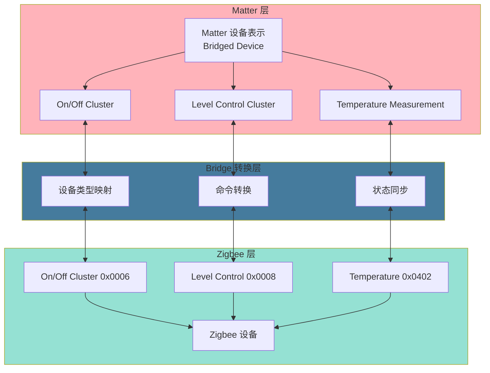
```mermaid
graph TB
    subgraph MatterLayer["Matter 层"]
        MD[Matter 设备表示<br/>Bridged Device]
        MC1[On/Off Cluster]
        MC2[Level Control Cluster]
        MC3[Temperature Measurement]
    end
    
    subgraph BridgeLayer["Bridge 转换层"]
        Map[设备类型映射]
        Trans[命令转换]
        Sync[状态同步]
    end
    
    subgraph ZigbeeLayer["Zigbee 层"]
        ZD[Zigbee 设备]
        ZC1[On/Off Cluster 0x0006]
        ZC2[Level Control 0x0008]
        ZC3[Temperature 0x0402]
    end
    
    MD --> MC1
    MD --> MC2
    MD --> MC3
    
    MC1 <--> Map <--> ZC1
    MC2 <--> Trans <--> ZC2
    MC3 <--> Sync <--> ZC3
    
    ZC1 --> ZD
    ZC2 --> ZD
    ZC3 --> ZD
    
    style MatterLayer fill:#ffb3ba
    style BridgeLayer fill:#457b9d
    style ZigbeeLayer fill:#95e1d3
```

**Cluster 映射示例**：

| Zigbee Cluster | Cluster ID | Matter Cluster | Cluster ID |
|----------------|------------|----------------|------------|
| On/Off | 0x0006 | On/Off | 0x0006 |
| Level Control | 0x0008 | Level Control | 0x0008 |
| Color Control | 0x0300 | Color Control | 0x0300 |
| Temperature Measurement | 0x0402 | Temperature Measurement | 0x0402 |
| Occupancy Sensing | 0x0406 | Occupancy Sensing | 0x0406 |
| Door Lock | 0x0101 | Door Lock | 0x0101 |

**注意**：许多 Zigbee Cluster 与 Matter Cluster 有相同的 ID，因为 Matter 继承了 Zigbee Cluster Library（ZCL）的设计。

#### Bridge 的局限性

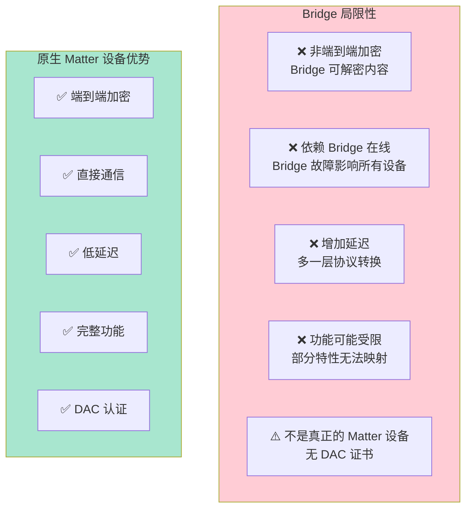
```mermaid
graph TB
    subgraph Limitations["Bridge 局限性"]
        L1[❌ 非端到端加密<br/>Bridge 可解密内容]
        L2[❌ 依赖 Bridge 在线<br/>Bridge 故障影响所有设备]
        L3[❌ 增加延迟<br/>多一层协议转换]
        L4[❌ 功能可能受限<br/>部分特性无法映射]
        L5[⚠️ 不是真正的 Matter 设备<br/>无 DAC 证书]
    end
    
    subgraph NativeMatter["原生 Matter 设备优势"]
        N1[✅ 端到端加密]
        N2[✅ 直接通信]
        N3[✅ 低延迟]
        N4[✅ 完整功能]
        N5[✅ DAC 认证]
    end
    
    style Limitations fill:#ffccd5
    style NativeMatter fill:#a8e6cf
```

**Bridge vs 原生 Matter**：

| 特性 | Zigbee via Bridge | 原生 Matter over Thread |
|------|-------------------|------------------------|
| 端到端加密 | ❌ Bridge 可解密 | ✅ 完全端到端 |
| 单点故障 | ❌ Bridge 故障影响全部 | ✅ 多 Border Router |
| 延迟 | 较高（协议转换） | 低（直接通信） |
| 功能完整性 | 可能受限 | 完整支持 |
| 设备认证 | 无 DAC | ✅ DAC 证书 |
| 部署复杂度 | 需要 Bridge | 需要 Border Router |
| 现有设备支持 | ✅ 可复用 | ❌ 需要新设备 |

### Matter 核心概念

#### 数据模型（Data Model）

Matter 使用层级化的数据模型：

```
Node（节点）
  └─ Endpoint（端点）
      └─ Cluster（簇）
          ├─ Attribute（属性）
          ├─ Command（命令）
          └─ Event（事件）
```

**示例：智能灯泡**

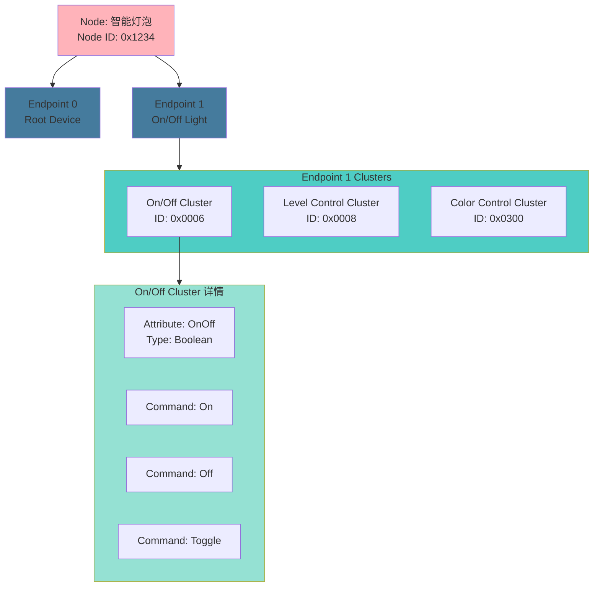
```mermaid
graph TB
    Node[Node: 智能灯泡<br/>Node ID: 0x1234]
    
    EP0[Endpoint 0<br/>Root Device]
    EP1[Endpoint 1<br/>On/Off Light]
    
    Node --> EP0
    Node --> EP1
    
    subgraph EP1Clusters["Endpoint 1 Clusters"]
        C1[On/Off Cluster<br/>ID: 0x0006]
        C2[Level Control Cluster<br/>ID: 0x0008]
        C3[Color Control Cluster<br/>ID: 0x0300]
    end
    
    EP1 --> EP1Clusters
    
    subgraph OnOffDetails["On/Off Cluster 详情"]
        A1[Attribute: OnOff<br/>Type: Boolean]
        CMD1[Command: On]
        CMD2[Command: Off]
        CMD3[Command: Toggle]
    end
    
    C1 --> OnOffDetails
    
    style Node fill:#ffb3ba
    style EP0 fill:#457b9d
    style EP1 fill:#457b9d
    style EP1Clusters fill:#4ecdc4
    style OnOffDetails fill:#95e1d3
```

#### Multi-Admin 机制

Matter 的关键特性是**同时支持多个控制器**：

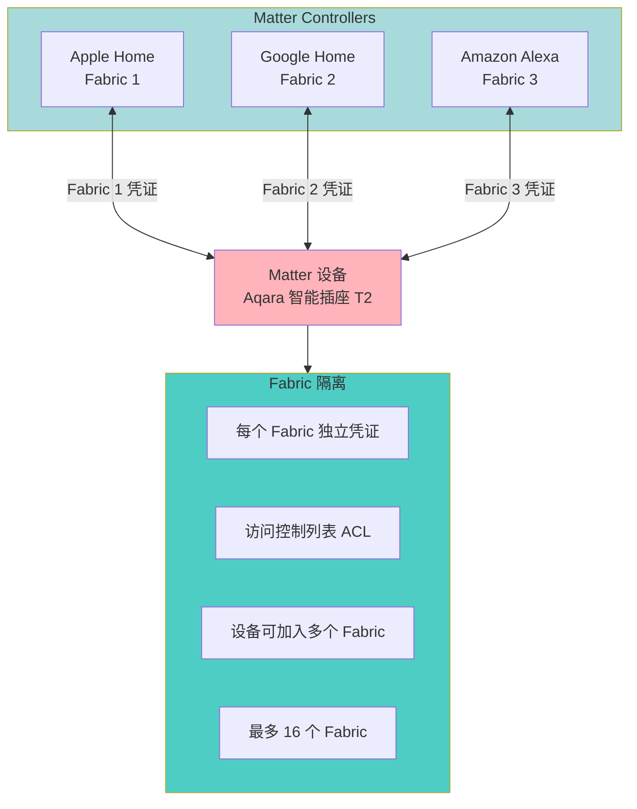
```mermaid
graph TB
    subgraph Controllers["Matter Controllers"]
        C1[Apple Home<br/>Fabric 1]
        C2[Google Home<br/>Fabric 2]
        C3[Amazon Alexa<br/>Fabric 3]
    end
    
    Device[Matter 设备<br/>Aqara 智能插座 T2]
    
    C1 <--->|Fabric 1 凭证| Device
    C2 <--->|Fabric 2 凭证| Device
    C3 <--->|Fabric 3 凭证| Device
    
    subgraph Fabrics["Fabric 隔离"]
        F1[每个 Fabric 独立凭证]
        F2[访问控制列表 ACL]
        F3[设备可加入多个 Fabric]
        F4[最多 16 个 Fabric]
    end
    
    Device --> Fabrics
    
    style Controllers fill:#a8dadc
    style Device fill:#ffb3ba
    style Fabrics fill:#4ecdc4
```

**Fabric 概念**：
- Fabric = 一个管理域
- 每个平台（Apple/Google/Amazon）是一个 Fabric
- 设备存储每个 Fabric 的独立凭证
- 不同 Fabric 之间隔离

### Matter 传输层选择

#### Matter over Thread

Matter 在 Thread 上的最佳实践：

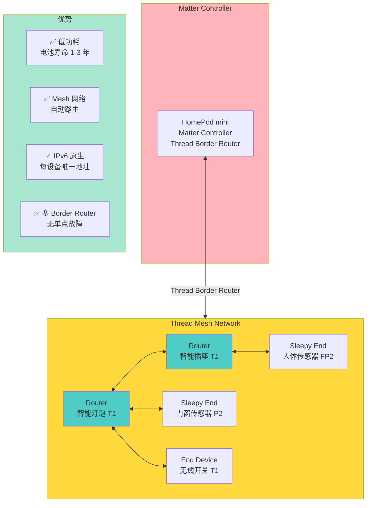
```mermaid
graph TB
    subgraph Controller["Matter Controller"]
        MC[HomePod mini<br/>Matter Controller<br/>Thread Border Router]
    end
    
    subgraph ThreadMesh["Thread Mesh Network"]
        R1[Router<br/>智能灯泡 T1]
        R2[Router<br/>智能插座 T1]
        
        SED1[Sleepy End<br/>门窗传感器 P2]
        SED2[Sleepy End<br/>人体传感器 FP2]
        ED1[End Device<br/>无线开关 T1]
    end
    
    MC <--->|Thread Border Router| ThreadMesh
    
    R1 <--> R2
    R1 <--> SED1
    R2 <--> SED2
    R1 <--> ED1
    
    subgraph Advantages["优势"]
        A1[✅ 低功耗<br/>电池寿命 1-3 年]
        A2[✅ Mesh 网络<br/>自动路由]
        A3[✅ IPv6 原生<br/>每设备唯一地址]
        A4[✅ 多 Border Router<br/>无单点故障]
    end
    
    style Controller fill:#ffb3ba
    style ThreadMesh fill:#ffd93d
    style R1 fill:#4ecdc4
    style R2 fill:#4ecdc4
    style Advantages fill:#a8e6cf
```

#### Matter over WiFi

Matter 也支持 WiFi 传输：

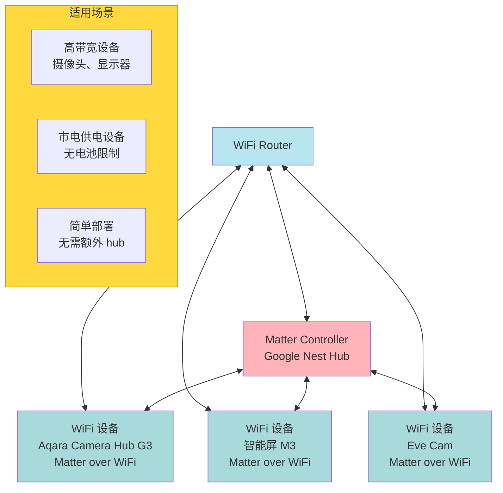
```mermaid
graph TB
    Router[WiFi Router] <--> MC[Matter Controller<br/>Google Nest Hub]
    
    Router <--> W1[WiFi 设备<br/>Aqara Camera Hub G3<br/>Matter over WiFi]
    Router <--> W2[WiFi 设备<br/>智能屏 M3<br/>Matter over WiFi]
    Router <--> W3[WiFi 设备<br/>Eve Cam<br/>Matter over WiFi]
    
    MC <--> W1
    MC <--> W2
    MC <--> W3
    
    subgraph UseCase["适用场景"]
        U1[高带宽设备<br/>摄像头、显示器]
        U2[市电供电设备<br/>无电池限制]
        U3[简单部署<br/>无需额外 hub]
    end
    
    style Router fill:#b8e6f0
    style MC fill:#ffb3ba
    style W1 fill:#a8dadc
    style W2 fill:#a8dadc
    style W3 fill:#a8dadc
    style UseCase fill:#ffd93d
```

#### Matter via Bridge（Zigbee/Z-Wave/专有协议）

通过 Bridge 将现有设备集成到 Matter：

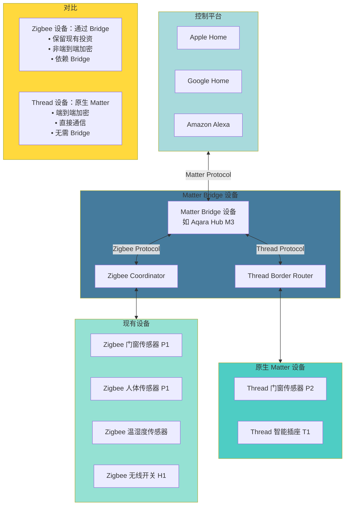
```mermaid
graph TB
    subgraph Platforms["控制平台"]
        AH[Apple Home]
        GH[Google Home]
        AA[Amazon Alexa]
    end
    
    subgraph BridgeDevice["Matter Bridge 设备"]
        MB[Matter Bridge 设备<br/>如 Aqara Hub M3]
        ZC[Zigbee Coordinator]
        TC[Thread Border Router]
    end
    
    subgraph LegacyDevices["现有设备"]
        Z1[Zigbee 门窗传感器 P1]
        Z2[Zigbee 人体传感器 P1]
        Z3[Zigbee 温湿度传感器]
        Z4[Zigbee 无线开关 H1]
    end
    
    subgraph NativeDevices["原生 Matter 设备"]
        T1[Thread 门窗传感器 P2]
        T2[Thread 智能插座 T1]
    end
    
    Platforms <-->|Matter Protocol| MB
    MB <-->|Zigbee Protocol| ZC
    MB <-->|Thread Protocol| TC
    ZC <--> LegacyDevices
    TC <--> NativeDevices
    
    subgraph Comparison["对比"]
        C1[Zigbee 设备：通过 Bridge<br/>• 保留现有投资<br/>• 非端到端加密<br/>• 依赖 Bridge]
        C2[Thread 设备：原生 Matter<br/>• 端到端加密<br/>• 直接通信<br/>• 无需 Bridge]
    end
    
    style Platforms fill:#a8dadc
    style BridgeDevice fill:#457b9d
    style LegacyDevices fill:#95e1d3
    style NativeDevices fill:#4ecdc4
    style Comparison fill:#ffd93d
```

**Bridge 的价值**：
- ✅ 保护现有 Zigbee 设备投资
- ✅ 无需更换设备即可加入 Matter
- ✅ 统一管理不同协议设备
- ✅ 平滑过渡到 Matter 生态

**迁移路径**：

```mermaid
graph LR
    Stage1[阶段 1<br/>纯 Zigbee<br/>专用 Hub]
    Stage2[阶段 2<br/>Zigbee via Bridge<br/>加入 Matter]
    Stage3[阶段 3<br/>混合部署<br/>Zigbee + Thread]
    Stage4[阶段 4<br/>逐步迁移<br/>Thread 为主]
    
    Stage1 --> Stage2 --> Stage3 --> Stage4
    
    style Stage1 fill:#ffccd5
    style Stage2 fill:#ffd93d
    style Stage3 fill:#4ecdc4
    style Stage4 fill:#a8e6cf
```


## Apple Home 生态系统

> 对应总览图中 **🎛️ 控制中心** 和 **📱 远程访问** 区块。HomePod mini 和 Apple TV 4K 组成 Apple Home Hub 主备对，承担 Thread Border Router、Matter Controller、HomeKit Hub 三重角色；Aqara M1S 通过 HomeKit Bridge 将 Zigbee 设备接入 Apple Home；iPhone 作为客户端通过本地或 iCloud 远程控制所有设备。

### HomeKit vs Home App vs iCloud

这三个概念在 Apple 智能家居生态中扮演不同角色：

```mermaid
graph LR
    subgraph UI["Home App — 用户入口"]
        direction TB
        HA1["📱 iOS / iPadOS / macOS / watchOS"]
        HA2["设备控制 · 场景管理<br/>自动化编辑 · 扫码配对"]
        HA1 --- HA2
    end

    subgraph Framework["HomeKit — 智能家居协议与平台"]
        direction TB
        HK1["HAP 协议: 设备端通信标准<br/>Bonjour 发现 · HTTP 通信<br/>安全: SRP 配对 · Ed25519 · ChaCha20"]
        HK2["HomeKit Framework: iOS/macOS 开发者 SDK"]
        HK3["HomeKit 运行时: 运行在 Home Hub 上<br/>管理设备 · 执行自动化 · Matter Controller"]
        HK1 --- HK2 --- HK3
    end

    subgraph Cloud["iCloud — 云端基础设施"]
        direction TB
        IC["CloudKit 数据同步<br/>远程访问中继 (E2EE)<br/>家庭共享 · 备份"]
    end

    UI -->|调用| Framework
    Framework -->|HAP| D1[WiFi/BLE 设备]
    Framework -->|Matter| D2[Thread/WiFi 设备]
    Framework -->|Bridge| D3[Zigbee 设备]
    Framework <-->|同步| Cloud

    style UI fill:#457b9d,color:#fff
    style Framework fill:#ffb3ba
    style Cloud fill:#a8dadc
```

### HomeKit 技术架构

#### HAP (HomeKit Accessory Protocol)

```mermaid
graph LR
    subgraph HAP["HAP 协议栈"]
        L4[应用层<br/>Services & Characteristics] --> L3[安全层<br/>TLS 1.2 + ChaCha20] --> L2[会话层<br/>HTTP/1.1] --> L1[传输层<br/>TCP/IP 或 BLE]
    end
    
    subgraph Security["安全机制"]
        S1[SRP 配对] --> S2[Ed25519 签名]
        S3[会话密钥] --> S4[Pair-Verify]
    end
    
    HAP --> Security
    
    style HAP fill:#ffb3ba
    style Security fill:#457b9d
```

#### HomeKit 设备配对流程

```mermaid
sequenceDiagram
    participant App as Home App
    participant Bonjour as Bonjour/mDNS
    participant Device as HomeKit 设备
    
    Note over Device: 设备广播服务
    Device->>Bonjour: _hap._tcp.local
    
    Note over App: 用户发起配对
    App->>Bonjour: 扫描 HomeKit 设备
    Bonjour->>App: 返回设备列表
    
    App->>Device: 扫描 Setup Code<br/>（8 位数字）
    
    Note over App,Device: SRP 配对流程
    App->>Device: SRP Start Request
    Device->>App: SRP Start Response
    App->>Device: SRP Verify Request
    Device->>App: SRP Verify Response
    
    Note over App,Device: 交换长期密钥
    App->>Device: Add Pairing Request<br/>（iOS 公钥）
    Device->>App: Add Pairing Response<br/>（设备公钥）
    
    Note over App,Device: 配对完成
    App->>Device: Get Accessories
    Device->>App: Accessory Information<br/>Services & Characteristics
```

#### HomeKit 与 Matter 集成

```mermaid
graph LR
    subgraph Apple["Apple 生态"]
        HA[Home App] --> HK[HomeKit Framework]
    end
    
    subgraph MatterLayer["Matter 层"]
        MC[Matter Controller] --> MD[数据模型 + Cluster Library]
    end
    
    HK --> MC
    HK --> Legacy[传统 HomeKit 设备<br/>HAP over WiFi/BLE]
    MD --> Thread[Thread]
    MD --> WiFi[WiFi]
    MD --> Ethernet[Ethernet]
    Thread --> MatterDev[Matter 设备]
    WiFi --> MatterDev
    Ethernet --> MatterDev
    
    style Apple fill:#a8dadc
    style MatterLayer fill:#ffb3ba
    style Legacy fill:#4ecdc4
    style MatterDev fill:#4ecdc4
```

**关键点**：
- HomeKit 现在是 Matter Controller
- 传统 HAP 设备继续支持
- Matter 设备通过 Matter Controller 集成
- 在 Home App 中统一管理

### Home App 功能架构

```mermaid
graph LR
    subgraph UI["用户界面层"]
        direction TB
        Control[设备控制 · 场景管理<br/>自动化编辑 · 设置配置]
    end
    
    subgraph Logic["业务逻辑层"]
        direction TB
        Discovery[设备发现 · 配对管理<br/>命令处理 · 状态同步]
    end
    
    subgraph Framework["框架层"]
        direction TB
        HK[HomeKit HAP]
        MC[Matter Controller]
    end
    
    UI --> Logic --> Framework
    
    style UI fill:#a8dadc
    style Logic fill:#457b9d
    style Framework fill:#ffb3ba
```

#### 自动化引擎

Home App 支持多种触发器：

```mermaid
graph LR
    subgraph Triggers["触发器"]
        direction TB
        T1[时间: 特定时间 · 日出日落]
        T2[位置: 到达/离开家庭]
        T3[设备: 传感器变化 · 开关状态]
        T4[场景: 场景激活]
    end
    
    subgraph Conditions["条件"]
        direction TB
        C1[时间范围 · 人员在家<br/>设备状态 · AND/OR 组合]
    end
    
    subgraph Actions["动作"]
        direction TB
        A1[控制设备 · 激活场景<br/>发送通知 · 延迟执行]
    end
    
    Triggers --> Conditions --> Actions
    
    style Triggers fill:#ffb3ba
    style Conditions fill:#457b9d
    style Actions fill:#4ecdc4
```

**自动化示例**：

```
触发器：人体传感器检测到运动
条件：时间在 22:00-06:00 之间
动作：打开走廊灯（亮度 20%）
延迟：5 分钟后关闭
```

### iCloud 在智能家居中的角色

#### 数据同步架构

```mermaid
graph LR
    subgraph Local["本地网络"]
        iPhone[iPhone/iPad] <--> Hub[Home Hub<br/>HomePod/Apple TV] <--> Device[智能设备]
    end
    
    subgraph Cloud["iCloud 服务"]
        direction TB
        Sync[数据同步 CloudKit<br/>远程中继 · 认证 · 备份]
    end
    
    Hub <-->|加密同步| Sync
    RemotePhone[远程 iPhone<br/>外出控制] <-->|端到端加密| Sync
    
    style Local fill:#4ecdc4
    style Cloud fill:#a8dadc
    style RemotePhone fill:#95e1d3
```

#### 远程访问流程

```mermaid
sequenceDiagram
    participant Remote as 远程 iPhone<br/>（外出）
    participant iCloud as iCloud 中继<br/>（Apple 服务器）
    participant Hub as Home Hub<br/>（家中）
    participant Device as 智能设备<br/>（灯泡）
    
    Note over Remote,Device: 用户在外地控制家中灯泡
    
    Remote->>Remote: 1. 生成控制命令<br/>"打开客厅灯"
    Remote->>Remote: 2. 使用 Hub 公钥加密
    Remote->>iCloud: 3. 发送加密命令
    
    Note over iCloud: iCloud 无法解密内容<br/>仅作为中继转发
    
    iCloud->>Hub: 4. 转发加密命令
    Hub->>Hub: 5. 使用私钥解密
    Hub->>Device: 6. 发送本地 HAP 命令
    Device->>Device: 7. 执行命令（开灯）
    Device->>Hub: 8. 返回状态
    Hub->>Hub: 9. 加密响应
    Hub->>iCloud: 10. 发送加密响应
    iCloud->>Remote: 11. 转发响应
    Remote->>Remote: 12. 解密并显示
    
    Note over Remote,Device: 端到端加密<br/>Apple 无法读取内容
```

**安全特性**：
- 端到端加密（E2EE）
- iCloud 只作为中继，无法解密
- 使用设备特定的密钥对
- 符合 Apple 隐私承诺

#### 家庭共享权限

| 权限 | 管理员 (Owner) | 成员 (Member) |
|------|:-:|:-:|
| 控制设备 / 查看状态 | ✅ | ✅ |
| 创建场景 | ✅ | ✅ |
| 添加 / 删除设备 | ✅ | ❌ |
| 编辑自动化 | ✅ | ❌ |
| 邀请 / 移除成员 | ✅ | ❌ |
| 编辑房间 / 区域 | ✅ | ❌ |

### Apple Home 多协议集成

```mermaid
graph LR
    subgraph Apple["Apple 控制层"]
        HomeApp[Home App] --> HomeKit[HomeKit<br/>HAP + Matter]
        Siri[Siri] --> HomeKit
    end
    
    subgraph Hubs["Hub 设备"]
        HomePod[HomePod mini<br/>Thread BR · Matter · Siri]
        AppleTV[Apple TV 4K<br/>Thread BR · Matter]
    end
    
    subgraph Bridges["第三方 Bridge"]
        AqaraHub[Aqara Hub M1S]
        HueBridge[Hue Bridge]
    end
    
    HomeKit --> HomePod
    HomeKit --> AppleTV
    HomePod --> ThreadDev[Thread 设备]
    HomePod --> WiFiDev[WiFi 设备]
    HomePod --> BLEDev[BLE 设备]
    AppleTV --> ThreadDev
    AppleTV --> WiFiDev
    HomePod --> AqaraHub
    HomePod --> HueBridge
    AppleTV --> AqaraHub
    AppleTV --> HueBridge
    AqaraHub --> ZigbeeDev[Zigbee 设备]
    HueBridge --> ZigbeeDev
    
    style Apple fill:#a8dadc
    style Hubs fill:#ffb3ba
    style Bridges fill:#457b9d
    style ThreadDev fill:#4ecdc4
    style WiFiDev fill:#4ecdc4
    style BLEDev fill:#4ecdc4
    style ZigbeeDev fill:#4ecdc4
```

**集成优势**：

1. **统一控制界面**：
   - 所有设备在 Home App 中统一管理
   - 无论底层协议（Zigbee/Thread/WiFi/BLE）
   - 一致的用户体验
   - **Zigbee 设备通过 Bridge 暴露为 HomeKit 配件**

2. **跨协议自动化**：
   - Zigbee 传感器（via Bridge）触发 Thread 灯泡
   - Thread 开关控制 WiFi 插座
   - BLE 按钮激活场景
   - 协议对用户透明
   - **Bridge 负责协议转换**

3. **多 Hub 冗余**：
   - 多个 HomePod/Apple TV 提供冗余
   - Thread Border Router 自动故障切换
   - Home Hub 功能分布式运行
   - 自动化本地执行
   - **注意：Zigbee Bridge 本身是单点**

4. **本地优先架构**：
   - 优先使用本地网络控制
   - 仅在必要时使用 iCloud 中继
   - 降低延迟（< 100ms）
   - 提高可靠性
   - **Bridge 设备必须在线**

## 对比与选型

### 协议标识

在设备详情、外包装或说明书里，经常可以看到下面的小图标，标明**支持或兼容**的无线/生态能力：

|                       标识                        | 常见含义                                                     |
| :-----------------------------------------------: | :----------------------------------------------------------- |
|  | **Zigbee**：基于 Zigbee 3.0 / ZCL 的低功耗 mesh 设备，常需配合品牌网关或支持 Zigbee 的多模中枢。 |
|       | **Thread**：设备可作为 Thread mesh 节点（多为 Router/SED）；若同时标 **Matter**，通常表示 Matter 跑在 Thread 承载上。 |
|       | **Matter**：经 CSA 认证的 Matter 设备，可与支持 Matter 的控制器（手机 App、音箱、桥接器等）按标准配对，传输可走 Thread 或 Wi‑Fi 等。 |
|     | **HomeKit / Apple Home**：可与 Apple「家庭」App 及 Home 中枢协同（本地控制、场景、Siri 等）；可能是原生 HomeKit，也可能是经认证的桥接/网关间接支持。 |

同一产品可能并列多个图标（例如同时 **Matter + Thread + HomeKit**），表示在各自生态下均声明了兼容路径；是否**无需额外网关**、是否支持 **Thread Border Router** 等，仍要以规格表为准。

### 综合对比

| 特性 | Zigbee 3.0 | Thread | Matter |
|------|------------|--------|--------|
| **协议层级** | 应用层 + 网络层 | 网络层 | 应用层 |
| **物理层** | IEEE 802.15.4 | IEEE 802.15.4 | 多种（Thread/WiFi/Ethernet） |
| **IP 支持** | 否（需网关转换） | 原生 IPv6 | 通过传输层 |
| **网络拓扑** | Star / Tree / Mesh | Mesh | 取决于传输层 |
| **核心节点** | 单 Coordinator（单点故障） | 多 Border Router（自动切换） | 多 Controller（Multi-Admin） |
| **设备规模** | 100–200（实际） | 数百（实际） | 取决于传输层 |
| **加密** | AES-128-CCM | AES-128-CCM | AES-128-CCM |
| **设备认证** | Install Code（可选） | Joining Credential | DAC 证书（必需） |
| **电池寿命** | 优秀（12–24 月） | 更优（12–36 月） | 取决于传输层 |
| **生态成熟度** | 成熟（数千种设备） | 增长中（数百种） | 快速增长，主流厂商全支持 |
| **互操作性** | 同 Profile 内 | 需应用层协议 | 跨平台保证 |

### 选型建议

| 场景 | 推荐方案 | 原因 |
|------|----------|------|
| **新系统部署** | Thread + Matter | 面向未来、无单点故障、跨平台 |
| **现有 Zigbee 扩展** | Zigbee 3.0 + Bridge | 保护已有投资，通过 Bridge 接入 Matter |
| **预算敏感** | Zigbee 3.0 | 设备价格低、生态成熟 |
| **高可用要求** | Thread | 多 BR 自动故障切换 |
| **跨平台家庭** | Matter | Apple / Google / Amazon 统一管理 |
| **摄像头等高带宽** | WiFi + Matter | Thread/Zigbee 带宽不足 |

**混合部署实施路径**：新设备优先 Thread + Matter，现有 Zigbee 通过 Bridge 保留，高带宽设备走 WiFi + Matter。

## 结论

```mermaid
graph LR
    Past[过去<br/>Zigbee 主导<br/>碎片化生态]
    Present[现在<br/>Thread + Matter<br/>标准化进程]
    Future[未来<br/>Matter 统一<br/>多协议共存]
    
    Past --> Present --> Future
    
    style Past fill:#95e1d3
    style Present fill:#4ecdc4
    style Future fill:#a8e6cf
```

智能家居协议从 Zigbee 的早期探索，到 Thread 的架构革新，再到 Matter 的统一标准，经历了三代演进。未来不是单一协议的胜利，而是多协议共存——Thread + Matter 作为新设备首选，Zigbee 通过 Bridge 继续服务，WiFi 承载高带宽场景，Matter 在应用层将它们统一起来。

## 参考资料

- [Connectivity Standards Alliance (CSA) — Zigbee & Matter 规范](https://csa-iot.org/)
- [Thread Group — Thread 协议规范](https://www.threadgroup.org/)
- [IEEE 802.15.4 标准](https://standards.ieee.org/standard/802_15_4-2020.html)
- [Vesternet — Zigbee 3.0 vs 1.2 Guide](https://vesternet.com/blogs/smart-home/zigbee-3-0-vs-zigbee-1-2-guide)
- [Thread Group — Network Topologies](https://threadgroup.org/Newsroom/Blog/typical-thread-network-topologies-smart-homes-with-matter-commercial-buildings)
- [Smart Home Explorer — Protocol Comparison 2026](https://www.smarthomeexplorer.com/guides/matter-vs-thread-vs-zigbee-smart-home-protocols-2026)
- [Apple — HomeKit Accessory Protocol Specification](https://developer.apple.com/homekit/)
- [Apple — Home Architecture Documentation](https://developer.apple.com/home/)
